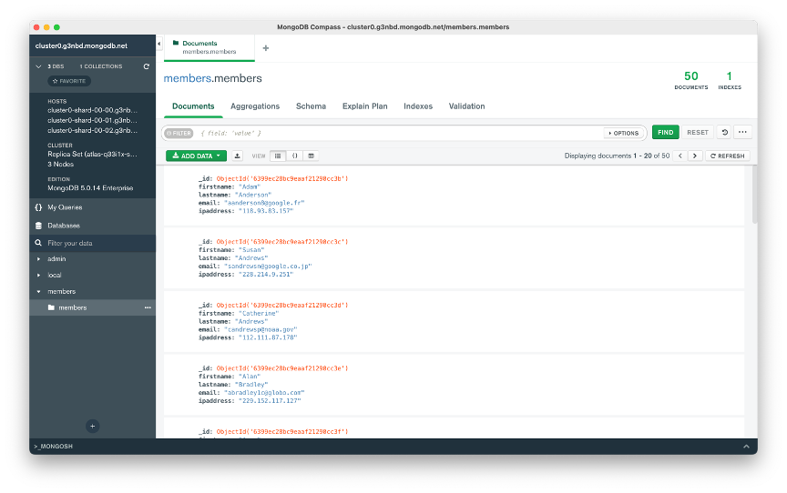
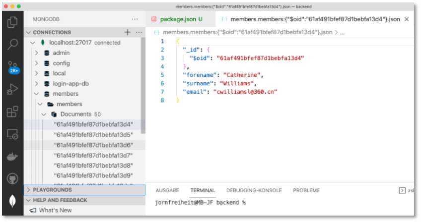
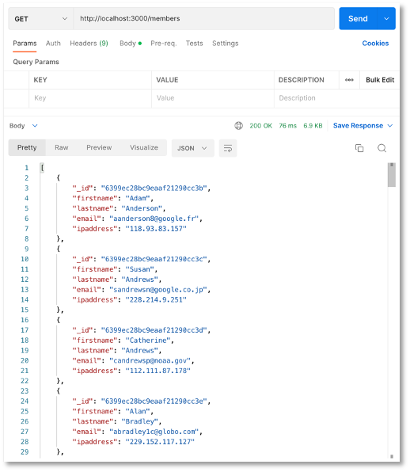
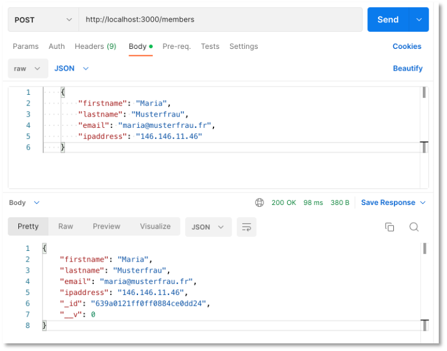
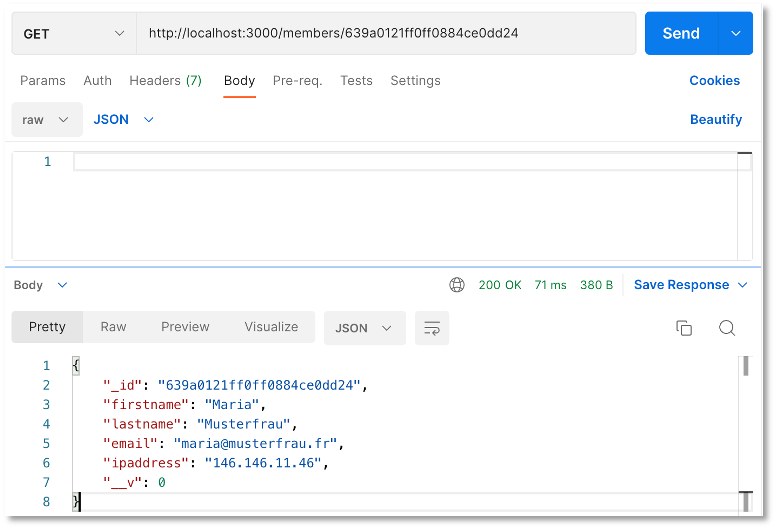
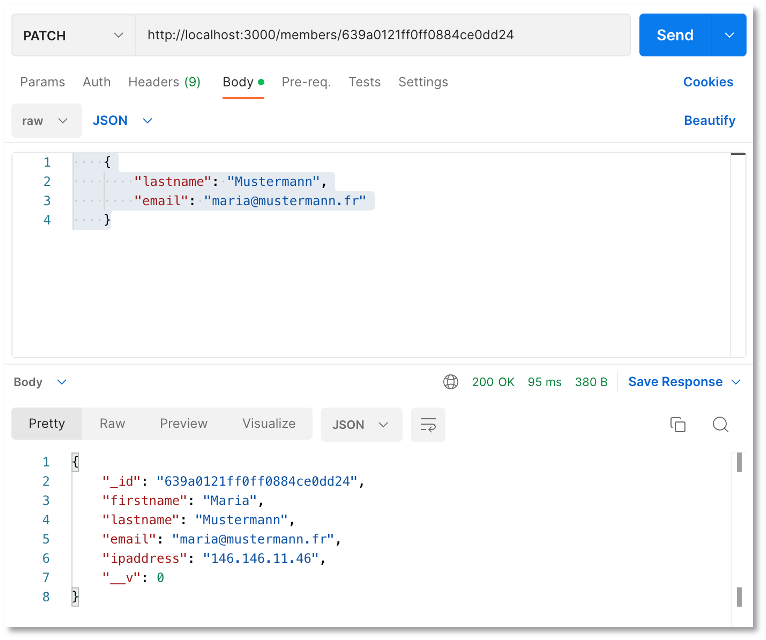

# REST-API (MongoDB)

Die wesentlichsten Konzepte, wie Komponenten, Services und Routing für Angular-Projekte haben wir bereits kennengelernt. Ehe wir uns weiter mit dem Frontend beschäftigen, erstellen wir einen Server, der uns die Daten liefert. Derzeit haben wir unsere Mockup-Daten noch clientseitig von einem Service verwalten lassen. Das wollen wir nun ändern. Die Daten speichern wir in einer Datenbank und stellen sie über eine REST-API bereit. 


??? note "Video zur Vorlesung Backend(MongoDB)"
	<iframe src="https://mediathek.htw-berlin.de/media/embed?key=0aa0f30ec91e4254db1e4a33d0eaff89&width=720&height=540&autoplay=false&controls=true&autolightsoff=false&loop=false&chapters=false&playlist=false&related=false&responsive=false&t=0&loadonclick=true&thumb=true" data-src="https://mediathek.htw-berlin.de/media/embed?key=0aa0f30ec91e4254db1e4a33d0eaff89&width=720&height=540&autoplay=false&controls=true&autolightsoff=false&loop=false&chapters=false&playlist=false&related=false&responsive=false&t=0&loadonclick=true" class="" width="720" height="540" frameborder="0" allowfullscreen="allowfullscreen" allowtransparency="true" scrolling="no" aria-label="media embed code" style=""></iframe>

## REST

Für diese Datenbank stellen wir die Implementierung einer Schnittstelle bereit, so dass wir die wesentlichen Datenbankanfragen darüber ausführen können. Diese wesentlichen Datenbankfragen werden mit [CRUD](https://en.wikipedia.org/wiki/Create,_read,_update_and_delete) abgekürzt, für <strong>C</strong>reate, <strong>R</strong>ead, <strong>U</strong>pdate und <strong>D</strong>elete. Das bedeutet, wir implementieren Funktionalitäten, mit denen wir einen neuen Datensatz in die Datenbank einfügen (*create*), aus der Datenbank auslesen (*read*), in der Datenbank aktualisieren (*update*) und aus der Datenbank löschen (*delete*) können. 

Die Schnittstelle, die wir implementieren, ist eine sogenannte [REST-API](https://www.redhat.com/de/topics/api/what-is-a-rest-api). *REST* steht für [*Representational State Transfer*](https://de.wikipedia.org/wiki/Representational_State_Transfer) und basiert auf einigen wenigen Prinzipien:

1. Alles wird als eine *Ressource* betrachtet, z.B. `book`.
2. Jede Ressource ist durch *URIs* (*Uniform Resource Identifiers*) eindeutig identifizierbar, z.B. `http://localhost/books`.
3. Es werden die [Standard-HTTP-Methoden](https://de.wikipedia.org/wiki/Hypertext_Transfer_Protocol#HTTP-Anfragemethoden) verwendet, also `GET`, `POST`, `PUT`, `UPDATE`.  
4. Ressourcen können in verschiedenen Formaten vorliegen, z.B. in [HTML](https://html.spec.whatwg.org/multipage/), [XML](https://www.w3.org/TR/xml/), [JSON](https://jsonapi.org/format/), 
5. Die Kommunikation ist *zustandslos*. Jede einzelne HTTP-Anfrage wird komplett isoliert bearbeitet. Es gibt keinerlei Anfragehistorie. 

Das bedeutet, wir erstellen ein Backend (einen REST-Server), an den HTTP-Anfragen mit der eindeutig identifizierbaren Ressource gestellt werden. Das Backend erstellt daraus die entsprechende SQL-Query. Das Resultat der Datenbankanfrage wird im `JSON`- oder `HTML`- oder `XML`- oder in einem anderen Format bereitsgestellt.


Prinzipiell gibt es also ein *Mapping*  von HTTP-Anfragen auf SQL-Anfragen:

|CRUD |SQL |MongoDB |HTTP |
|-----|----|--------|-----|
|create |INSERT |insertOne(), insertMany() |POST |
|read |SELECT |findOne(), find() |GET |
|update |UPDATE |updateOne(), updateMany() |PUT (oder PATCH)|
|delete |DELETE |deleteOne(), deleteMany() |DELETE |

Zur Unterscheidung zwischen `PUT` und `PATCH` siehe z.B. [hier](https://www.geeksforgeeks.org/difference-between-put-and-patch-request/) oder [hier](https://stackoverflow.com/questions/21660791/what-is-the-main-difference-between-patch-and-put-request).
Wir wollen uns ein Backend erstellen, über das wir unsere Daten verwalten. Dazu überlegen wir uns zunächst ein paar sogenannte *Endpunkte* (siehe Prinzipien von REST oben) und die Zugriffsmethoden, mit denen wir auf unsere Daten zugreifen wollen.

| Methode | URL | Bedeutung |
|---------|-----|-----------|
| GET     | /members | hole alle Datensätze |
| GET     | /members/11 | hole den Datensatz mit der id=11 |
| POST    | /members | füge einen neuen Datensatz hinzu |
| PUT     | /members/11 | ändere den Datensatz mit der id=11 |
| DELETE  | /members/11 | lösche den Datensatz mit der id=11 |
| DELETE  | /members | lösche alle Datensätze |

Der Wert der `id` ist natürlich nur ein Beispiel. Es soll für alle `id`-Werte funktionieren, die in unserem Datensatz enthalten sind. 

## Ein Node.js-Projekt mit Express

Wir starten damit, uns ein `node.js`-Projekt zu erstellen. Dazu erstellen wir uns zunächst einen Ordner `backend`, wechseln in diesen Ordner und führen dann `npm init` aus:

```bash
mkdir backend
cd backend
npm init
```

Sie werden ein paar Sachen gefragt. Im Prinzip können Sie immer `Enter` drücken:

```bash
This utility will walk you through creating a package.json file.
It only covers the most common items, and tries to guess sensible defaults.

See `npm help init` for definitive documentation on these fields
and exactly what they do.

Use `npm install <pkg>` afterwards to install a package and
save it as a dependency in the package.json file.

Press ^C at any time to quit.
package name: (backend) 
version: (1.0.0) 
description: Backend REST-API
entry point: (index.js) 
test command: 
git repository: 
keywords: restapi, backend
author: J. Freiheit
license: (ISC) 
About to write to /Users/jornfreiheit/Sites/WT21/backend/package.json:

{
  "name": "backend",
  "version": "1.0.0",
  "description": "Backend REST-API",
  "main": "index.js",
  "scripts": {
    "test": "echo \"Error: no test specified\" && exit 1"
  },
  "keywords": [
    "restapi",
    "backend"
  ],
  "author": "J. Freiheit",
  "license": "ISC"
}


Is this OK? (yes) 
```

Die `package.json` wurde erstellt. Nun benötigen wir noch das Modul [Express](https://expressjs.com/de/). Express bietet uns eine unkomplizierte *Middleware* für die Weiterverwaltung von `http`-Anfragen an die Datenbank und zurück. 

```bash
npm install express --save
```

Sie erhalten eine Meldung in der Form:

```bash
% npm install express --save

added 50 packages, and audited 51 packages in 844ms

found 0 vulnerabilities
```

In der `package.json` wurde die entsprechende Abhängigkeit eingetragen: 

=== "package.json"
	```json linenums="1" hl_lines="15-17"
	{
	  "name": "backend",
	  "version": "1.0.0",
	  "description": "Backend REST-API",
	  "main": "index.js",
	  "scripts": {
	    "test": "echo \"Error: no test specified\" && exit 1"
	  },
	  "keywords": [
	    "restapi",
	    "backend"
	  ],
	  "author": "J. Freiheit",
	  "license": "ISC",
	  "dependencies": {
	    "express": "^4.18.2"
	  }
	}
	``` 


Öffnen Sie nun das `backend`-Projekt in Ihrer IDE und erstellen Sie sich dort eine Datei `server.js` mit folgendem Inhalt:

=== "server.js"
	```javascript linenums="1"
	const express = require('express');
	const routes = require('./routes');

	const app = express();
	const PORT = 3000;

	app.use(express.json());
	app.use('/', routes);

	app.listen(PORT, (error) => {
	    if (error) {
	        console.log(error);
	    } else {
	        console.log(`Server started and listening on port ${PORT} ... `);
	    }
	});
	``` 

Das bedeutet, wir importieren `express` (Zeile `1`), erzeugen uns davon ein Objekt und speichern dieses in der Variablen `app` (Zeile `4`). Wir legen in einer Konstanten `PORT` die Portnummer `3000` fest (Zeile `5` - die Portnummer können Sie wählen). Das `backend` ist somit unter `http://localhost:3000` verfügbar. Das eigentliche Starten des Webservers erfolgt in den Zeilen `10-16` durch Aufruf der `listen()`-Funktion von `express`. Die Syntax der `listen()`-Funktion ist generell wie folgt:

```bash
app.listen([port[, host[, backlog]]][, callback])
```

Wir übergeben als ersten Parameter die `PORT`-Nummer (`3000`) und als zweiten Parameter eine (anonyme) Funktion als sogenannten *callback*. *Callbacks* sind [hier](../promises/#callbacks) näher erläutert. Die anonyme Funktion wird durch die `listen()`-Funktion aufgerufen. Sollte ein Fehler aufgetreten sein (z.B. wenn der Port bereits belegt ist), wird der anonymen Funktion ein `error`-Objekt übergeben. Ist das der Fall, wird der Fehler auf der Konsole ausgegeben. Wird der anonymen Funktion kein Objekt übergeben, wurde der Webserver korrekt gestartet und die entsprechende Meldung erscheint auf der Konsole. 

Die Definitionsfunktion in *Arrow-Notation* 

```js
(error) => {
    if (error) {
        console.log(error);
    } else {
        console.log(`Server started and listening on port ${PORT} ... `);
    }
}
```

ist äquivalent zu 

```js
function(error) {
    if (error) {
        console.log(error);
    } else {
        console.log(`Server started and listening on port ${PORT} ... `);
    }
}
```

`error` ist der Name des hier gewählten Parameters. Beachten Sie auch die verwendete Syntax `${PORT}` im sogenannte [template literal](https://developer.mozilla.org/en-US/docs/Web/JavaScript/Reference/Template_literals). Beachten Sie, dass *template literals* nicht in einfachen (`'`) oder doppelten (`"`) Anführungsstrichen stehen, sondern in <code>&#96;</code> (*backticks*). 

### Router

Noch lässt sich unser Programm aber nicht ausführen. Wir benötigen im Projektordner noch eine Datei `routes.js`. Diese wird nämlich in der `server.js` bereits in Zeile `2` eingebunden und in Zeile `8` verwendet. 

=== "routes.js"
	```javascript linenums="1"
	const express = require('express');
	const router = express.Router();

	// eine GET-Anfrage
	router.get('/', async(req, res) => {

	    res.send({ message: "Hello FIW!" });
	});

	module.exports = router;
	``` 


Beim `Router` handelt es sich um eine *Middleware* (siehe [hier](https://expressjs.com/de/guide/using-middleware.html)), die die Routen verwaltet und `request`-Objekte an die entsprechende Routen weiterleitet und `response`-Objekte empfängt. In unserer `routes.js` haben wir zunächst eine `GET`-Anfrage implementiert (Zeile `5`). Das `request`-Objekt heißt hier `req`. Das verwenden wir aber gar nicht. Das `respones`-Objekt heißt hier `res` und wird durch die Anfrage erzeugt. Wir senden in der `response` ein JavaScript-Objekt zurück, das einen Schlüssel `message` enthält. 

In der `server.js` haben wir mit `app.use(express.json())` (Zeile `7`) angegeben, dass alle JavaScript-Objekte in der `response` nach JSON umgewandelt werden sollen. Wenn nun die URL `localhost:3000` aufgerufen wird, dann wird ein `request` ausgelöst, den wir hier mit `Hello FIW!` als `response` beantworten (Zeilen `5-8`). 

Wichtig ist, dass wir `router` mit `module.exports` exportieren, damit es von anderen Modulen importiert und genutzt werden kann. Siehe dazu z.B. [hier](https://www.sitepoint.com/understanding-module-exports-exports-node-js/). Meine Empfehlung ist, **(noch) nicht** das [neue ESM6-Format](https://www.sitepoint.com/understanding-es6-modules/) zu nutzen! 

Noch "läuft" unser Backend aber noch nicht. Wir müssen es erst starten. 

### Starten des Projektes und Installation von nodemon

Das Projekt lässt sich nun starten. Wir geben dazu im Terminal im `backend`-Ordner

```bash
node server.js
```

ein. Im Terminal erscheint 

```bash
Server started and listening on port 3000 
```

und wenn Sie im Browser die URL `http://localhost:3000/` eingeben, wird dort


angezeigt. Sie können auch Postman öffnen und `http://localhost:3000` eintragen (`GET`-Methode):


Wann immer wir jetzt jedoch etwas an der Implementierung ändern, müssen wir im Terminal zunächst den Webserver mit 

```bash
Strg-C		// bzw. Control-C
```

stoppen, um ihn dann wieder mit `node server.js` zu starten. Um das zu umgehen, gibt es das Paket [nodemon](https://www.npmjs.com/package/nodemon). Da es nur sinnvoll während der Entwicklung eingesetzt werden kann (und sollte), installieren wir es als eine *development dependency*:

```bash
npm install --save-dev nodemon
```

Die `package.json` sieht daraufhin so aus:

=== "package.json"
	```json linenums="1" hl_lines="18-20"
	{
	    "name": "backend",
	    "version": "1.0.0",
	    "description": "Backend REST-API",
	    "main": "server.js",
	    "scripts": {
	        "test": "echo \"Error: no test specified\" && exit 1"
	    },
	    "keywords": [
	        "restapi",
	        "backend"
	    ],
	    "author": "J. Freiheit",
	    "license": "ISC",
	    "dependencies": {
	        "express": "^4.18.2"
	    },
	    "devDependencies": {
	        "nodemon": "^2.0.20"
	    }
	}
	```

Zur Verwendung von `nodemon` fügen wir in die `package.json` unter `"scripts"` noch die Eigenschaft `watch` (frei gewählt) und den dazugehörigen Wert `nodemon server.js` ein:

=== "package.json"
	```json linenums="1" hl_lines="7"
	{
	    "name": "backend",
	    "version": "1.0.0",
	    "description": "Backend REST-API",
	    "main": "server.js",
	    "scripts": {
	        "watch": "nodemon ./server.js",
	        "test": "echo \"Error: no test specified\" && exit 1"
	    },
	    "keywords": [
	        "restapi",
	        "backend"
	    ],
	    "author": "J. Freiheit",
	    "license": "ISC",
	    "dependencies": {
	        "express": "^4.18.2"
	    },
	    "devDependencies": {
	        "nodemon": "^2.0.20"
	    }
	}
	```

Nun lässt sich die Anwendung mithilfe von `nodemon` per 

```bash
npm run watch
```

starten und muss auch nicht mehr gestoppt und neu gestartet werden, wenn Änderungen an der Implementierungen durchgeführt wurden. Die Ausgabe im Terminal nach Eingabe von `npm run watch` ist ungefähr so:

```bash

> backend@1.0.0 watch
> nodemon ./server.js

[nodemon] 2.0.20
[nodemon] to restart at any time, enter `rs`
[nodemon] watching path(s): *.*
[nodemon] watching extensions: js,mjs,json
[nodemon] starting `node ./server.js`
Server started and listening on port 3000 ... 

```

Hier nur zum Verständnis. Angenommen, wir ändern bspw. in der `server.js` die Zeile `8` zu 

```js
app.use('/api', routes);
```

, dann würden alle Routen, die wir in `routes.js` definieren, unter `localhost:3000/api` verfügbar sein. Wenn wir dann also z.B. in der `routes.js` die Zeile `5` zu 

```js
router.get('/fiw', async(req, res) => {
```

ändern, dann ist der GET-Endpunkt `localhost:3000/api/fiw`. 

### Mongoose installieren

[MongoDB](https://www.mongodb.com/de-de) ist die am meisten verwendete *NoSQL (not only SQL)* Datenbank. Sie basiert nicht auf Relationen, Tabellen und ihren Beziehungen zueinander (ist also keine *relationale* Datenbank), sondern speichert Dokumente in JSON-ähnlichem Format. Die [Community Edition der MongoDB](https://github.com/mongodb/mongo) ist Open Source und kostenlos verfügbar. 
Sollten Sie mit *Visual Studio Code* arbeiten, sollten Sie sich am besten die [MongoDB for VS Code](https://code.visualstudio.com/docs/azure/mongodb)-Ereiterung installieren. 

Zur Verwendung von *MongoDB* im Backend verwenden wir das Modul [Mongoose](https://mongoosejs.com/). Wir installieren *Mongoose* mithilfe von

```bash
npm install mongoose --save
```

In die `package.json` wird das Paket und die entsprechende Abhängigkeit eingetragen:

=== "package.json"
	```json linenums="1" hl_lines="18"
	{
	    "name": "backend",
	    "version": "1.0.0",
	    "description": "Backend REST-API",
	    "main": "server.js",
	    "scripts": {
	        "watch": "nodemon ./server.js",
	        "test": "echo \"Error: no test specified\" && exit 1"
	    },
	    "keywords": [
	        "restapi",
	        "backend"
	    ],
	    "author": "J. Freiheit",
	    "license": "ISC",
	    "dependencies": {
	        "express": "^4.17.1",
	        "mongoose": "^6.0.14"
	    },
	    "devDependencies": {
	        "nodemon": "^2.0.15"
	    }
	}
	```

*Mongoose* stellt eine einfach zu verwendende Schnittstelle zwischen Node.js und MongoDB bereit. Die
MongoDB benötigen wir aber trotzdem (wir könnten jedoch auch eine Cloud von MongoDB oder z.B. `mlab.com` verwenden). Bevor wir uns mit der MongoDB verbinden, erstellen wir zunächst noch eine Datenbank. 

Um Datenbanken zu erstellen, zu befüllen, anzusehen und zu verwalten, können Sie entweder [MongoDB Compass](../tools/#mongodb-compass) oder [MongoDB Shell](../tools/#mongosh-mongodb-in-der-shell) verwenden. Ich empfehle Compass, weil es komfortabler ist. Im Folgenden ist der etwas kompliziertere Weg mit der MongoDB Shell gezeigt. Der hat aber den Vorteil, dass man die queries sieht, die verwendet werden. 

Sollten Sie Compass verwenden, dann nennen sie Ihre Datenbank und die Collection einfach jeweils `members` und fügen die Daten mithilfe [dieser Datei](./files/members.json) ein. Das Ergebnis sieht dann so aus:



### Datenbank erstellen

Wenn `mongosh` gestartet ist, erscheint im Terminal `test>`. Das bedeutet, dass Sie auf der Datenbank `test` operieren. Mit dem Befehl `db` können Sie sich die Datenbank anschauen, auf der Sie gerade operieren. Das ist zu Beginn die `test`-Datenbank. Wir wollen eine neue Datenbank `members` erstellen. Dazu nutzen wir den Befehl `use <db>`:

```bash
> use members
```

(ohne das `>` - das soll nur symbolisieren, dass wir in der MongoDB-Shell sind). Es entsteht die Datenbank `members` und es wird direkt in diese Datenbank gewechselt. 

```bash
test> db
test
test> use members
switched to db members
members> db
members
members> 
```

Wir befüllen diese Datenbank unter Verwendung des Befehls:

```bash
db.collection.insertMany(
   [ <document 1> , <document 2>, ... ]
)
```

Dabei sind die `<documente>` Objekte in [JavaScript Object Notation (JSON)](/angular2/#javascript-object-notation-json) und `collection` stellt einen Namen (ähnlich einer Tabelle in relationalen Datenbanken) dar. Insgesamt sieht der befehl mit unseren Daten so aus:

??? "Daten einfügen"
		db.members.insertMany([
			{
			 "forename": "Catherine",
			 "surname": "Williams",
			 "email": "cwilliamsl@360.cn"
			},
			{
			 "forename": "Adam",
			 "surname": "Anderson",
			 "email": "aanderson8@google.fr"
			},
			{
			 "forename": "Susan",
			 "surname": "Andrews",
			 "email": "sandrewsn@google.co.jp"
			},
			{
			 "forename": "Catherine",
			 "surname": "Andrews",
			 "email": "candrewsp@noaa.gov"
			},
			{
			 "forename": "Alan",
			 "surname": "Bradley",
			 "email": "abradley1c@globo.com"
			},
			{
			 "forename": "Anne",
			 "surname": "Brooks",
			 "email": "abrooks16@bravesites.com"
			},
			{
			 "forename": "Russell",
			 "surname": "Brown",
			 "email": "rbrownq@nifty.com"
			},
			{
			 "forename": "Ryan",
			 "surname": "Burton",
			 "email": "rburton18@foxnews.com"
			},
			{
			 "forename": "Roy",
			 "surname": "Campbell",
			 "email": "rcampbell1@geocities.com"
			},
			{
			 "forename": "Russell",
			 "surname": "Campbell",
			 "email": "rcampbell17@eventbrite.com"
			},
			{
			 "forename": "Bonnie",
			 "surname": "Coleman",
			 "email": "bcoleman11@fc2.com"
			},
			{
			 "forename": "Ernest",
			 "surname": "Coleman",
			 "email": "ecoleman15@businessweek.com"
			},
			{
			 "forename": "Richard",
			 "surname": "Cruz",
			 "email": "rcruz7@unc.edu"
			},
			{
			 "forename": "Sean",
			 "surname": "Cruz",
			 "email": "scruz10@answers.com"
			},
			{
			 "forename": "Rebecca",
			 "surname": "Cunningham",
			 "email": "rcunninghamd@mac.com"
			},
			{
			 "forename": "Margaret",
			 "surname": "Evans",
			 "email": "mevansh@pcworld.com"
			},
			{
			 "forename": "Jeffrey",
			 "surname": "Ford",
			 "email": "jford14@cnet.com"
			},
			{
			 "forename": "Andrea",
			 "surname": "Gardner",
			 "email": "agardnerv@woothemes.com"
			},
			{
			 "forename": "Deborah",
			 "surname": "George",
			 "email": "dgeorge6@furl.net"
			},
			{
			 "forename": "Sean",
			 "surname": "Gibson",
			 "email": "sgibsony@alexa.com"
			},
			{
			 "forename": "Virginia",
			 "surname": "Graham",
			 "email": "vgrahamk@aol.com"
			},
			{
			 "forename": "Steven",
			 "surname": "Hamilton",
			 "email": "shamiltonu@state.tx.us"
			},
			{
			 "forename": "Virginia",
			 "surname": "Hawkins",
			 "email": "vhawkinsf@ehow.com"
			},
			{
			 "forename": "Edward",
			 "surname": "Hicks",
			 "email": "ehicksc@pcworld.com"
			},
			{
			 "forename": "Mark",
			 "surname": "Johnson",
			 "email": "mjohnsonj@hostgator.com"
			},
			{
			 "forename": "Ruth",
			 "surname": "Jordan",
			 "email": "rjordan1a@smugmug.com"
			},
			{
			 "forename": "Antonio",
			 "surname": "Kim",
			 "email": "akim4@odnoklassniki.ru"
			},
			{
			 "forename": "Jennifer",
			 "surname": "Marshall",
			 "email": "jmarshallt@gnu.org"
			},
			{
			 "forename": "Eric",
			 "surname": "Matthews",
			 "email": "ematthews5@independent.co.uk"
			},
			{
			 "forename": "Raymond",
			 "surname": "Mcdonald",
			 "email": "rmcdonald2@ihg.com"
			},
			{
			 "forename": "Eric",
			 "surname": "Miller",
			 "email": "emillere@creativecommons.org"
			},
			{
			 "forename": "Jonathan",
			 "surname": "Morales",
			 "email": "jmoralesa@ovh.net"
			},
			{
			 "forename": "Marie",
			 "surname": "Morgan",
			 "email": "mmorganb@cloudflare.com"
			},
			{
			 "forename": "Amanda",
			 "surname": "Nelson",
			 "email": "anelson13@indiatimes.com"
			},
			{
			 "forename": "Lisa",
			 "surname": "Olson",
			 "email": "lolsonr@telegraph.co.uk"
			},
			{
			 "forename": "Alice",
			 "surname": "Ortiz",
			 "email": "aortizw@histats.com"
			},
			{
			 "forename": "Peter",
			 "surname": "Phillips",
			 "email": "pphillipss@1688.com"
			},
			{
			 "forename": "Matthew",
			 "surname": "Porter",
			 "email": "mporter9@europa.eu"
			},
			{
			 "forename": "Tammy",
			 "surname": "Ray",
			 "email": "trayx@weather.com"
			},
			{
			 "forename": "Mark",
			 "surname": "Richardson",
			 "email": "mrichardson1d@ihg.com"
			},
			{
			 "forename": "Joan",
			 "surname": "Roberts",
			 "email": "jroberts12@alibaba.com"
			},
			{
			 "forename": "Kathleen",
			 "surname": "Rose",
			 "email": "kroseg@pinterest.com"
			},
			{
			 "forename": "Steve",
			 "surname": "Sanders",
			 "email": "ssanders1b@wikispaces.com"
			},
			{
			 "forename": "Shirley",
			 "surname": "Scott",
			 "email": "sscottm@macromedia.com"
			},
			{
			 "forename": "Lillian",
			 "surname": "Stephens",
			 "email": "lstephens19@hugedomains.com"
			},
			{
			 "forename": "Nicole",
			 "surname": "Thompson",
			 "email": "nthompson3@admin.ch"
			},
			{
			 "forename": "Marie",
			 "surname": "Thompson",
			 "email": "mthompsonz@yelp.com"
			},
			{
			 "forename": "Alan",
			 "surname": "Vasquez",
			 "email": "avasquezo@miibeian.gov.cn"
			},
			{
			 "forename": "Mildred",
			 "surname": "Watkins",
			 "email": "mwatkins0@miibeian.gov.cn"
			},
			{
			 "forename": "Eugene",
			 "surname": "Williams",
			 "email": "ewilliamsi@deliciousdays.com"
			}
		 ])


Im Terminal erscheint eine Ausgabe in der folgenden Form:

??? "Ausgabe im Terminal"
		{
		  acknowledged: true,
		  insertedIds: {
		    '0': ObjectId("61af491bfef87d1bebfa13d4"),
		    '1': ObjectId("61af491bfef87d1bebfa13d5"),
		    '2': ObjectId("61af491bfef87d1bebfa13d6"),
		    '3': ObjectId("61af491bfef87d1bebfa13d7"),
		    '4': ObjectId("61af491bfef87d1bebfa13d8"),
		    '5': ObjectId("61af491bfef87d1bebfa13d9"),
		    '6': ObjectId("61af491bfef87d1bebfa13da"),
		    '7': ObjectId("61af491bfef87d1bebfa13db"),
		    '8': ObjectId("61af491bfef87d1bebfa13dc"),
		    '9': ObjectId("61af491bfef87d1bebfa13dd"),
		    '10': ObjectId("61af491bfef87d1bebfa13de"),
		    '11': ObjectId("61af491bfef87d1bebfa13df"),
		    '12': ObjectId("61af491bfef87d1bebfa13e0"),
		    '13': ObjectId("61af491bfef87d1bebfa13e1"),
		    '14': ObjectId("61af491bfef87d1bebfa13e2"),
		    '15': ObjectId("61af491bfef87d1bebfa13e3"),
		    '16': ObjectId("61af491bfef87d1bebfa13e4"),
		    '17': ObjectId("61af491bfef87d1bebfa13e5"),
		    '18': ObjectId("61af491bfef87d1bebfa13e6"),
		    '19': ObjectId("61af491bfef87d1bebfa13e7"),
		    '20': ObjectId("61af491bfef87d1bebfa13e8"),
		    '21': ObjectId("61af491bfef87d1bebfa13e9"),
		    '22': ObjectId("61af491bfef87d1bebfa13ea"),
		    '23': ObjectId("61af491bfef87d1bebfa13eb"),
		    '24': ObjectId("61af491bfef87d1bebfa13ec"),
		    '25': ObjectId("61af491bfef87d1bebfa13ed"),
		    '26': ObjectId("61af491bfef87d1bebfa13ee"),
		    '27': ObjectId("61af491bfef87d1bebfa13ef"),
		    '28': ObjectId("61af491bfef87d1bebfa13f0"),
		    '29': ObjectId("61af491bfef87d1bebfa13f1"),
		    '30': ObjectId("61af491bfef87d1bebfa13f2"),
		    '31': ObjectId("61af491bfef87d1bebfa13f3"),
		    '32': ObjectId("61af491bfef87d1bebfa13f4"),
		    '33': ObjectId("61af491bfef87d1bebfa13f5"),
		    '34': ObjectId("61af491bfef87d1bebfa13f6"),
		    '35': ObjectId("61af491bfef87d1bebfa13f7"),
		    '36': ObjectId("61af491bfef87d1bebfa13f8"),
		    '37': ObjectId("61af491bfef87d1bebfa13f9"),
		    '38': ObjectId("61af491bfef87d1bebfa13fa"),
		    '39': ObjectId("61af491bfef87d1bebfa13fb"),
		    '40': ObjectId("61af491bfef87d1bebfa13fc"),
		    '41': ObjectId("61af491bfef87d1bebfa13fd"),
		    '42': ObjectId("61af491bfef87d1bebfa13fe"),
		    '43': ObjectId("61af491bfef87d1bebfa13ff"),
		    '44': ObjectId("61af491bfef87d1bebfa1400"),
		    '45': ObjectId("61af491bfef87d1bebfa1401"),
		    '46': ObjectId("61af491bfef87d1bebfa1402"),
		    '47': ObjectId("61af491bfef87d1bebfa1403"),
		    '48': ObjectId("61af491bfef87d1bebfa1404"),
		    '49': ObjectId("61af491bfef87d1bebfa1405")
		  }
		}
		members> 

Die Datenbank `members` existiert nun und ist mit Daten befüllt. Wir können uns z.B. alle diese Daten mit 

```bash
db.members.find()
```

anzeigen lassen oder z.B. mit 

```bash
db.members.find( { forename: "Sean" } )
```

alle Einträge anzeigen lassen, in denen `forename` den Wert `'Sean'` hat:

```bash
[
  {
    _id: ObjectId("61af491bfef87d1bebfa13e1"),
    forename: 'Sean',
    surname: 'Cruz',
    email: 'scruz10@answers.com'
  },
  {
    _id: ObjectId("61af491bfef87d1bebfa13e7"),
    forename: 'Sean',
    surname: 'Gibson',
    email: 'sgibsony@alexa.com'
  }
]
members> 
```


### MongoDB in VSCode

Falls Sie *Visual Studio Code* verwenden und darin die [MongoDB for VS Code](https://code.visualstudio.com/docs/azure/mongodb)-Erweiterung installiert haben, können Sie auf der linken Seite auf das MongoDB-Blatt klicken und das `Advanced Connection Settings` mit dem Formular `Open form` anklicken.

Sie geben `mongodb://127.0.0.1:27017` ein und dass Sie keine Authentifizierung verwenden. Öffnen Sie die `connection` und darin `members` und es erscheint



Um sich in Node.js mit der MongoDB zu verbinden, geben Sie 

=== "server.js"
	```js linenums="1" hl_lines="3 11-19"
	const express = require('express');
	const routes = require('./routes');
	const mongoose = require('mongoose');

	const app = express();
	const PORT = 3000;

	app.use(express.json());
	app.use('/', routes);

	// connect to mongoDB
	mongoose.connect('mongodb+srv://<username>:<passwort>@cluster0.g3nbd.mongodb.net', { dbName: 'members' });
	const db = mongoose.connection;
	db.on('error', err => {
	  console.log(err);
	});
	db.once('open', () => {
	    console.log('connected to DB');
	});

	app.listen(PORT, (error) => {
	    if (error) {
	        console.log(error);
	    } else {
	        console.log(`Server started and listening on port ${PORT} ... `);
	    }
	});
	```

ein. Sie müssen natürlich Ihren Nutzerinnennamen und Ihr Passwort einsetzen. Sollten Sie eine MongoDB lokal installiert haben, dann verbinden Sie sich mit `mongodb://127.0.0.1:27017` (bzw. `mongodb://127.0.0.1:27017/members`). Im Terminal sollte dann

```bash
[nodemon] restarting due to changes...
[nodemon] starting `node ./server.js`
Server started and listening on port 3000 ...
connected to DB
```

erscheinen. 

### Dotenv für sichere Zugangsdaten

Für die "geheimen" Zugangsdaten (die jetzt noch gar nicht "geheim" sind) verwenden wir das [dotenv](https://www.npmjs.com/package/dotenv)-Paket:

```bash
npm install dotenv --save
```

Im Projektordner erstellen wir und eine Datei `.env` (mit Punkt!) und schreiben darin entweder für die lokale MongoDB

=== ".env"
	```js linenums="1"
	DB_CONNECTION = mongodb://127.0.0.1:27017/members
	```

oder für die Atlas-Verbindung

=== ".env"
	```js linenums="1"
	DB_CONNECTION = mongodb+srv://<username>:<passwort>@cluster0.g3nbd.mongodb.net
	DATABASE = members
	```


Beachten Sie, dass der Wert nicht in Hochkomma steht und dass auch kein Semikolon folgt! 
Wir fügen `dotenv` n die `server.js` ein und greifen mithilfe von `process.env.DB_CONNECTION` auf den Wert von `DB_CONNECTION` zu (und mit `process.env.DATEBASE` auf den Wert von `DATABASE`) :

=== "server.js"
	```js linenums="1" hl_lines="4 13"
	const express = require('express');
	const routes = require('./routes');
	const mongoose = require('mongoose');
	require('dotenv').config();

	const app = express();
	const PORT = 3000;

	app.use(express.json());
	app.use('/', routes);

	// connect to mongoDB
	mongoose.connect(process.env.DB_CONNECTION, { dbName: process.env.DATABASE });
	const db = mongoose.connection;
	db.on('error', err => {
	  console.log(err);
	});
	db.once('open', () => {
	    console.log('connected to DB');
	});

	app.listen(PORT, (error) => {
	    if (error) {
	        console.log(error);
	    } else {
	        console.log(`Server started and listening on port ${PORT} ... `);
	    }
	});
	```

In Zeil `3` wird das `dotenv`-Paket importiert. Mithilfe der `config()`-Funktion wird die `.env`-datei eingelesen. Auf die in der `.env`-Datei hinterlegten Schlüssel-Werte-Paare (mit `=` dazwischen) kann dann mittels `process.env.<Schlüssel>` zugegriffen werden (siehe Zeile `14`). 

Beachten Sie, die `.env`-Datei in die `.gitignore` einzutragen. Die `.env`-Datei sollte **nicht** committed werden!

### Ein Model erstellen

Mongoose ist Schema-basiert. Ein Schema kann man sich wie ein Datenmodell vorstellen. Tatsächlich wird es verwendet, um ein entsprechendes Mongoose-Model zu erstellen. Ein Schema wird unter Aufruf des Konstruktors (`new Schema()`) in Mongoose erstellt. Unter Verwendung des Schemas wird dann mithilfe der `model()`-Funktion das Datenmodell erzeugt. 

Wir werden im Folgenden zeigen, wie ein Schema für `members` erstellt wird. Das Datenmodell heißt dann `Member`. Um später auch weitere Schemata, z.B. für `user` o.ä. zu entwicklen und diese zu trennen, erstellen wir das Schema in einem eigenen Ordner `models`. Das bedeutet, wir erstellen im Projektordner 

- ein Ordner `models` und
- darin eine Datei `models/members.js`

Die Datei `members.js` bekommt folgenden Inhalt:

=== "models/members.js"
	```javascript
	const mongoose = require('mongoose');

	const schema = new mongoose.Schema({
	    firstname: String,
	    lastname: String,
	    email: String,
	    ipaddress: String
	});

	module.exports = mongoose.model('Member', schema);
	```

Weiterführende Informationen zu Mongoose-Models finden Sie z.B. [hier](https://mongoosejs.com/docs/models.html). Das Thema Schema wird z.B. [hier](https://mongoosejs.com/docs/guide.html) näher erläutert. 

### Zugriffe auf die Datenbank

Nun haben wir alles, was wir benötigen, um unsere Anfragen zu implementieren. Wir nutzen den `express.Router`, um die Routen zu definieren und können mithilfe des Mongoose-Models auf die MongoDB zugreifen. Wir werden nun sukzessive alle Anfragen in die `routes.js` einfügen. 

#### R - read all

Wir beginnen mit der Anfrage, alle Daten aus der Datenbank auszulesen. Für die MongoDB erfolgt dies mit der Funktion `find()`. In `routes.js` ändern wir unsere `GET`-Anfrage wie folgt: 

=== "routes.js"
	```javascript linenums="1" hl_lines="3 6-10"
	const express = require('express');
	const router = express.Router();
	const Member = require('./models/members');

	// get all members
	router.get('/members', async(req, res) => {
	    const allMembers = await Member.find();
	    console.log(allMembers);
	    res.send(allMembers);
	});

	module.exports = router;
	```

Beachten Sie, dass wir dazu nun das `Member`-Model in die `routes.js` einbinden (Zeile `3`). Die Route wird mit `localhost:3000/members` definiert. Die anonyme Callback-Funktion enthält noch zwei Schlüsselwörter: `async` und `await`. Die Funktion `find()` ist ein sogenanntes *Promise* (siehe dazu [hier](../promises/#promises)). Die Funktion `find()` wird asynchron ausgeführt und "irgendwann" ist entweder das Ergebnis dieser Funktion verfügbar oder die Funktion gibt einen Fehler zurück. Auf eines der beiden wird gewartet (`await`). Nur eine als `async` deklarierte Funktion darf einen `await`-Aufruf enthalten (siehe dazu z.B. [hier](https://developer.mozilla.org/de/docs/Web/JavaScript/Reference/Statements/async_function)).

Die Ausgabe der Werte auf die Konsole (Zeile `8`) ist natürlich nicht erforderlich und Sie können sie auch löschen, wenn Sie wollen. Wenn Sie nun in Postman `GET http://localhost:3000/members` aufrufen, erscheinen alle Einträge aus der Datenbank:




#### C - create

Als nächstes implementieren wir einen Endpunkt, an dem wir einen neuen Datensatz in die Datenbank anlegen können. Dafür gibt es die http-Methode `POST`. Wir führen also nicht mehr eine `GET`-, sondern eine `POST`-Anfrage durch. Bei dieser `POST`-Anfrage wird der neue Datensatz an den Webserver mitgeschickt. Dies erfolgt im `body` des `request`-Objektes. Das Schreiben des Datensatzes in die Datenbank erfolgt mithilfe der `save()`-Funktion von MongoDB. 

=== "routes.js"
	```javascript linenums="12"
	// post one member
	router.post('/members', async(req, res) => {
	    const newMember = new Member({
	        firstname: req.body.firstname,
	        lastname: req.body.lastname,
	        email: req.body.email,
	        ipaddress: req.body.ipaddress
	    })
	    await newMember.save();
	    res.send(newMember);
	});
	```

In den Zeilen `15-17` werden die Daten aus dem `body` des `request`-Objektes ausgelesen und mit diesen Daten ein neues `Member`-Objekt erzeugt. Dieses neue `Member`-Objekt (`newMember`) wird in Zeile `19` in die Datenbank gespeichert und in Zeile `20` als `response` zurückgeschickt.  

Nun geben wir in Postman `POST http://localhost:3000/members` ein und befüllen den `Body` z.B. mit:

```json linenums="1"
{
    "firstname": "Maria",
    "lastname": "Musterfrau",
    "email": "maria@musterfrau.fr",
    "ipaddress": "146.146.11.46"
}
``` 

Achten Sie darauf, dass in der zweiten Menüzeile rechts `JSON` ausgewählt ist (im Bild blau) - nicht `Text`. Wir klicken auf `Send` und es erscheint:



Schauen Sie auch in Compass nach, ob der Datensatz dort erscheint:


#### R - read one

Wir erweitern die `routes.js` um einen Endpunkt, der uns für eine gegebene `id` den entsprechenden Datensatz zurückliefert. Die `_id` werden von MongoDB automatisch vergeben und sind recht kryptisch, also z.B. `"61b0e4fcc050789546f979d3"`. Wir können natürlich nach jedem beliebigen Wert für jeden Schlüssel in der Datenbank suchen. Wir nehmen hier beispielhaft die `_id`. 

Die `id` wird aus der URL des Endpunktes ausgelesen, d.h. wenn wir bspw. den Endpunkt `GET http://localhost:3000/members/61b0e4fcc050789546f979d3` eingeben, dann soll der Datensatz mit der `_id: 61b0e4fcc050789546f979d3` im JSON-Format zurückgegeben werden. Wir nutzen dazu parametrisierte Routen und lesen die `id` aus der Parameterliste aus. Paremtrisierte Routen werden per `:` und dann den Namen des Parameters (hier `id`) erstellt. Um dann den Wert des Parametrs `id` aus der Parameterliste auszulesen, wird `params` verwendet. Im folgenden Code lassen wir `req.params` auf die Konsole ausgeben, um die Funktionsweise zu erläutern. Diese Ausgabe kann natürlich gelöscht werden (Zeile `27`). 

=== "routes.js"
	```javascript linenums="23"
	// get one member via id
	router.get('/members/:id', async(req, res) => {
	    const member = await Member.findOne({ _id: req.params.id });
	    console.log(req.params);
	    if(member) {
	        res.send(member);
	    } else {
	        res.status(404);
	        res.send({
	            error: "Member does not exist!"
	        });
	    }
	})
	``` 

Zum Finden eines einzelnen Datensatzes wird in MongoDB die Funktion `findOne()` verwendet (siehe [hier](https://docs.mongodb.com/manual/reference/method/db.collection.findOne)). Wird der Datensatz gefunden, d.h. existiert die entsprechende `_id`, dann wird dieser in der `response` zurückgesendet (Zeile `28`). Existiert er nicht, wird der HTTP-Statuscode `404` gesendet (Zeile `30`) und ein JSON mit der `error`-Nachricht `Member does not exist!` (Zeile `31`). 

Nach Neustart des Servers geben wir in Postman z.B. `GET http://localhost:3000/members/639a0121ff0ff0884ce0dd24` ein (bei Ihnen sind die `_id`-Werte andere!) und erhalten:



Probieren Sie auch einmal `GET http://localhost:3000/members/0` aus, um die Fehlermeldung als JSON zu sehen. 


#### U - update

Um einen bereits existierenden Datensatz zu ändern, kann entweder die HTTP-Anfrage `PUT` oder `PATCH` verwendet werden. Zur Unterscheidung zwischen `PUT` und `PATCH` siehe z.B. [hier](https://www.geeksforgeeks.org/difference-between-put-and-patch-request/) oder [hier](https://stackoverflow.com/questions/21660791/what-is-the-main-difference-between-patch-and-put-request). Um einen Datensatz in der MongoDB zu ändern, stehen prinzipiell mehrere Funktionen zur Verfüging:

- `updateOne()`: ändert einzelne (oder alle) Teile eines Datensatzes und sendet die `_id` zurück, falls ein neur Datensatz angelegt wurde,
- `findOneAndUpdate()`: ändert einzelne (oder alle) Teile eines Datensatzes und sendet den kompletten Datensatz zurück,
- `replaceOne()`: ändert den kompletten Datensatz. 

In der folgenden Implementierung haben wir uns für die HTTP-Anfragemethode `PATCH` und für die MongoDB-Funktion `updateOne()` entschieden. Diese Funktion erwartet als ersten Parameter einen `<filter>`, d.h. die Werte, nach denen nach einem Datensatz gesucht werden soll. Im folgenden Beispiel ist der Filter die `_id`. Dazu wird erneute ein Parameter `id` für die URL definiert. Der zweite Parameter der `updateOne()`-Funktion sind die zu ändernden Werte für diesen Datensatz. In der folgenden Implementierung werden diese zu ändernden Werte als ein JSON dem `body` des `request`-Objektes übergeben. Um zu ermöglichen, dass ein, zwei oder drei Schlüssel-Werte-Paare in diesem JSON enthalten sein können, prüfen wir die Einträge im `body` und setzen daraus ein neues `member`-Objekt zusammen, wenn es bereits in der Datenbank existiert (deshalb zunächst `findOne()`):

=== "router.js"
	```javascript linenums="37"
	// update one member
	router.patch('/members/:id', async(req, res) => {
	    try {
	        const member = await Member.findOne({ _id: req.params.id })

	        if (req.body.firstname) {
	            member.firstname = req.body.firstname
	        }

	        if (req.body.lastname) {
	            member.lastname = req.body.lastname
	        }

	        if (req.body.email) {
	            member.email = req.body.email
	        }

            if (req.body.ipaddress) {
	            member.ipaddress = req.body.ipaddress
	        }

	        await Member.updateOne({ _id: req.params.id }, member);
	        res.send(member)
	    } catch {
	        res.status(404)
	        res.send({ error: "Member does not exist!" })
	    }
	});
	```

Wir können diese Funktion in Postman ausprobieren, indem wir im `body` z.B. das JSON 

```json linenums="1"
{
    "lastname": "Mustermann",
    "email": "maria@mustermann.fr"
}
```

mit unserem Request übergeben und `PATCH http://localhost:3000/members/639a0121ff0ff0884ce0dd24` wählen (bei Ihnen eine andere `id`!). Der Datensatz mit der `_id=639a0121ff0ff0884ce0dd24` wird dann aktualisiert. 

Vor Ausführung der Anfrage:


Nach Ausführung der Anfrage:



Schauen Sie auch in der Datenbank nach (z.B. in VSCode) und wählen auch ruhig nochmal `GET http://localhost:3000/members` (z.B. in Postman).


#### D - delete one

Jetzt implementieren wir noch den Endpunkt, um einen Datensatz zu löschen. Dazu werden die HTTP-Anfragemethode `DELETE` und die MongoDB-Funktion `deleteOne()` verwendet. Im folgenden Beispiel wird der Datensatz erneut über die `_id` ermittelt und dafür erneut die parametrisierte URL ausgelesen:

=== "routes.js"
	```javascript linenums="87"
	// delete one member via id
	router.delete('/members/:id', async(req, res) => {
	    try {
	        await Member.deleteOne({ _id: req.params.id })
	        res.status(204).send()
	    } catch {
	        res.status(404)
	        res.send({ error: "Member does not exist!" })
	    }
	});
	``` 

Wenn wir nun in Postman z.B. `DELETE http://localhost:3000/members/639a0121ff0ff0884ce0dd24` wählen (bei Ihnen eine andere `id`!), wird der Datensatz mit der `_id=639a0121ff0ff0884ce0dd24` aus der Datenbank gelöscht. 

Hier nochmal die vollständige `routes.js`:

??? "routes.js"
	```js linenums="1"
	const express = require('express');
	const router = express.Router();
	const Member = require('./models/members');

	// get all members
	router.get('/members', async(req, res) => {
	    const allMembers = await Member.find();
	    console.log(allMembers);
	    res.send(allMembers);
	});

	// post one member
	router.post('/members', async(req, res) => {
	    const newMember = new Member({
	        firstname: req.body.firstname,
	        lastname: req.body.lastname,
	        email: req.body.email,
	        ipaddress: req.body.ipaddress
	    })
	    await newMember.save();
	    res.send(newMember);
	});

	// get one member via id
	router.get('/members/:id', async(req, res) => {
	    const member = await Member.findOne({ _id: req.params.id });
	    console.log(req.params);
	    if(member) {
	        res.send(member);
	    } else {
	        res.status(404);
	        res.send({
	            error: "Member does not exist!"
	        });
	    }
	})

	// update one member
	router.patch('/members/:id', async(req, res) => {
	    try {
	        const member = await Member.findOne({ _id: req.params.id })

	        if (req.body.firstname) {
	            member.firstname = req.body.firstname
	        }

	        if (req.body.lastname) {
	            member.lastname = req.body.lastname
	        }

	        if (req.body.email) {
	            member.email = req.body.email
	        }

	        if (req.body.ipaddress) {
	            member.ipaddress = req.body.ipaddress
	        }

	        await Member.updateOne({ _id: req.params.id }, member);
	        res.send(member)
	    } catch {
	        res.status(404)
	        res.send({ error: "Member does not exist!" })
	    }
	});

	// delete one member via id
	router.delete('/members/:id', async(req, res) => {
	    try {
	        await Member.deleteOne({ _id: req.params.id })
	        res.status(204).send()
	    } catch {
	        res.status(404)
	        res.send({ error: "Member does not exist!" })
	    }
	});

	module.exports = router;

	```

!!! success
	Wir haben unser Backend erfolgreich als REST-Server implementiert, der alle CRUD-Funktionalitäten umsetzt. Wir werden im nächsten Schritt das Frontend nun so gestalten, dass es auf die REST-API zugreift und das Backend für die Datenverwaltung verwendet. 

### Cross-Origin Resource Sharing (CORS)

Die *Same Origin Policy (SOP)* ist ein Sicherheitskonzept, das clientseitig Skriptsprachen (also z.B. JavaScript oder CSS) untersagt, Ressourcen aus verschiedenen Herkunften zu verwenden, also von verschiedenen Servern. Dadurch soll verhindert werden, dass fremde Skripte in die bestehende Client-Server-Kommunikation eingeschleust werden. Gleiche *Herkunft (origin)* bedeutet, dass das gleiche Protokoll (z.B. `http` oder `https`), von der gleichen Domain (z.B. `localhost` oder `htw-berlin`) sowie dem gleichen Port (z.B. `80` oder `4200`) verwendet werden. Es müssen alle drei Eigenschaften übereinstimmen. 

Mit dem Aufkommen von Single Page Applications und dem darin benötigten AJAX kam jedoch der Bedarf auf, die SOP aufzuweichen. Es sollte möglich sein, dass z.B. JavaScript sowohl client-seitig das DOM ändert als auch einen Request an den Server (das Backend) sendet. Der Kompromiss, der dafür gefunden wurde, nennt sich *Cross-Origin Resource Sharing (CORS)*. Damit ist es möglich, für einige oder alle Anfragen zu definieren, dass sie im Sinne der SOP trotzdem erlaub sein sollen. 

Um CORS für Ihr Backend zu aktivieren, wechseln Sie im Terminal in Ihren `backend`-Ordner und geben dort

```bash
npm install cors
```

ein. Öffnen Sie dann die `server.js` und fügen Sie die hervorgehobenen Zeilen ein:

=== "server.js"
	```javascript linenums="1" hl_lines="2 11-12"
	const express = require('express');
	const cors = require('cors');
	const routes = require('./routes');
	const mongoose = require('mongoose');
	require('dotenv').config();

	const app = express();
	const PORT = 3000;

	app.use(express.json());
	// enable cors for all requests
	app.use(cors());
	app.use('/', routes);

	// connect to mongoDB
	mongoose.connect(process.env.DB_CONNECTION, { dbName: process.env.DATABASE });
	const db = mongoose.connection;
	db.on('error', err => {
	  console.log(err);
	});
	db.once('open', () => {
	    console.log('connected to DB');
	});

	app.listen(PORT, (error) => {
	    if (error) {
	        console.log(error);
	    } else {
	        console.log(`Server started and listening on port ${PORT} ... `);
	    }
	});
	```

Wenn Sie z.B. nur die `get`-Anfrage teilen wollen, dann wählen Sie nicht `app.use(cors());`, sondern 

```javascript
app.get("/", cors(), (req, res) => {
	    res.json({ message: "Hello FIW!" });
	});
```

Mehr zum CORS-Paket von node.js bzw. express finden Sie [hier](https://expressjs.com/en/resources/middleware/cors.html).

