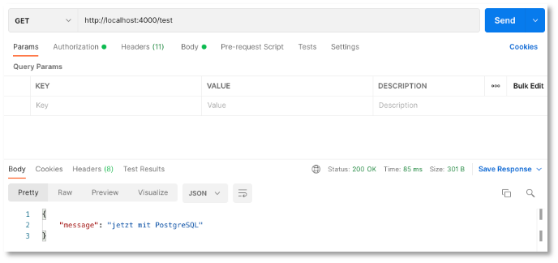

# REST-API (PostgreSQL)

Wir zeigen hier nochmal in schneller Zusammenfassung die Erstellung einer REST-API unter Verwendung von Node.js und Express. Dieses Mal wird als Datenbank jedoch PostgreSQL verwendet. 

## PostgreSQL

PostgreSQL können Sie sich selbst lokal [installieren](https://www.postgresql.org/download/) oder Sie nutzen den PostgreSQL-Server auf `ocean.f4.htw-berlin.de`. Das folgende Beispiel zeigt die Verwendung des Servers `ocean.f4.htw-berlin.de`. 

## Node.js und Express

Wir richten zunächst das Grundgerüst des Backends ein. 

1. Erstellen eines Node.js-Projektes `backend-pg`, Installieren von Express, dotenv, nodemon, cors

	```bash
	mkdir backend-postgresql
	cd backend-postgresql
	npm init
	npm install express 
	npm install nodemon --save-dev
	npm install dotenv 
	npm install cors 
	```

2. `package.json` anpassen (`"watch": "nodemon ./server.js",` einfügen und auf `"main": "server.js",` achten)

	```json linenums="1" hl_lines="5 7"
	{
	    "name": "backend-postgresql",
	    "version": "1.0.0",
	    "description": "",
	    "main": "server.js",
		  "scripts": {
		    "watch": "nodemon server.js",
		    "test": "echo \"Error: no test specified\" && exit 1"
		  },
		  "author": "J.Freiheit",
		  "license": "ISC",
		  "dependencies": {
		    "cors": "^2.8.5",
		    "dotenv": "^16.3.1",
		    "express": "^4.18.2"
		  },
		  "devDependencies": {
		    "nodemon": "^3.0.2"
		  }
	}
	```

3. `server.js` und `routes.js` erstellen

	=== "server.js"
		```js linenums="1"
		const express = require('express');
		const cors = require('cors');
		require('dotenv').config();
		const routes = require('./routes');

		const app = express();
		const PORT = 4000;

		app.use(express.json());
		app.use(cors());
		app.use('/', routes);

		app.listen(PORT, (error) => {
		    if (error) {
		        console.log(error);
		    } else {
		        console.log(`Server started and listening on port ${PORT} ...`);
		    }
		})
		```
	=== "routes.js"
		```js linenums="1"
		const express = require('express');
		const router = express.Router();

		// test
		router.get('/test', async(req, res) => {
		    res.send({ message: "jetzt mit PostgreSQL" });
		});

		module.exports = router;
		```

4. Backend starten (ist jetzt Port `4000`!) und `http://localhost:4000/test` aufrufen

	```bash
	npm run watch
	```

	


## PostgreSQL

Jetzt erstellen wir die Datenbank und binden sie an.

1. `ocean.f4.htw-berlin.de` aufrufen, als Name der Datenbank `members` eingeben und auf die `PostgreSQL`-Karte klicken

	

2. Modul `pg` installieren (siehe [hier](https://www.npmjs.com/package/pg)) sowie `.env` und `db.js` im Projektordner `backend-pg` erstellen:

	```bash
	npm i pg 
	```

	=== ".env"
		```js linenums="1"
		PGUSER=ihr_account_name
		PGHOST=psql.f4.htw-berlin.de
		PGPASSWORD=ihr_passwort
		PGDATABASE=members
		PGPORT=5432
		```
	=== "db.js"
		```js linenums="1"
		const pg = require('pg');

		const client = new pg.Client({
		    user: process.env.PGUSER,
		    host: process.env.PGHOST,
		    database: process.env.PGDATABASE,
		    password: process.env.PGPASSWORD,
		    port: process.env.PGPORT,
		});

		client.connect(err => {
		    if (err) {
		        console.log(err);
		    } else {
		        console.log('Connection to DB ...');
		    }
		});

		module.exports = client;
		```

3. Wir erstellen uns dieses Mal sogar ein Extra-Skript, um die die Datenbank mit Einträgen per Skript zu befüllen: Dazu erstellen wir eine Datei `initdb.js`, in der für die Datenbank eine Tabelle `members` erstellt und diese mit Einträgen befüllt wird. Da es recht aufwendig ist, sehr viele Einträge in die Datenbank mit dem `pg`-Modul zu schreiben, installieren wir noch ein zusätzliches Paket `pg-format`, mit dessen Hilfe es möglich ist, die vielen Werte als ein verschachteltes Array anzugeben. Informationen zu `pg-format` finden Sie [hier](https://www.npmjs.com/package/pg-format).

	```bash
	npm i pg-format 
	```

	=== "initdb.js"
		```js linenums="1"
		const express = require('express');
		const client = require('./db');
		const initdb = express.Router();
		const format = require('pg-format');


		initdb.get('/', async(req, res) => {

			// Anlegen der Tabelle members
		    let query = `
		            DROP TABLE IF EXISTS members;
		            CREATE TABLE members(id serial PRIMARY KEY, firstname VARCHAR(50), lastname VARCHAR(50), email VARCHAR(50));
		            `;

		    try {
		        await client.query(query)
		        console.log("Table created successfully ...")
		    } catch (err) {
		        console.log(err)
		    }

			// Befüllen der Tabelle members mit 50 Einträgen
		    const values = [
		        ["Catherine", "Williams", "cwilliamsl@360.cn"],
		        ["Adam", "Anderson", "aanderson8@google.fr"],
		        ["Susan", "Andrews", "sandrewsn@google.co.jp"],
		        ["Catherine", "Andrews", "candrewsp@noaa.gov"],
		        ["Alan", "Bradley", "abradley1c@globo.com"],
		        ["Anne", "Brooks", "abrooks16@bravesites.com"],
		        ["Russell", "Brown", "rbrownq@nifty.com"],
		        ["Ryan", "Burton", "rburton18@foxnews.com"],
		        ["Roy", "Campbell", "rcampbell1@geocities.com"],
		        ["Russell", "Campbell", "rcampbell17@eventbrite.com"],
		        ["Bonnie", "Coleman", "bcoleman11@fc2.com"],
		        ["Ernest", "Coleman", "ecoleman15@businessweek.com"],
		        ["Richard", "Cruz", "rcruz7@unc.edu"],
		        ["Sean", "Cruz", "scruz10@answers.com"],
		        ["Rebecca", "Cunningham", "rcunninghamd@mac.com"],
		        ["Margaret", "Evans", "mevansh@pcworld.com"],
		        ["Jeffrey", "Ford", "jford14@cnet.com"],
		        ["Andrea", "Gardner", "agardnerv@woothemes.com"],
		        ["Deborah", "George", "dgeorge6@furl.net"],
		        ["Sean", "Gibson", "sgibsony@alexa.com"],
		        ["Virginia", "Graham", "vgrahamk@aol.com"],
		        ["Steven", "Hamilton", "shamiltonu@state.tx.us"],
		        ["Virginia", "Hawkins", "vhawkinsf@ehow.com"],
		        ["Edward", "Hicks", "ehicksc@pcworld.com"],
		        ["Mark", "Johnson", "mjohnsonj@hostgator.com"],
		        ["Ruth", "Jordan", "rjordan1a@smugmug.com"],
		        ["Antonio", "Kim", "akim4@odnoklassniki.ru"],
		        ["Jennifer", "Marshall", "jmarshallt@gnu.org"],
		        ["Eric", "Matthews", "ematthews5@independent.co.uk"],
		        ["Raymond", "Mcdonald", "rmcdonald2@ihg.com"],
		        ["Eric", "Miller", "emillere@creativecommons.org"],
		        ["Jonathan", "Morales", "jmoralesa@ovh.net"],
		        ["Marie", "Morgan", "mmorganb@cloudflare.com"],
		        ["Amanda", "Nelson", "anelson13@indiatimes.com"],
		        ["Lisa", "Olson", "lolsonr@telegraph.co.uk"],
		        ["Alice", "Ortiz", "aortizw@histats.com"],
		        ["Peter", "Phillips", "pphillipss@1688.com"],
		        ["Matthew", "Porter", "mporter9@europa.eu"],
		        ["Tammy", "Ray", "trayx@weather.com"],
		        ["Mark", "Richardson", "mrichardson1d@ihg.com"],
		        ["Joan", "Roberts", "jroberts12@alibaba.com"],
		        ["Kathleen", "Rose", "kroseg@pinterest.com"],
		        ["Steve", "Sanders", "ssanders1b@wikispaces.com"],
		        ["Shirley", "Scott", "sscottm@macromedia.com"],
		        ["Lillian", "Stephens", "lstephens19@hugedomains.com"],
		        ["Nicole", "Thompson", "nthompson3@admin.ch"],
		        ["Marie", "Thompson", "mthompsonz@yelp.com"],
		        ["Alan", "Vasquez", "avasquezo@miibeian.gov.cn"],
		        ["Mildred", "Watkins", "mwatkins0@miibeian.gov.cn"],
		        ["Eugene", "Williams", "ewilliamsi@deliciousdays.com"]
		    ];
		    // hierfuer muss pg-format installiert werden (wegen %L):
		    const paramquery = format('INSERT INTO members(firstname, lastname, email) VALUES %L RETURNING *', values);


		    try {
		        const result = await client.query(paramquery)
		        console.log("50 members inserted ...")
		        res.status(200)
		        res.send(result.rows)
		    } catch (err) {
		        console.log(err)
		    }

		});


		module.exports = initdb;
		```

	Das Skript enthält zwei Anfragen an die Datenbank. Zunächst wird die Tabelle `members` gelöscht, falls sie existiert und dann erstellt. Das Ausführen dieser Anfrage erfolgt in Zeile `16`. Danach werden in einer zweiten Anfrage 50 Einträge in diese Tabelle eingefügt. Die Anfrage wird in Zeile `75` mithilfe des `pg-format`-Paketes formatiert (`format()`-Methode). Dadurch ist in dem Anfragestring der Platzhalter `%L` möglich, in den dann das verschachtelte Array `values` eingesetzt werden kann. Dadurch wird das Einfügen vieler Datensätze erleichtert.

	Das Skript `initdb.js` wird in der `server.js` verwendet. Unter der Route `/init` wird es ausgeführt und alle Datensätze in die Datenbank eingetragen. 

	=== "server.js"
		```js linenums="1" hl_lines="5 12"
		const express = require('express');
		const cors = require('cors');
		require('dotenv').config();
		const routes = require('./routes');
		const init = require('./initdb');

		const app = express();
		const PORT = 4000;

		app.use(express.json());
		app.use(cors());
		app.use('/init', init);
		app.use('/', routes);


		app.listen(PORT, (error) => {
		    if (error) {
		        console.log(error);
		    } else {
		        console.log(`Server started and listening on port ${PORT} ...`);
		    }
		})
		```

	Wenn wir nun `http://localhost:4000/init` aufrufen, wird die Datenbank automatisch befüllt. 

### CRUD-Funktionen

Nun fügen wir in die `routes.js` die einzelnen Routen ein, um die CRUD-Funktionen zu implementieren. Wir zeigen zunächst die `routes.js` vollständig und diskutieren dann einige Aspekte:


=== "routes.js"
	```js linenums="1"
	const express = require('express');
	const client = require('./db');
	const router = express.Router();

	// get all members
	router.get('/members', async(req, res) => {
	    const query = `SELECT * FROM members `;

	    try {
	        const result = await client.query(query)
	        console.log(result)
	        res.send(result.rows);
	    } catch (err) {
	        console.log(err.stack)
	    }
	});

	// post one member
	router.post('/members', async(req, res) => {
	    let firstname = (req.body.firstname) ? req.body.firstname : null;
	    let lastname = (req.body.lastname) ? req.body.lastname : null;
	    let email = (req.body.email) ? req.body.email : null;

	    const query = `INSERT INTO members(firstname, lastname, email) VALUES ($1, $2, $3) RETURNING *`;

	    try {
	        const result = await client.query(query, [firstname, lastname, email])
	        console.log(res)
	        res.send(result.rows[0]);
	    } catch (err) {
	        console.log(err.stack)
	    }
	});

	// get one member via id
	router.get('/members/:id', async(req, res) => {
	    const query = `SELECT * FROM members WHERE id=$1`;

	    try {
	        const id = req.params.id;
	        const result = await client.query(query, [id])
	        console.log(result)
	        if (result.rowCount == 1)
	            res.send(result.rows[0]);
	        else
	            res.send({ message: "No member found with id=" + id });
	    } catch (err) {
	        console.log("error", err.stack)
	    }
	});

	// update one member
	router.put('/members/:id', async(req, res) => {
	    const query = `SELECT * FROM members WHERE id=$1`;

	    let id = req.params.id;
	    const result = await client.query(query, [id])
	    if(result.rowCount > 0)
	    {
	        let member = result.rows[0];
	        let firstname = (req.body.firstname) ? req.body.firstname : member.firstname;
	        let lastname = (req.body.lastname) ? req.body.lastname : member.lastname;
	        let email = (req.body.email) ? req.body.email : member.email;

	        const updatequery = `UPDATE members SET 
	            firstname = $1, 
	            lastname = $2,
	            email = $3
	            WHERE id=$4;`;
	        const updateresult = await client.query(updatequery, [firstname, lastname, email, id]);
	        console.log(updateresult)
	        res.send({ id, firstname, lastname, email });
	    } else {
	        res.status(404)
	        res.send({
	            error: "Member with id=" + id + " does not exist!"
	        })
	    }
	});
	

	// delete one member via id
	router.delete('/members/:id', async(req, res) => {
	    const query = `DELETE FROM members WHERE id=$1`;

	    try {
	        const id = req.params.id;
	        const result = await client.query(query, [id])
	        console.log(result)
	        if (result.rowCount == 1)
	            res.send({ message: "Member with id=" + id + " deleted" });
	        else
	            res.send({ message: "No member found with id=" + id });
	    } catch (err) {
	        console.log(err.stack)
	    }
	});


	module.exports = router;
	```


Das generelle Prinzip der Anfragen wird für `post /members` deutlich (Zeilen `18-33`). Wir definieren uns eine *parametrisierte SQL-Anfrage*: 

```js
const query = `INSERT INTO members(firstname, lastname, email) VALUES ($1, $2, $3) RETURNING *`;
```

In die Parameter `$1`, `$2` und `$3` werden dann die entsprechenden Werte eingetragen:

```js
const result = await client.query(query, [firstname, lastname, email]);
```

Wichtig ist, dass die Werte als Array übergeben werden. Der Funktion `query()` wird also die parametrisierte Anfrage übergeben und als zweiter Parameter folgt das Array mit den Werten, die in die Parameter eingesetzt werden. 

### Postman

Beachten Sie, dass wir im Unterschied zum Backend mit MongoDB hier die Schlüssel 

- `firstname`,
- `lastname` und
- `email` 

verwendet haben. Einer `POST`-Anfrage müsste deshalb dem `body` beispielsweise folgendes Objekt übergeben werden: 

```json
{
    "firstname": "Ada",
    "lastname": "Lovelace",
    "email": "ada@lovelace.uk"
}
```

Beachten Sie auch, dass in `server.js` der Port auf den Wert `4000` gesetzt wurde. 

!!! success
	Wir haben nun auch ein Backend, das auf die PostgreSQL zugreift, die Sie auch in der Datenbankvorlesung verwenden. Sie benötigen also keine eigene Installation der PostgreSQL. Ansonsten ist die Struktur und das Konzept des Backends genau das Gleiche wie beim Backend über die MongoDB. Wir haben hier nur auch noch für die Befüllung der Datenbank per Skript gesorgt. Das Backend für die MongoDB ließe sich ebenso entsprechend erweitern. 
