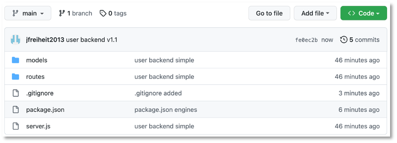

# Deployment

Das in [RxJS und Gurads](../guards/#subject-observable-observer-und-guards) erstellte Projekt zur einfachen Nutzerverwaltung soll hier deployed werden. Wir werden unterschiedliche Möglichkeiten des Deployments zeigen. Wichtig ist, dass wir das Frontend und das Backend jeweils unabhängig voneinander deployen. 

## Backend-Deployment mittels Render

Lange hatte [Heroku](https://www.heroku.com) ist eine kostenfreie cloud-basierte Plattform zum Betrieb von Applikationen bereitgestellt. Leider ist diese nun nicht mehr (ganz) kostenfrei. Insbesondere müssen Sie nun, selbst bei kostenfreier Nutzung von [Heroku](https://www.heroku.com) eine Zahlungsmethode hinterlegen. Dasselbe gilt für die [AWS Cloud](https://aws.amazon.com/de/). Damit entfallen diese Möglichkeiten für uns. Aber es gibt [Render](https://render.com/) und dort ist zum Glück die kostenfreie Nutzung (auch ohne Zahlungsmittel zu hinterlegen) möglich. Allerdings muss man sich registrieren, kann dafür aber auch den GitHub-Account (oder GitLab oder Google) nutzen. Nach dem Einloggen in Render erscheint folgendes Dashboard:


### Eigenes Backend-Repository 

Wichtig ist, dass Sie Ihr Backend in einem eigenen Repository haben, damit Sie explizit auf das Backend verweisen können. Das heißt, Ihr Repository auf Github (Sie können auch GitLab wählen) sollte ungefähr so aussehen:



Achten Sie darauf, dass Sie `.env`, `/node_modules` und `package-lock.json` in die `.gitignore` eingetragen haben. Sollten Sie z.B. die `.env`-Datei `committed` haben, ehe Sie sie in die `.gitignore` eingetragen hatten, können Sie sie mit `git rm --cached .env` aus dem Git-Tracking entfernen. 

Klicken Sie nun im Render-Dashboard in der Karte `Web Services` auf den Button `New Web Service`. Es erscheint ein Formular `Create a new Web Service`. Tragen Sie in das Eingabefeld unter `Public Git repository` die URL zu Ihrem Repository ein, z.B. so:


Klicken Sie auf `Continue`. Füllen Sie das folgende Formular aus, z.B. so:


Als `Build command` können Sie ruhig `yarn` lassen. Wählen Sie als `Instance Type` `Free` und klicken unten auf `Create Web Service`. Es kommen noch Fehler, da Sie noch keine `Environment`-Variablen gesetzt haben (die ja in der `.env`-Datei stehen, die nicht in Github hochgeladen wurde) . Fügen Sie deshalb unter `Environment` die Umgebungsvariablen aus der `.env`-Datei hinzu oder laden Sie dort Ihre `.env`-Datei hoch:


Sie können dann jederzeit `Manual Deploy` auswählen und darin `Clear build cache & deploy`. Prinzipiell sollte der Build-Prozess dann durchlaufen, allerdings endet er mit 

```bash
Server started and listening on port 3000 ...
```

und nicht mit der Ausgabe, dass sich auch mit der MongoDB im Cloud-Atlas verbunden wurde. Dazu sind zunächst weitere Schritte notwendig. 

### MongoDB Cloud Atlas vorbereiten

Wenn Sie [MongoDB Atlas](https://www.mongodb.com/atlas/database) verwenden, dann muss für diese ein *App Service* als eine *Github Application* installiert werden. Loggen Sie sich dazu in der Webanwendung von MongoDB Atlas ein und wählen Sie für Ihren *cluster* unter `Manage` den Menüeintrag `Deployment`:


Klicken Sie auf den Link `Install App Services on GitHub` unter Schritt `1` der Anleitung. Es öffnet sich ein GitHub-Tab im Browser und Sie können auswählen, dass für Ihre Repositories der `MongoDB Atlas App Service` installiert werden soll. 


Nach Auswahl erscheint


Wechseln Sie zurück in das *Render-Dashboard* und geben Sie dort nun auch noch die Umgebungsvariablen `username` und `password` an. Die Werte dazu können Sie der `DB_CONNECTION`-URL entnehmen, also `mongodb+srv://<username>:<password>@cluster0.g3nbd.mongodb.net`. Wenn Sie nun erneut `Manual Deploy` auswählen und darin `Clear build cache & deploy`, dann erscheint

```bash
Server started and listening on port 3000 ...
connected to DB
```

und die Verbindung zu MongoDB Atlas wurde hergestllt. Die URL des Backends finden Sie links oben im Render-Dashboard:


In diesem Fall aus der Abbildung also `https://userbackend-cvf9.onrender.com`. Nun können wir beispielsweise mithilfe von Postman alle Endpunkte probieren, also z.B. `GET https://userbackend-cvf9.onrender.com/users`:


wenn bereits Daten in der Datenbank enthalten sind. 

Das Backend wird übrigens immer neu deployed, sobald neue Daten in das GitHub-Repo committed und gepusht wurden, da oben in den Einstellungen des Deployments `Auto-Deploy` auf `Yes` gesetzt wurde. 

Wurden 30 Minuten keine Requests an das Backend geschickt, schickt *Render* die Anwendung in den Schlafmodus. Es dauert dann eine Weile, ehe ein weiterer Request beantwortet wird. 

Ähnlich (fast genauso) wie bei Render funktioniert der gesamte Deployment-Prozess auch mit [Railway](https://railway.app/). Eine detaillierte Beschreibung dazu finden Sie [hier](https://developer.mozilla.org/en-US/docs/Learn/Server-side/Express_Nodejs/deployment).


## Frontend-Deployment als GitHub-Pages

Prinzipiell wird ein Angular-Projekt mithilfe des Befehls

```bash
ng build
```

deployed. Dadurch entsteht im Projektordner ein Ordern `dist/<projektname>`. Dieser Ordner enthält die `index.html` sowe einige `.js`-Dateien und eine `css`-Datei. Es handelt sich nun um eine statisches Projekt, welches einfach durch den Aufruf der `index.html` gestartet werden könnte, wenn nicht aufgrund der *CORS policy* das Laden der `.js`-Datein unterbunden wäre. Außerdem müssen wir noch beachten, dass der Zugriff auf das Backend immer mit `localhost:3000` (oder einer leicht abweichenden `baseURL`) implementiert wurde. Dies muss ebenfalls angepasst werden. 


### Eigenes Frontend-Repository 

Wichtig ist, dass Sie Ihr Frontend in einem eigenen Repository haben, damit Sie explizit auf das Frontend verweisen und dieses separat deployen können. Wenn Sie Ihr Angular-Projekt mithilfe der Angular CLI (also mithilfe von `ng new `) erstellen, dann wird auch automatisch ein `.git`-Ordner angelegt, d.h. das Projekt ist unter Git-Verwaltung. Sie müssen dann nur noch ein GitHub-Repository (am besten, ohne dort bereits eine `Readme.md`-Datei anzulegen, sonst haben Sie gleich einen Konflikt) erstellen und das Projekt-Repo mit dem Github-repo verbinden. Wie das geht, steht dann bereits auf der ersten Seite in GitHub sobald Sie das Repo dort erstellt haben. Die `.gitignore`-Datei ist durch die Angular CLI ebenfalls bereits gut configuriert. 


### Angular-Projekt Environments

Derzeit haben wir nur die `development`-Environment von Angular verwendet und z.B. als `baseURL` für den Zugriff auf das Backend `localhost:3000` o.ä. angegeben. Wir wollen nun unterscheiden, ob wir noch in der Entwicklung oder bereits in der Produktion sind. Dazu konfigurieren wir eine *Environment* für unser Projekt. Im Angular-Projekt geben wir ins Terminal dazu 

```bash
ng generate environments
```

ein. Sollte die Eingabe einen Fehler erzeugen, dann ist Ihre Angular CLI zu alt. Sie sollten dann `ng update @angular/cli @angular/core` ausführen. Danach klappt `ng generate environments`. 

Es wird ein Ordner `/src/environments` erstellt, in dem zunächst 2 Datein sind `environment.development.ts` und `environment.ts`. Sie können diesem Ordner weitere Dateien hinzufügen, wenn Sie weitere Umgebungen konfigurieren wollen. Wir belassen es bei diesen beiden Dateien, da wir in der `environment.development.ts` die Entwicklungsumgebung beschreiben können und in der `environment.ts` die Produktionsumgebung. 

Die beiden Datein konfigurieren wir zunächst so:

=== "environment.ts"
	```js
	export const environment = {
	  production: true,
	  apiUrl: 'https://userbackend-cvf9.onrender.com'
	};
	```
=== "environment.development.ts"
	```js
	export const environment = {
	  production: false,
	  apiUrl: 'http://localhost:3000'
	};
	```

Nun binden wir die `environment.ts` in unseren Service ein, in dem wir die `apiUrl` nutzen wollen:

=== "auth.service.ts"
```js linenums="1" hl_lines="5 11"
import { HttpClient } from '@angular/common/http';
import { Injectable } from '@angular/core';
import { Observable, Subject } from 'rxjs';
import { User } from './user';
import { environment } from '../../environments/environment';

@Injectable({
  providedIn: 'root'
})
export class AuthService {
  baseUrl = environment.apiUrl;
  user: User = {username: '', password: '', email: '', role: ''};
  userChange: Subject<User> = new Subject<User>();
  loggedIn = false;
  loggedInChange: Subject<boolean> = new Subject<boolean>();

  constructor(private http: HttpClient) {
    this.loggedInChange.subscribe((value) => {
            this.loggedIn = value
    });
    this.userChange.subscribe((value) => {
            this.user = value
    });
  }

  getAllUsers(): Observable<User[]>{
    return this.http.get<User[]>(this.baseUrl + '/users');
  }

  getOneUser(username: string): Observable<User>{
    return this.http.get<User>(this.baseUrl + '/users/' + username);
  }

  registerUser(user:User): Observable<any> {
    return this.http.post(this.baseUrl + '/users/register', user);
  }

  loginUser(username: string, password: string ): Observable<any>{
    return this.http.post(this.baseUrl + '/users/login/', { username: username, password: password }, {observe: 'response'});
  }

  isLoggedin(): boolean {
    return this.loggedIn;
  }

  login(user: User): void {
    this.loggedIn = true
    this.loggedInChange.next(this.loggedIn);
    this.user = user;
    this.userChange.next(this.user);
    console.log('login() : ', this.user);
  }

  logout(): void {
    this.loggedIn = false;
    this.loggedInChange.next(this.loggedIn);
    this.user = {username: '', password: '', email: '', role: ''};
    this.userChange.next(this.user);
  }

  isAdmin(): boolean {
    if(this.user?.role === 'admin')
    {
      return true;
    }
    return false;
  }

  isUser(): boolean {
    if(this.user?.role === 'user')
    {
      return true;
    }
    return false;
  }
}
```

Wenn nun `ng build` ausgeführt wird, dann wird die `environment.ts` importiert und der dort hinterlegte Wert für die `apiUrl` verwendet. Wenn wir jedoch `ng build --watch --configuration development` ausführen, dann soll die `environment.development.ts` verwendet werden. Dazu erweitern wir die `package.json` um ein `fileReplacement`. Darin geben wir an, dass für die `configuration development` die Datei `environment.ts` durch die `environment.development.ts` ersetzt werden soll. 

=== "package.json"
```json linenums="1" hl_lines="40-49"
{
  "name": "frontend",
  "version": "0.0.0",
  "scripts": {
    "ng": "ng",
    "start": "ng serve",
    "build": "ng build",
    "watch": "ng build --watch --configuration development",
    "test": "ng test"
  },
  "private": true,
  "dependencies": {
    "@angular/animations": "^15.1.1",
    "@angular/cdk": "^15.0.4",
    "@angular/common": "^15.1.1",
    "@angular/compiler": "^15.1.1",
    "@angular/core": "^15.1.1",
    "@angular/forms": "^15.1.1",
    "@angular/material": "^15.0.4",
    "@angular/platform-browser": "^15.1.1",
    "@angular/platform-browser-dynamic": "^15.1.1",
    "@angular/router": "^15.1.1",
    "rxjs": "~7.5.0",
    "tslib": "^2.3.0",
    "zone.js": "~0.12.0"
  },
  "devDependencies": {
    "@angular-devkit/build-angular": "^15.1.2",
    "@angular/cli": "~15.1.2",
    "@angular/compiler-cli": "^15.1.1",
    "@types/jasmine": "~4.3.0",
    "jasmine-core": "~4.5.0",
    "karma": "~6.4.0",
    "karma-chrome-launcher": "~3.1.0",
    "karma-coverage": "~2.2.0",
    "karma-jasmine": "~5.1.0",
    "karma-jasmine-html-reporter": "~2.0.0",
    "typescript": "~4.8.2"
  },
  "configurations": {
  "development": {
    "fileReplacements": [
        {
          "replace": "src/environments/environment.ts",
          "with": "src/environments/environment.development.ts"
        }
      ]
    }
  }
}
```

Wenn wir nun das Projekt mithilfe von `ng build --watch --configuration development` compilieren, dann werden alle notwendigen Dateien in den `dist/<projektname>` Ordner übersetzt. Schauen wir uns dort die `main.js` an, dann finden wir 

=== "<projektordner>/dist/<projektname>/main.js"
	```js linenums="1173"
	/***/ 2340:
	/*!*****************************************!*\
	  !*** ./src/environments/environment.ts ***!
	  \*****************************************/
	/***/ ((__unused_webpack_module, __webpack_exports__, __webpack_require__) => {

	__webpack_require__.r(__webpack_exports__);
	/* harmony export */ __webpack_require__.d(__webpack_exports__, {
	/* harmony export */   "environment": () => (/* binding */ environment)
	/* harmony export */ });
	const environment = {
	  production: false,
	  apiUrl: 'http://localhost:3000'
	};

	/***/ }),
	```

Wenn wir aber das Projekt mithilfe von `ng build` compilieren, dann werden ebenfalls alle notwendigen Dateien in den `dist/<projektname>` Ordner übersetzt. Dann steht dort in der `main.js` aber

=== "<projektordner>/dist/<projektname>/main.js"
	```js linenums="1173"
	/***/ 2340:
	/*!*****************************************!*\
	  !*** ./src/environments/environment.ts ***!
	  \*****************************************/
	/***/ ((__unused_webpack_module, __webpack_exports__, __webpack_require__) => {

	__webpack_require__.r(__webpack_exports__);
	/* harmony export */ __webpack_require__.d(__webpack_exports__, {
	/* harmony export */   "environment": () => (/* binding */ environment)
	/* harmony export */ });
	const environment = {
	  production: true,
	  apiUrl: 'hhttps://userbackend-cvf9.onrender.com'
	};

	/***/ }),
	```


### Deployment bei Vercel

Das Deployment des Angular-Projektes ist dann sehr einfach. Committen und pushen Sie Ihr Projekt nach Github. Loggen Sie sich mit Ihrem Github-Account bei [Vercel](https://vercel.com/) ein. Verbinden Sie Ihr Repository mit Vercel, installieren Sie die *Vercel App* bei Github und voilà: hier erreichbar unter `https://userfrontend-one.vercel.app/`:


mit allen (CRUD-)Funktionalitäten. Sowohl Backend als auch Frontend sind nun permanent und für alle verfügbar. Detaillierte Informationen zum Deployment von Angular Projekten finden Sie [hier](https://angular.io/guide/build) und [hier](https://angular.io/guide/deployment).


!!! success
	Wir haben unsere Webanwendung nun permanent und öffentlich verfügbar gemacht. Das Backend und das Frontend wurden jeweils deployed und werden von einem öffentlichen Dienst betrieben. 


