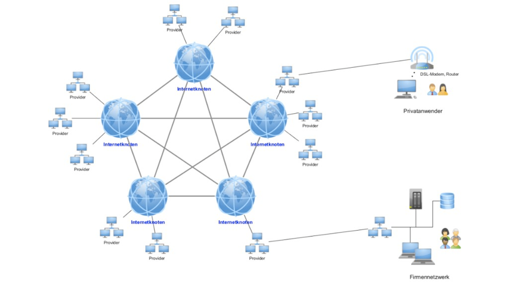
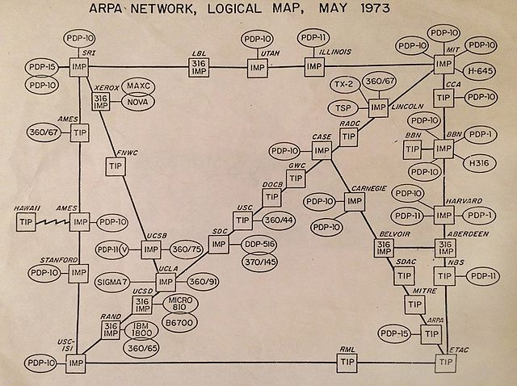
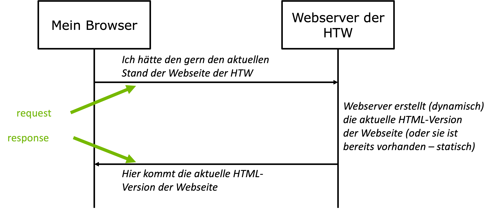
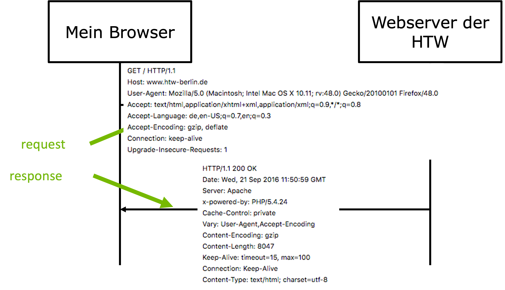
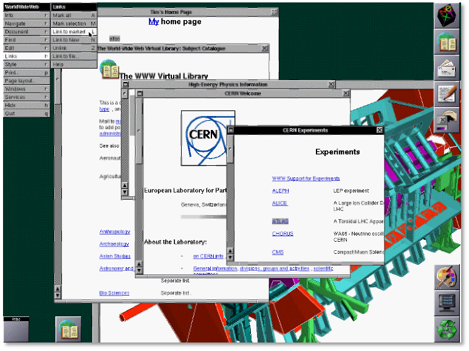

# Webtechnologien - Einführung

Als ein wesentlicher Begründer des World Wide Webs gilt [Tim Berners Lee](https://de.wikipedia.org/wiki/Tim_Berners-Lee). Er begann 1989 mit einem Projekt, dessen Ergebnisse 

- der erste Browser,
- der erste Webserver,
- HTTP und 
- HTML

waren. Hier werden die wesentlichen Begriffe erläutert, die bei den Webtechnologien eine Rolle spielen.  

### Internet

Das Internet ist ein **Netzwerk von Rechnernetzen** (*Interconnected Network - InterNet*). Es handelt sich also um miteinander verbundene Rechnernetze. 



Das Internet ist aus dem *ARPANET* (*Advanced Research Projects Agency Network*) entstanden, welches Ende der 1960er Jahre am MIT und im US-Verteidigungsministerium entwickelt wurde. Die folgende Abbildung zeigt das komplette ARPANET im Jahre 1973:



Die erste Datenübertragung im ARPANET erfolgte 1969. Zwei wesentliche Konzepte wurden dafür (im Laufe der folgenden Jahre) entwickelt:

- die eindeutige Adressierbarkeit der einzelnen Rechner im ARPANET/Internet und
- das Transportprotokolle, das die Datenübertragung (in Datenpaketen) ermöglichte.

Es entstand eine Internetprotokollfamilie: das *Internet Protocol* (*IP*).


### Internet Protocol

Das Internet Protocol ist im OSI-Schichtenmodell die erste Schicht, die unabhängig vom eigentlichen Übetragungsmedium ist. Ein wesentlicher Teil der Definition des Internet Protocols nehmen die *IP-Adressen* ein. Die IP-Adressen des Internet Protocols Version 4 (*v4*) bestehen aus 32 Bits und sind in 4 Blöcke unterteilt, die durch einen Punkt getrennt sind. In Dezimaldarstellung kann jeder dieser vier Blöcke die Werte von `0` bis `255` annehmen. Eine IP-Adresse der HTW sieht z.B. so aus:

```bash
141.45.66.214
```

Die ersten drei Zahlenblöcke bilden den *Netzanteil* und der letzte Zahlenblock gibt den *Hostanteil* an. Die Aufteilung dieser Anteile kann allerdings durch eine *Subnetzmaske* festgelegt bzw. geändert werden. Die genannte Aufteilung gilt für eine Subnetzmaske `255.244.255.0`. 

Die Kommunikation zwischen den Teilnetzen erfolgt über einen *Router*. Unter Verwendung von IPv4 lassen sich `2^32 = 256^4 = 4.294.967.296` Adressen unterscheiden. Da die Anzahl der Rechner, die mit dem Internet verbunden sind, in den vergangenen Jahren enorm gestiegen ist und weitere Geräte (siehe *Internet of Things*) hinzukommen werden, reicht dieser Adressraum nicht mehr aus und es wurde *IPv6* spezifiziert, in dem 128 Bit zur Adressierung verwendet werden und somit `2^128` Adressen zur Verfügung stehen. Das genügt erstmal (*Diese Anzahl reicht aus, um für jeden Quadratmillimeter der Erdoberfläche mindestens 665.570.793.348.866.944 (= 6,65 · 10^17) IP-Adressen bereitzustellen* [Wikipedia](https://de.wikipedia.org/wiki/IP-Adresse#cite_note-2)).

Die Übertragung der Datenpakete zwischen zwei *Hosts* (Rechner mit jeweiliger IP-Adresse) wird auf der Transportschicht durch das *Transmission Control Protocol* (*TCP*) geregelt. Dabei kommunizieren die beiden sich verbindenden Rechner im *Vollduplex*, d.h. beide Rechner können sowohl Daten empfangen als auch senden. Die herstellung der Verbindung zwischen den beiden Rechnern erfogt über einen *Handshake*. Die jeweiligen Datenpakete bestehen aus einem *Header* und den eigentlichen *Daten*. Ein Paket wird so oft gesendet, bis der Empfang bestätigt wurde. *TCP* wird als Transportprotokoll für viele *Internet-Dienste* verwendet, z.B. für WWW und für E-Mail. Dabei darf das Transportprotokoll (Transportschicht) nicht mit einem Protokoll der Anwendungsschicht (ist über der Transportschicht) verwechselt werden. Das HTTP (Anwendungsschicht) nutzt TCP genauso wie SMTP. 

### Internet-Dienste

Das Internet (der Verbund aus Rechnernetzen) stellt zusammen mit dem Internet Protocol eine Infrastruktur für verschiedene *Dienste* zur Verfügung. Dienste stellen Möglichkeiten dar, das Internet zu nutzen. Zu solchen Diensten gehören z.B. (in Klammern die verwendteen Protokolle):

- E-Mail ([SMTP](https://de.wikipedia.org/wiki/Simple_Mail_Transfer_Protocol), [POP3](https://de.wikipedia.org/wiki/Post_Office_Protocol), [IMAP](https://de.wikipedia.org/wiki/Internet_Message_Access_Protocol)), 
- File Transfer ([FTP](https://de.wikipedia.org/wiki/File_Transfer_Protocol)), 
- World Wide Web ([HTTP](https://de.wikipedia.org/wiki/Hypertext_Transfer_Protocol), [HTTPS](https://de.wikipedia.org/wiki/Hypertext_Transfer_Protocol_Secure)),
- Secure Shell ([SSH](https://de.wikipedia.org/wiki/Secure_Shell)),
- Namensauflösung ([DNS](https://de.wikipedia.org/wiki/Domain_Name_System)),
- Internet-Telefonie (VoIP), Video-Chat, Video on Demand usw. 

Das WWW ist also ein **Dienst** für die Infrastruktur Internet! Die beiden Begriffe werden häufig fälschlicherweise synonym verwendet.

### Hypertext Transfer Protocol (HTTP)

Das *Hypertext Transfer Protocol* ist ein Protokoll der Anwendungsschicht, aufbauend auf das TCP der Transportschicht. Es wird verwendet, um Daten von einem Rechner (dem *Webserver*) auf einen anderen Rechner (dem *Client* mit einem *Webbrowser*) zu übetragen (und vice versa). Es wurde von Tim Berners Lee entwickelt und nun vom *World Wide Web Consortium ([W3C](https://www.w3.org/))* standardisiert. Es unterscheidet nur wenige Anfragemethoden (folgende Liste nicht ganz vollständig):

- `GET`: fragt eine Ressource (Daten/Datei) von einem Webserver an,
- `POST`: schickt Daten vom Client an den Webserver, 
- `PUT`: schickt ebenfalls Daten an den Webserver, typischerweise, um Ressourcen zu aktualisieren, 
- `DELETE`: schickt Daten an den Server, um sie dort zu löschen. 

Die wichtigste Anfragemethode ist `GET`, denn sie wird in den allermeisten Fällen verwendet, um eine Webseite von einem Webserver anzufragen. Wenn wir in die Konsole bspw. 

```
curl https://www.htw-berlin.de/
```

eingeben, dann erhalten wir vom Webserver der HTW die Webseite der HTW. Für `curl` siehe [hier](../tools/#curl). Typischerweise werden die Anfragen an den Webserver aber von einem Browser aus durchgeführt. Das heißt, die Anfrage `GET https://www.htw-berlin.de/` wird von einem Browser durchgeführt, wenn wir in das URL-Eingabefeld `https://www.htw-berlin.de/` eingeben. Das prinzipielle Szenario ist also wie folgt:

 

Der *request* beginnt mit einer der obigen Anfragemethoden und der angefragten Ressource (also z.B. `GET https://www.htw-berlin.de/index.html`). Die *response* besteht dann genau aus der angefragten Ressource (`index.html`), wenn sie existiert. Die Ressource muss nicht zwingend eine `html`-Seite sein, es kann sich auch um eine `xml`, `json` oder irgendein anderes Dateiformat handeln. 

Ein konkreter *request* und eine konkrete *response* ist im folgenden Bild zu sehen:

 

In der *response* wird ein sogenannter *HTTP-Statuscode* mitgesendet. Die folgende Tabelle gibt einen kurzen Überblick über diese Codes (siehe auch [hier](https://developer.mozilla.org/en-US/docs/Web/HTTP/Status)):

<table>
	<thead>
		<tr>
			<th>Methode</th>
			<th>Beschreibung</th>
		</tr>
	</thead>
	<tbody>
		<tr>
			<td><code>1xx</code></td>
			<td>Verarbeitung des Requests dauert noch an. (Seltene) Rückmeldung, um Abbruch durch Zeitüberschreitung zu verhindern.
			</td>
		</tr>
		<tr>
			<td><code>2xx</code></td>
			<td>Erfolgreiche Bearbeitung der Anfrage und Rückmeldung. <br/>
				<code>200 OK</code>
			</td>
		</tr>
		<tr>
			<td><code>3xx</code></td>
			<td>Angeforderte Ressource wurde verschoben (Umleitung). <br/>
				<code>301 Moved Permanently</code>
			</td>
		</tr>
		<tr>
			<td><code>4xx</code></td>
			<td>Client-Fehler. Z.B. Request auf ein Dokument, das nicht existiert. <br/>
				<code>404 Not Found</code>
			</td>
		</tr>
		<tr>
			<td><code>5xx</code></td>
			<td>Server-Fehler. Z.B. Server kann Anfrage nicht bearbeiten. <br/>
				<code>500 Internal Server Error</code>
			</td>
		</tr>
	</tbody>
</table>

Ganz wichtig ist, dass das HTTProtokoll **zustandslos** ist. Das bedeutet, dass keine Informationen aus früheren Anfragen gespeichert oder anderweitig verwaltet werden. Das bedeutet aber auch, dass bspw. ein befüllter Warenkorb durch HTTP gar nicht unterstützt würde (fühere "Käufe" können durch das Protokoll nicht berücksichtigt werden). Um dieses Zustandslosigkeit zu umgehen, werden z.B. *Cookies* oder *Session-IDs* verwendet, um eine Historie der Anfragen beim Webserver erstellen und den Nutzern zuordnen zu können. 

*HTTPS* funktioniert wie HTTP, nur dass die Verbindung zwischen Browser und Webserver mittels *Transport Layer Security* ([TLS](https://de.wikipedia.org/wiki/Transport_Layer_Security)) verschlüsselt wird. 

Ein Programm, welches das HTTProtokoll implementiert hat, ist [Curl](../tools/#curl). Wenn Sie Curl installiert haben und im Terminal bspw. 

```bash
curl -v http://freiheit.f4.htw-berlin.de/WT/index.html
```

eingeben (`-v` steht für den `verbose`-Modus), dann erhalten Sie

```bash
*   Trying 141.45.146.146...
* TCP_NODELAY set
* Connected to freiheit.f4.htw-berlin.de (141.45.146.146) port 80 (#0)
> GET /WT/index.html HTTP/1.1
> Host: freiheit.f4.htw-berlin.de
> User-Agent: curl/7.64.1
> Accept: */*
> 
< HTTP/1.1 301 Moved Permanently
< Date: Fri, 08 Oct 2021 06:35:13 GMT
< Server: Apache/2.4.38 (Debian)
< Location: https://freiheit.f4.htw-berlin.de/WT/index.html
< Content-Length: 346
< Content-Type: text/html; charset=iso-8859-1
< 
<!DOCTYPE HTML PUBLIC "-//IETF//DTD HTML 2.0//EN">
<html><head>
<title>301 Moved Permanently</title>
</head><body>
<h1>Moved Permanently</h1>
<p>The document has moved <a href="https://freiheit.f4.htw-berlin.de/WT/index.html">here</a>.</p>
<hr>
<address>Apache/2.4.38 (Debian) Server at freiheit.f4.htw-berlin.de Port 80</address>
</body></html>
* Connection #0 to host freiheit.f4.htw-berlin.de left intact
* Closing connection 0
```

Sie erhalten also die Meldung vom Webserver, dass die Seite `index.html` nicht mehr unter dieser Adresse verfügbar ist, sondern wegbewegt wurde (`Moved permanently`). Der Statuscode der Antwort ist `301`. Das ist anders, wenn die Anfrage an die Ressource `https://freiheit.f4.htw-berlin.de/WT/index.html` gestellt wird, also per `Transport Layer Security (TLS)` verschlüsselt wird:

```bash
*   Trying 141.45.146.146...
* TCP_NODELAY set
* Connected to freiheit.f4.htw-berlin.de (141.45.146.146) port 443 (#0)
* ALPN, offering h2
* ALPN, offering http/1.1
* successfully set certificate verify locations:
*   CAfile: /etc/ssl/cert.pem
  CApath: none
* TLSv1.2 (OUT), TLS handshake, Client hello (1):
* TLSv1.2 (IN), TLS handshake, Server hello (2):
* TLSv1.2 (IN), TLS handshake, Certificate (11):
* TLSv1.2 (IN), TLS handshake, Server key exchange (12):
* TLSv1.2 (IN), TLS handshake, Server finished (14):
* TLSv1.2 (OUT), TLS handshake, Client key exchange (16):
* TLSv1.2 (OUT), TLS change cipher, Change cipher spec (1):
* TLSv1.2 (OUT), TLS handshake, Finished (20):
* TLSv1.2 (IN), TLS change cipher, Change cipher spec (1):
* TLSv1.2 (IN), TLS handshake, Finished (20):
* SSL connection using TLSv1.2 / ECDHE-RSA-AES256-GCM-SHA384
* ALPN, server accepted to use http/1.1
* Server certificate:
*  subject: CN=freiheit.f4.htw-berlin.de
*  start date: Aug  9 20:15:57 2021 GMT
*  expire date: Nov  7 20:15:55 2021 GMT
*  subjectAltName: host "freiheit.f4.htw-berlin.de" matched cert's "freiheit.f4.htw-berlin.de"
*  issuer: C=US; O=Let's Encrypt; CN=R3
*  SSL certificate verify ok.
> GET /WT/index.html HTTP/1.1
> Host: freiheit.f4.htw-berlin.de
> User-Agent: curl/7.64.1
> Accept: */*
> 
< HTTP/1.1 200 OK
< Date: Fri, 08 Oct 2021 06:49:55 GMT
< Server: Apache/2.4.38 (Debian)
< Last-Modified: Wed, 17 Oct 2018 13:09:16 GMT
< ETag: "f3-5786c60a5f2e6"
< Accept-Ranges: bytes
< Content-Length: 243
< Vary: Accept-Encoding
< Content-Type: text/html
< 
<!DOCTYPE html>
<html lang="de">
  <head>
    <meta charset="utf-8" />
    <meta name="viewport" content="width=device-width, initial-scale=1.0" />
    <title>Webtech</title>
  </head>
  <body>
    <p>Hallo FIW!</p>
  </body>
</html>
* Connection #0 to host freiheit.f4.htw-berlin.de left intact
* Closing connection 0
```
Sie sehen darin, dass der Webserver `freiheit.f4.htw-berlin.de` unter der IP `141.45.146.146` läuft, das die Verbindung über `TLSv1.2` hergestellt wird (Port `443`) und dass für die `GET`-Anfrage das HTTProtokoll in der Version `1.1` verwendet wird. Als *response* wird die HTML-Seite `index.html` zurückgesendet. Der Status-Code der Antwort ist nun `200 OK`. Für Curl siehe auch [hier](https://everything.curl.dev/usingcurl). 

### Uniform Resource Identifier (URI)

*Uniform Resource Identifiers* sind Zeichenfolgen, die Ressourcen eindeutig beschreiben und deren Zugriff darauf. Die bekannteste Unterart von *URI* sind *Uniform Resource Locator (URL)*. Häufig werden *URL* und *URI* synonym verwendet, was nicht ganz korrekt ist. 

Generell beschreiben *URI*:

- **Wie** kann ich auf die Ressource zugreifen (Zugriffsmethode)?
- Um **welche** Ressource handelt es sich (*URI*) bzw. **wo** befindet sich die Ressource im Netzwerk (*URL*)?

Der generelle Aufbau einer *URI* ist wie folgt:

```
scheme://authority/path?query#fragment
```

- `scheme` kann z.B. `ftp`, `mailto`, `news`, `file` oder `http` sein. 
- `authority` beschreibt meistens einen *Host*, z.B. `freiheit.f4.htw-berlin.de` oder `freiheit.f4.htw-berlin.de:443` oder `141.45.146.146`.
- `path` beschreibt den Pfad hin zur Ressource und die Ressource selbst, z.B. `WT/index.html`.
- `query` ist ein (oder mehrere) Schlüssel-Werte-Paare der Form `key=value`. Das erste Schlüssel-Werte-Paar steht nach einem `?`, jedes weitere Schlüssel-Werte-Paar steht nach einem `&`, z.B. `?search=webtech&id=1234`.
- `fragment` steht für eine bestimmte Stelle innerhalb der Ressource (z.B. ein *Anker* im HTML-Dokument)

Ganz **wichtig** ist, dass *URI* (*URL*) keine Leerzeichen enthalten dürfen (auch keine Umlaute! und manche Sonderzeichen, wie z.B. `?` und `&` eine Bedeutung haben). Daraus ergibt sich, dass solche Zeichen *maskiert* werden. Z.B. wird ein Leerzeichen als `%20` maskiert. 

### Domain Name System (DNS)

Das *Domain Name System (DNS)* ist für die Auflösung von Namen nach IP-Adressen zuständig. Wenn wir bspw. in den Browser `https://freiheit.f4.htw-berlin.de` eingeben, dann wird eine `GET`-Anfrage an den Webserver mit dem Namen `freiheit.f4.htw-berlin.de` gestellt. Da die Kommunikation unter den Rechnern im Internet jedoch über IP-Adressen erfolgt und nicht über Namen, muss dieser Namen "aufgelöst" werden. Das übernimmt das DNS. Es ermittelt für diesen Webserver die IP `141.45.146.146`. Das DNS funktioniert also wie eine Telefonauskunft, für einen konkreten Namen wird eine eindeutige IP ermittelt. 

Das DNS besteht aus sehr vielen Servern, die jeweils unabhängig voneinander (dezentral) arbeiten und die eine hierarchische Struktur des Namensraumes abbilden. Für den Fall `freiheit.f4.htw-berlin.de` bedeutet das, dass zuerst die Server (*Root-Server*) angesprochen werden, die die Top-level-Domain `de` verwalten. Von diesen Servern wird man an die Server weitergelietet, die den Namensraum `htw-berlin` verwalten und so weiter bis die IP-Adresse vollständig ermittelt und aufgelöst werden kann. 

Verfolgen lässt sich diese Auflösung bspw. mithilfe des `dig`-Kommandos:

```bash
dig +trace +additional -t A freiheit.f4.htw-berlin.de
```

Dieses Kommande erzeugt z.B. folgende Ausgabe (gekürzt):

```bash
; <<>> DiG 9.10.6 <<>> +trace +additional -t A freiheit.f4.htw-berlin.de
;; global options: +cmd
.			79476	IN	NS	d.root-servers.net.
.			79476	IN	NS	f.root-servers.net.
.			79476	IN	NS	c.root-servers.net.
.			79476	IN	NS	k.root-servers.net.
.			79476	IN	NS	i.root-servers.net.
.			79476	IN	NS	g.root-servers.net.
.			79476	IN	NS	h.root-servers.net.
.			79476	IN	NS	j.root-servers.net.
.			79476	IN	NS	b.root-servers.net.
.			79476	IN	NS	a.root-servers.net.
.			79476	IN	NS	e.root-servers.net.
.			79476	IN	NS	l.root-servers.net.
.			79476	IN	NS	m.root-servers.net.
.			79476	IN	RRSIG	NS 8 0 518400 20211021050000 20211008040000 14748 . 
;; Received 525 bytes from 192.168.178.1#53(192.168.178.1) in 11 ms

de.			172800	IN	NS	s.de.net.
de.			172800	IN	NS	n.de.net.
de.			172800	IN	NS	a.nic.de.
de.			172800	IN	NS	f.nic.de.
de.			172800	IN	NS	l.de.net.
de.			172800	IN	NS	z.nic.de.
de.			86400	IN	DS	26755 8 2 F341357809A5954311CCB82ADE114C6C1D724A75C0395137AA397803 5425E78D
de.			86400	IN	RRSIG	DS 8 1 86400 20211021050000 20211008040000 14748 . 
s.de.net.		172800	IN	A	195.243.137.26
s.de.net.		172800	IN	AAAA	2003:8:14::53
n.de.net.		172800	IN	A	194.146.107.6
n.de.net.		172800	IN	AAAA	2001:67c:1011:1::53
a.nic.de.		172800	IN	A	194.0.0.53
a.nic.de.		172800	IN	AAAA	2001:678:2::53
f.nic.de.		172800	IN	A	81.91.164.5
f.nic.de.		172800	IN	AAAA	2a02:568:0:2::53
l.de.net.		172800	IN	A	77.67.63.105
l.de.net.		172800	IN	AAAA	2001:668:1f:11::105
z.nic.de.		172800	IN	A	194.246.96.1
z.nic.de.		172800	IN	AAAA	2a02:568:fe02::de
;; Received 759 bytes from 198.41.0.4#53(a.root-servers.net) in 25 ms

htw-berlin.de.		86400	IN	NS	dns-2.dfn.de.
htw-berlin.de.		86400	IN	NS	infobloxv.htw-berlin.de.
tjlb7qbojvmlf1s6gdriru7vsms1lg16.de. 7200 IN NSEC3 1 1 15 CA12B74ADB90591A TJLFG48H
vkljn0takntiv7s3te6vlcveecv4kj34.de. 7200 IN NSEC3 1 1 15 CA12B74ADB90591A VKLN0C6F
tjlb7qbojvmlf1s6gdriru7vsms1lg16.de. 7200 IN RRSIG NSEC3 8 2 7200 20211017040550 20211003023550 54729 de. 
vkljn0takntiv7s3te6vlcveecv4kj34.de. 7200 IN RRSIG NSEC3 8 2 7200 20211018032318 20211004015318 54729 de. 
infobloxv.htw-berlin.de. 86400	IN	A	141.45.65.100
;; Received 628 bytes from 2003:8:14::53#53(s.de.net) in 17 ms

freiheit.f4.htw-berlin.de. 28800 IN	A	141.45.146.146
;; Received 70 bytes from 141.45.65.100#53(infobloxv.htw-berlin.de) in 35 ms
```

Zuerst erfolgt die Abfrage über die Root-Server und einige Weiterleitungsserver bis der Name vom DNS-Server der HTW `infobloxv.htw-berlin.de` (IP-Adresse `141.45.65.100`) schlussendlich aufgelöst wird. Man sieht auch, dass die Anfragen an die DNS-Server über den Port `53` gesendet werden. 


### World Wide Web (WWW)

Die Grundidee von Webservern ist es, HTML-Dokumente zum Lesen zur Verfügung zu stellen. HTML steht für *Hypertext Markup Language*. Dabei steht *Hypertext* für die Idee, in den Textdokumenten *Hyperlinks* auf andere Textdokumente (die auf dem gleichen oder anderen Webservern liegen) zu definieren. Ein Klick auf diese Hyperlinks liest die Dokumente vom Webserver und öffnet sie im Browser. Stellt man alle diese Dokumente als Knoten dar und fasst man die Hyperlinks als eine Verbindung zwischen diesen Dokumenten (Knoten) auf, so entsteht das Bild eines Netzes (*Web*). Da es Webserver auf der ganzen Welt umspannt, wird vom *World Wide Web* gesprochen. 


Das WWW ist also ein über das Internet aufrufbares Hypertext-System aus lauter Webseiten. Heute spricht man eher von Hypermedien als von Hypertexten. Es ist eines von vielen Diensten des Internets. 
  
### Tim Berners Lee

Es ist beeindruckend, wie viele der Webtechnologien erstmalig von Tim Berners Lee umgesetzt wurden. Er entwickelte

- HTML
- HTTP
- URL
- den ersten Webbrowser (*WorldWideWeb*) und
- den ersten Webserver (*CERN httpd*)



Keine dieser Entwicklungen wurden patentiert und konnten somit kostenfrei von allen genutzt werden, was der schnellen Verbreitung dieser Technologien diente. 1994 gründete er das World Wide Web Consortium (W3C), welches sich um die Standadisierung dieser und weiterer Webtechnologien kümmert, siehe [w3.org](https://www.w3.org/). 