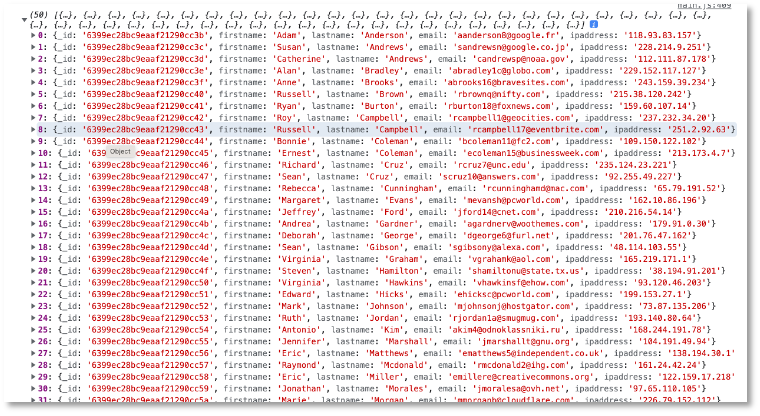
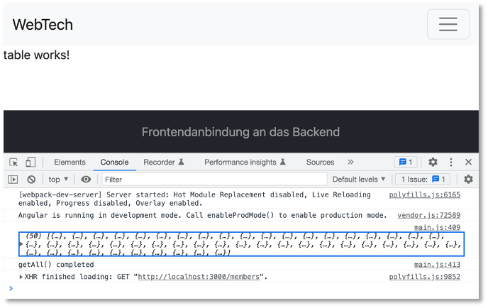

# Frontend-Backend-Anbindung

Wir haben jetzt ein Backend, das als REST-Server funngiert. Über die Endpunkte der REST-API können wir auf die einzelnen Funktionen des Backends zugreifen, um die Daten in der [MongoDB](../backend/#rest-api) (oder der [PostgreSQL](../backend_pg/#rest-api-postgresql)) zu manipulieren (erzeugen, lesen, ändern und löschen - CRUD). Unser [Frontend](../routing/#routing-und-services) stellt zur Zeit nur einen [Daten-Service](../routing/#services) zur Verfügung, der die Daten client-seitig verwaltet. Dies wollen wir jetzt ändern. Das Frontend soll mit dem Backend kommunizieren, um die Daten zu nutzen, die das Backend zur Verfügung stellt. 

Wir werden uns ein **neues** Frontend erstellen und dabei die einzelnen Schritte genauer untersuchen (bzw. wiederholen). Das hat folgende Vorteile:

- wir werden sicherer bei der Erstellung von Frontends mithilfe von Angular,
- wir müssen nicht auf bestehende Frontends aufsetzen, die evtl. bei einigen von Ihnen nicht richtig funktionieren,
- wir haben die Möglichkeit, tiefer in die Prinzipien von Angular einzutauchen und wesentliche Prinzipien ausführlicher zu diskutieren. 

Ich werde das Frontend, das ich hier erstelle, `frontend` nennen. Der Name bleibt natürlich Ihnen überlassen. Wir erstellen uns also neben unserem alten Frontend, neben dem Backend usw. in unserem Repository mithilfe von 

```bash
ng new frontend --routing
```

ein neues Angular-Projekt und wählen CSS. Wir wechseln in den `frontend`-Ordner und erzeugen uns dort 6 neue Komponenten:

```bash
cd frontend 
ng g c nav
ng g c footer
ng g c home
ng g c table
ng g c create
ng g c detail
```

Außerdem fügen wir [Bootstrap](https://ng-bootstrap.github.io/#/getting-started) hinzu: 

```bash
ng add @ng-bootstrap/ng-bootstrap
```


### Navigation und Routing

Wir passen unsere `nav`-Komponente an und können dabei gleich mal überprüfen, ob Bootstrap funktioniert. Den Code habe ich von [hier](https://getbootstrap.com/docs/5.0/components/navbar/#nav) entnommen. Außerdem erstellen wir noch einen `footer` und die `home`-Seite und legen die Routen fest:

=== "nav.component.html"
    ```html 
    <nav class="navbar navbar-expand-lg navbar-light bg-light">
        <div class="container-fluid">
            <a class="navbar-brand" href="http://freiheit.f4.htw-berlin.de/webtech/fe-be-anbindung/">WebTech</a>
            <button class="navbar-toggler" type="button" data-bs-toggle="collapse" data-bs-target="#navbarNavAltMarkup" aria-controls="navbarNavAltMarkup" aria-expanded="false" aria-label="Toggle navigation">
          <span class="navbar-toggler-icon"></span>
        </button>
            <div class="collapse navbar-collapse" id="navbarNavAltMarkup">
                <div class="navbar-nav">
                    <a class="nav-link" aria-current="page" [routerLink]="'/'">Home</a>
                    <a class="nav-link" [routerLink]="'/table'">Table</a>
                    <a class="nav-link" [routerLink]="'/member'">New</a>
                </div>
            </div>
        </div>
    </nav>
    ```

=== "footer.component.html"
    ```html 
    <div class="fixed-bottom text-white-50 bg-dark p-3 text-center">
        Frontendanbindung an das Backend
    </div>    
    ```

=== "home.component.html"
    ```html 
    <main class="d-flex align-items-center min-vh-100">
        <div class="container text-center">
            Welcome home!
        </div>
    </main>  
    ```

=== "home.component.css"
    ```css 
    main {
        background-color: grey;
    }
    ```

Hier die Routendefinitionen und das Einbinden der Komponenten:

=== "app-routing.module.ts"
    ```js 
    import { NgModule } from '@angular/core';
    import { RouterModule, Routes } from '@angular/router';
    import { CreateComponent } from './create/create.component';
    import { DetailComponent } from './detail/detail.component';
    import { HomeComponent } from './home/home.component';
    import { TableComponent } from './table/table.component';

    const routes: Routes = [{
        path: "",
        component: HomeComponent,
        pathMatch: 'full'
      },
      {
        path: "table",
        component: TableComponent
      },
      {
        path: "member",
        component: CreateComponent
      },
      {
        path: "member/:id",
        component: DetailComponent
      }];

    @NgModule({
      imports: [RouterModule.forRoot(routes)],
      exports: [RouterModule]
    })
    export class AppRoutingModule { }
    ```

=== "app.component.html"
    ```html 
    <app-nav></app-nav>
    <router-outlet></router-outlet>
    <app-footer></app-footer>
    ```

Wir geben im Terminal innerhalb des `frontend`-Ordners `ng serve` ein, um das Projekt zu starten. Die Startseite sollte nun so aussehen:


bzw. bei breiterem Viewport:


Die Routen sollten ebenfalls funktionieren, d.h. wenn Sie auf die Menüeinträge in der Navigation klicken, wird die entsprechende Komponente angezeigt. 


## Service für HTTP

Wir bereits beim [Routing](../routing/#routing-und-services)-Thema eingeführt, erstellen wir auch nun wieder einen [Service](../routing/#services) zur Verwaltung der Daten. Dieses Mal sind die Daten aber nicht direkt im Code, sondern wir greifen mit dem Service auf das Backend zu, vielmehr auf die Endpunkte des Backends:

|Methode |URL |Bedeutung |
|--------|----|----------|
|GET     |/members |hole alle Datensätze |
|GET     |/members/11 |hole den Datensatz mit der id=11 |
|POST    |/members |füge einen neuen Datensatz hinzu |
|PATCH   |/members/11 |ändere den Datensatz mit der id=11 |
|DELETE  |/members/11 |lösche den Datensatz mit der id=11 |
|DELETE  |/members |lösche alle Datensätze |

Wobei der Wert der `id` nur ein Beispiel ist.  

!!! warning "Achtung!"
    Damit wir überhaupt das Backend nutzen können, muss es laufen! Vergessen Sie also nicht, Ihr Backend zu starten!

Wir erstellen uns im Ordner `shared` einen `backend`-Service:

```bash
ng g service shared/backend
```

In diesem Service wollen wir ein Modul verwenden, dass die Kommunikation mit dem Backend per HTTP ermöglicht. Diese Modul heißt `HttpClientModule` und muss zunächst für die Anwendung in `app.module.ts` importiert werden:

=== "app.module.ts"
    ```ts linenums="1" hl_lines="11 29"
    import { NgModule } from '@angular/core';
    import { BrowserModule } from '@angular/platform-browser';

    import { AppRoutingModule } from './app-routing.module';
    import { AppComponent } from './app.component';
    import { NavComponent } from './nav/nav.component';
    import { FooterComponent } from './footer/footer.component';
    import { TableComponent } from './table/table.component';
    import { BrowserAnimationsModule } from '@angular/platform-browser/animations';
    import { HomeComponent } from './home/home.component';
    import { HttpClientModule } from '@angular/common/http';
    import { DetailComponent } from './detail/detail.component';
    import { CreateComponent } from './create/create.component';

    @NgModule({
      declarations: [
        AppComponent,
        NavComponent,
        FooterComponent,
        TableComponent,
        HomeComponent,
        DetailComponent,
        CreateComponent
      ],
      imports: [
        BrowserModule,
        AppRoutingModule,
        BrowserAnimationsModule,
        HttpClientModule
      ],
      providers: [],
      bootstrap: [AppComponent]
    })
    export class AppModule { }

    ```

Das `HttpClientModule` enthält einen Service `HttpClient`, der alle HTTP-Anfragemethoden, also `GET`, `POST`, `PUT`, `PATCH`, `DELETE` usw. als Funktionen bereitstellt. Diesen Service wollen wir in unserem `backend`-Service verwenden und binden ihn deshalb dort per *dependency injection* ein:

=== "shared/backend.service.ts"
    ```ts linenums="1" hl_lines="1 9"
    import { HttpClient } from '@angular/common/http';
    import { Injectable } from '@angular/core';

    @Injectable({
      providedIn: 'root'
    })
    export class BackendService {

      constructor(private http: HttpClient) { }
    }
    ```

Im Sinne der Typsicherheit erstellen wir uns auch hier wieder ein Interface für unsere Daten, um diesen als Typ zu verwenden. Beim letzten Mal hatten wir das Interface generisch `Data` genannt. Wir nennen es nun konkreter `Member` und erstellen es ebenfalls im `shared`-Ordner:

```bash
ng g interface shared/member
```

Wir übernehmen hier das Datenmodell, das wir für die MongoDB gewählt hatten. Bei der PostgreSQL hatten die Eigenschaften andere Namen (`id`, `firstname`, `lastname`)! Das sollte dann entsprechend angepasst werden - je nachdem, welches Backend verwendet wird. 

=== "shared/member.ts"
    ```ts linenums="1"
    export interface Member {
      _id: string;
      firstname: string;
      lastname: string;
      email: string;
      ipaddress: string;
    }
    ```


### `get()`-Funktion von `HttpClient`

Wir erstellen nun die erste "Verknüpfung" mit dem Backend und implementieren ein `GET`-Request an das Backend, um alle `members` abzufragen. Dazu verwenden wir die `get()`-Funktion des `HttpClient`-Services. 

Die einfachste Form der Anwendung der `get()`-Funktion besteht darin, dieser Funktion die entsprechende URL des Backends zu übergeben. In unserem Fall also 

```javascript
http.get('http://localhost:3000/members');
```

Diese Funktion gibt ein sogenanntes *Observable* zurück. *Observables* implementieren das *Observer Pattern* - ein Design Pattern zur Kommunikation zwischen einem sogenannte *subject*, das einen oder mehrere *observers* beobachtet und das immer dann informiert wird, sobald sich der Zustand eines *observers* geändert hat. Eine typische Implementierung des *Observer Patterns* findet durch Ereignis-Listener statt. Jemand (das *subject*) meldet sich an einem *observer* an, z.B. einem Button (genauer gesagt, an das Click-Ereignis des Buttons) und wird informiert, sobald der Button gecklickt wurde. 

Die Grundidee bei *Observables* in TypeScript ist die, dass es eine Funktion gibt, die Werte ermittelt (z.B. `http.get()`), aber diese Funktion nur ausgeführt wird, wenn sie jemand `subscribe`d. `subscribe()` ist also wie eine Anmeldung an den zu beobachtenden Wert. 

Wir schauen uns dieses Prinzip mal mit der `get()`-Funktion des `HttpClient`s an:

=== "src/app/shared/backend.service.ts" 
  ```javascript linenums="1" hl_lines="10 15"
  import { HttpClient } from '@angular/common/http';
  import { Injectable } from '@angular/core';
  import { Observable } from 'rxjs';
  import { Member } from './member';

  @Injectable({
    providedIn: 'root'
  })
  export class BackendService {
    baseUrl = 'http://localhost:3000/members';

    constructor(private http: HttpClient) { }

    getAll(): Observable<Member[]>{
      return this.http.get<Member[]>(this.baseUrl);
    }
  }
  ```

Zunächst einmal sehen wir in Zeile `15` den Aufruf der `get()`-Funktion von `HttpClient`. Der `get()`-Funktion wird als Parameter die URL des Backends übergeben. Diese ist in der Eigenschaft `baseUrl` in Zeile `10` definiert. 

Die Rückgabe der `get()`-Funktion ist, wie gesagt, ein `Observable`. Wir erzeugen den Aufruf der `get()`-Funktion in einer von uns erstellten Funktion `getAll()`deren Rückgabetyp dieses `Obervable` ist (Zeile `14`). Dieses `Observable` ist sogar typisiert, nämlich mit unserem Datenmodell-Typ `Member`. Vielmehr bekommen wir ein Array von `Member`-Objekten zurück, deshalb `Observable<Member[]>` als Rückgabetyp der `getAll()`-Funktion. Da wir diesen Rückgabetyp so konkret angeben (und nicht einfach nur `Observable` oder `Observable<any>`, erfordert TypeScript auch, dass wir die `get()`-Funktion typisieren - deshalb `get<Member[]>()`.

Wir müssen sowohl `Observable` (aus `rxjs`) als auch `Member` (aus unserer `member.ts`) importieren (Zeilen `3` und `4`). Nun müssen wir uns noch an dieses `Observable` mittels `subscribe()` anmelden. Das machen wir in unserer `TableComponent`.

### `subscribe()`

In unserer `TableComponent` wollen wir die `getAll()`-Funktion unseres Backend-Services nutzen, um uns alle `members`-Datensätze vom Backend anfragen und anzeigen zu lassen. Wir öffnen dazu die `table.component.ts`:

=== "src/app/table.component.ts" 
  ```javascript linenums="1" 
  import { Component, OnInit } from '@angular/core';
  import { BackendService } from '../shared/backend.service';
  import { Member } from '../shared/member';

  @Component({
    selector: 'app-table',
    templateUrl: './table.component.html',
    styleUrls: ['./table.component.css']
  })
  export class TableComponent implements OnInit {
    members!: Member[];

    constructor(private bs: BackendService) { }

    ngOnInit(): void {
      this.readAll();
    }

    readAll(): void {
      this.bs.getAll().subscribe(
            {
              next: (response) => {
                    this.members = response;
                    console.log(this.members);
                    return this.members;
                  },
              error: (err) => console.log(err),
              complete: () => console.log('getAll() completed')
            })
    }
  }
  ```

Zunächst binden wir den `BackendService` mittels *dependency injection* in unsere Komponente ein (Zeile `13`). In einer eigenen Funktion `readAll()` rufen wir nun die `getAll()`-Funktion des `BackendService` auf (Zeile `20`). Wie in dem Abschnitt zuvor erläutert, wird diese Funktion nur durch ein `subscribe()` ausgeführt. Die `subscribe()`-Funktion "holt" das `Observer`-Objekt, welches drei sogenannte *callback*-Funktionen definiert: `next`, `error` und `complete`. [Callback-Funktionen](../javascript/#callback-funktionen) sind [hier](../javascript/#callback-funktionen) erläutert. Wir haben also drei Parameter in der `subscribe()`-Funktion, von denen jedoch nur einer (`next`) erforderlich ist. `error` und `complete` sind optional. 

Unter `next` erhalten wir die `response` zurück, also das angefragte Objekt. Wir verwenden dafür eine *Arrow-Funktion* (siehe [Arrow-Funktionen](../javascript/#arrow-funktionen)). Wie wir diese Funktion nennen, bleibt uns überlassen. Hier heißt sie `response`. Der Inhalt dieser Funktion ist die Zuweisung der `response` auf unsere Eigenschaft `members` vom Typ `Member[]` (definiert in Zeile `11`) und der Rückgabe der `response` (wir geben `this.members` zurück, entspricht aber genau der `response`). Die Konsolenausgabe kann natürlich auch weggelassen werden. 


## Backend starten

Um die Anbindung an das Backend zu testen, dürfen wir nicht vergessen, es zu starten! Wechseln Sie im Terminal in Ihren Backend-Ordner und rufen dort

```bash
node server.js 
```

auf. Es erscheint im Terminal (wenn das MongoDB-Backend gestartet wird)

```bash
Server started and listening on port 3000 ... 
connected to DB
```


## Frontend starten

Wir müssen unser Frontend compilieren `ng serve` und wenn wir dann im Browser `http://localhost:4200/table` eingeben, also die Route zu unserer `TableComponent`, dann sollten wir in der **Konsole in den Entwicklertools** die Ausgabe der Response sehen (die `id`s und auch die Anzahl der Einträge können bei Ihnen anders sein):



Achtung! Man sieht nichts auf der Webseite, sondern wir geben die Datensätze derzeit nur in der Konsole der Entwicklertools aus! 



!!! success
    Wir haben das Backend an das Frontend angebunden. Wir haben die erste Anfrage an das Backend im Frontend umgesetzt, nämlich `GET /members`, indem wir im Frontend die `get()`-Funktion des `HttpClient` implementiert und diese in der `TableComponent`mittels `subscribe()` ausgeführt haben. Wir werden nun zunächst die Daten noch im HTML-Template darstellen und dann weitere Endpunkte unserer REST-API anbinden. 


## R-ead -- TableComponent

Wir wollen eine ansprechende Ansicht der Daten erzeugen. Wir werden die Daten in einer Tablle anzeigen und verwenden dazu Bootstrap-CSS-Klassen für das Design. Dazu wollen wir auch [Bootstrap-Icons](https://icons.getbootstrap.com/) (oder auch [diese](https://www.npmjs.com/package/ngx-bootstrap-icons)) verwenden. Diese installieren wir mit 

```bash
npm i bootstrap-icons
```

(für die [ngx-bootstrap-icons](https://www.npmjs.com/package/ngx-bootstrap-icons) müssten Sie `npm i ngx-bootstrap-icons` eingeben). Um die Icons in der `TableComponent` einfach verwenden zu können, werden die Icons in der `table.component.css` importiert:

=== "table.component.css"
    ```css
    @import url('../../../node_modules/bootstrap-icons/font/bootstrap-icons.css');
    ```

Die Bootstrap-Klassen für eine Tablle können [hier](https://getbootstrap.com/docs/5.2/content/tables/#accented-tables) entnommen werden. 

=== "table.component.html"
    ```html linenums="1"
    <div class="container mt-3">
      <h3 class="m-3">Alle Einträge</h3>
      <div class="table-responsive">
        <table class="m-3 table table-striped table-hover">
          <caption>Alle <code>members</code></caption>
          <thead>
            <tr>
              <th scope="col ">Nr</th>
              <th scope="col ">Vorname</th>
              <th scope="col ">Nachname</th>
              <th scope="col ">E-Mail</th>
            </tr>
          </thead>
          <tbody>
            <tr *ngFor="let member of members; let i=index; ">
              <td>{{ i+1 }}</td>
              <td>{{ member.firstname }}</td>
              <td>{{ member.lastname }}</td>
              <td>
                <a [href]="'mailto:' + member.email"><span class="bi bi-envelope px-5"></span></a>
                <a [routerLink]="['/member', member._id]"> <span class=" bi bi-pencil-square px-5 "></span></a>
                <span (click)="delete(member._id)" class=" bi bi-trash px-5 "></span>
              </td>
            </tr>
          </tbody>

        </table>
      </div>
    </div>
    ```

In der `table.component.ts` wird beim Erstellen der Komponente (`ngOnInit()`) die Variable `members` mit allen Daten aus der Datenbank befüllt. Dieses Array wird in der `table.component.html` ausgelesen. Wir verwenden dazu wieder die `*ngFor`-Direktive (siehe Zeile `15`).

Die erste Spalte der Tabelle wird einfach mit einer fortlaufenden Nummer befüllt, in die zweite Spalte kommt der Vorname (`member.forename`) und in die dritte Spalte der Nachname (`member.surname`) - siehe Zeilen `16-18`. In Zeile `20` erstellen wir einen Link, um an die E-Mail-Adresse (`member.email`) eine E-Mail zu senden. Der Inhalt des Links ist das Bootstrap-Icon `bi-envelope` - siehe [hier](https://icons.getbootstrap.com/icons/envelope/).

In Zeile `21` definieren wir ebenfalls einen Link, dieses Mal aber keinen Hyperlink, sondern einen Routerlink unter Verwendung der `_id` von `member`. Es entsteht der Aufruf der Route `/member/:id`, wobei für die `:id` die entsprechende `_id` von `member` eingesetzt wird. Inhalt des Links ist das Bootstrap-Icon [pencil-square](https://icons.getbootstrap.com/icons/pencil-square/).

In Zeile `22` verwenden wir das Bootstrap-Icon [trash](https://icons.getbootstrap.com/icons/trash/). Dieses wird an das `click`-Ereignis angemeldet. Sobald das Icon angeklickt wird, wird die Methode `delete(id)` aufgerufen. Dieser Methode wird die jeweilige `_id` von `member` übergeben. Diese Methode `delete(id)` muss dazu in der `table.component.ts` definiert werden. Um die vollständige Implementierung der Methode kümmern wir uns später. Zunächst fügen wir sie nur ein, damit kein Fehler beim Übersetzen der Anwendung mehr passiert und geben einfach die übergebene `_id` auf die Konsole aus:

=== "table.component.ts"
    ```ts linenums="1" hl_lines="31-33"
    import { Component, OnInit } from '@angular/core';
    import { BackendService } from '../shared/backend.service';
    import { Member } from '../shared/member';

    @Component({
      selector: 'app-table',
      templateUrl: './table.component.html',
      styleUrls: ['./table.component.css']
    })
    export class TableComponent implements OnInit {
      members!: Member[];
      constructor(private bs: BackendService) { }

      ngOnInit(): void {
        this.readAll();
      }

      readAll(): void {
        this.bs.getAll().subscribe(
          {
            next: (response) => {
                  this.members = response;
                  console.log(this.members);
                  return this.members;
                },
            error: (err) => console.log(err),
            complete: () => console.log('getAll() completed')
          })
      }

      delete(id: string): void {
        console.log("id :" ,id );
      }
    }
    ```

- Wenn Sie nun auf das `trash`-Icon klicken, wird in der Konsole Ihrer Developer-Tools die `_id` von `member` aus dieser Zeile ausgegeben. 
- Wenn Sie nun auf das `pencil`-Icon klicken, wird die `DetailComponent` aufgerufen (in der URL steht dann soetwas wie `http://localhost:4200/member/61b7127e13537fa69be3a21c`). 
- Wenn Sie nun auf das `envelope`-Icon klicken, wird Ihr E-Mail-Client aufgerufen und in der Empfängerzeile der E-Mail ist die `email` von `member` eingetragen. 

## U-pdate -- DetailComponent

Die `detail`-Komponente wird durch die Route `/member/:id` aufgerufen, wobei `:id` einer `_id` eines `member` entspricht. Die Idee dieser Komponente ist, den Datensatz von `member` zu ändern. Wir erstellen ein Formular, in dem die Daten von `member` eingetragen werden, so dass sie aktualisiert werden können. Werden diese neuen Daten an das Backend gesendet, wird dort die `update`-Funktion aufgerufen, d.h. wir sprechen beim Senden der Daten den Endpunkt `PATCH /members/:id` an. 

Zunächst implementieren wir, dass der Datensatz von `member`, dessen `_id` in der Route übergeben wird, aus der Datenbank geholt wird. Dazu

- erweiteren wir den `BackendService` um eine Funktion `getOne(id)`, die den Endpunkt `GET /members/id` der REST-API des Backends aufruft.
- Wir nutzen diese Funktion, um in der `detail.component.ts` die Daten dieses `member` zu speichern. Dazu gehen wir wie beim [Routing mit parametrisierten Routen](../routing/#weiter-mit-parametrisierten-routen) gezeigt, vor. 

=== "backend.service.ts"
    ```ts linenums="1" hl_lines="18-20"
    import { HttpClient } from '@angular/common/http';
    import { Injectable } from '@angular/core';
    import { Observable } from 'rxjs';
    import { Member } from './member';

    @Injectable({
      providedIn: 'root'
    })
    export class BackendService {
      baseUrl = 'http://localhost:3000/members';

      constructor(private http: HttpClient) { }

      getAll(): Observable<Member[]>{
        return this.http.get<Member[]>(this.baseUrl);
      }

      getOne(id: string): Observable<Member>{
        return this.http.get<Member>(this.baseUrl + '/' + id);
      }
    }
    ```

=== "detail.component.ts"
    ```ts linenums="1" hl_lines="12-13 16-17 21-22 25-35"
    import { Component, OnInit } from '@angular/core';
    import { ActivatedRoute } from '@angular/router';
    import { BackendService } from '../shared/backend.service';
    import { Member } from '../shared/member';

    @Component({
      selector: 'app-detail',
      templateUrl: './detail.component.html',
      styleUrls: ['./detail.component.css']
    })
    export class DetailComponent implements OnInit {
      id: string = '';
      member!: Member;

      constructor(
        private route: ActivatedRoute,
        private bs: BackendService
      ) { }

      ngOnInit(): void {
        this.id = this.route.snapshot.paramMap.get('id') || '';
        this.readOne(this.id);
      }

      readOne(id: string): void {
          this.bs.getOne(id).subscribe(
          {
            next: (response: Member) => {
                    this.member = response;
                    console.log(this.member);
                    return this.member;
            },
            error: (err) => console.log(err),
            complete: () => console.log('getOne() completed')
          });
      }

    }
    ```


Wenn wir nun die `detail`-Komponente durch Klick auf das `pencil`-Icon in der Tabelle aufrufen, wird beim Initialisieren der Komponente die Variable `member` mit den passenden Einträgen aus der Datenbank befüllt und auf der Konsole in den Developertools angezeigt. Wir nutzen erneut die `subscribe()`-Funktion des `Observable`, das durch die Funktion `getOne(id)` des `BackendService` erzeugt wird.  

Um die Daten von `member` ändern zu können, laden wir diese in ein Formular. Der folgende Abschnitt diskutiert die Möglichkeiten der Formularerstellung in Angular.

## Formulare in Angular

Formulare werden verwendet, um Nutzereingaben zu ermöglichen und die eingegebenen Daten zu verwalten, sie z.B. in einer Datenbank zu speichern. In Angular gibt es zwei verschiedene Ansätze, Forumlare zu erstellen:

- **reaktive Formulare** werden in der TypeScript-Klasse konzipiert und basieren auf einem unveränderlichen Datenmodell. Sie sind leichter zu skalieren als *Template-basierte Formulare* und besser wiederzuverwenden. Sie sind prinzipiell den *Template-basierten Formularen* vorzuziehen, außer dass Formular ist sehr einfach und besteht z.B. nur aus einem einzigen Eingabefeld.
- **Template-basierte Formulare** basieren auf Direktiven im HTML. Sie sind sehr einfach zu erstellen (direkt im HTML), können aber weniger einfach evaluiert und getestet werden und sind für strukturierte (verschachtelte) Datenmodelle ungeeignet. 

Für weitere Informationen zu Formularen in Angular siehe [hier](https://angular.io/guide/forms-overview#introduction-to-forms-in-angular). 

### Reactive Forms in `*.component.ts`

Wir verwenden hier *reaktive Formulare*. Die beiden wesentlichen TypeScript-Klassen bei Formularen sind

- `FormControl` für ein einzelnes Steuerelement (z.B. ein `input` oder ein `radio`Button) und
- `FormGroup` für eine zusammenhängende Menge von Steuerlementen (einem Formular). 


Um *reaktive Formulare* zu verwenden, ist es **wichtig**, das Modul `ReactiveFormsModule` in die `app.module.ts` zu importieren!

=== "app.module.ts"
    ```ts linenums="1" hl_lines="14 31"
    import { NgModule } from '@angular/core';
    import { BrowserModule } from '@angular/platform-browser';

    import { AppRoutingModule } from './app-routing.module';
    import { AppComponent } from './app.component';
    import { NavComponent } from './nav/nav.component';
    import { FooterComponent } from './footer/footer.component';
    import { TableComponent } from './table/table.component';
    import { BrowserAnimationsModule } from '@angular/platform-browser/animations';
    import { HomeComponent } from './home/home.component';
    import { HttpClientModule } from '@angular/common/http';
    import { DetailComponent } from './detail/detail.component';
    import { CreateComponent } from './create/create.component';
    import { ReactiveFormsModule } from '@angular/forms';

    @NgModule({
      declarations: [
        AppComponent,
        NavComponent,
        FooterComponent,
        TableComponent,
        HomeComponent,
        DetailComponent,
        CreateComponent
      ],
      imports: [
        BrowserModule,
        AppRoutingModule,
        BrowserAnimationsModule,
        HttpClientModule,
        ReactiveFormsModule
      ],
      providers: [],
      bootstrap: [AppComponent]
    })
    export class AppModule { }
    ```

Wenn das vergessen wird, sind die Fehlerausgaben wirklich nicht zielführend und es ist recht schwierig, diesen Fehler zu finden! *Reactive Forms* werden, im Gegensatz zu den *template-basierten Formularen*, hauptsächlich in der TypeScript-Klasse erstellt. Wir passen deshalb unsere `detail.component.ts` wie folgt an:

=== "detail.component.ts"
    ```ts linenums="1" hl_lines="2 15-20 39-44"
    import { Component, OnInit } from '@angular/core';
    import { FormGroup, FormControl } from '@angular/forms';
    import { ActivatedRoute } from '@angular/router';
    import { BackendService } from '../shared/backend.service';
    import { Member } from '../shared/member';

    @Component({
      selector: 'app-detail',
      templateUrl: './detail.component.html',
      styleUrls: ['./detail.component.css']
    })
    export class DetailComponent  implements OnInit {
      id: string = '';
      member!: Member ;
      form = new FormGroup({
            firstnameControl : new FormControl<string>(''),
            lastnameControl: new FormControl<string>(''),
            emailControl: new FormControl<string>(''),
            ipaddressControl: new FormControl<string>(''),
      });

      constructor(
        private route: ActivatedRoute,
        private bs: BackendService
      ) { }

      ngOnInit(): void {
        this.id = this.route.snapshot.paramMap.get('id') || '';
        this.readOne(this.id);

      }

      readOne(id: string): void {
          this.bs.getOne(id).subscribe(
          {
            next: (response) => {
                    this.member = response;
                    console.log('member', this.member);
                    this.form.patchValue({
                      firstnameControl: this.member?.firstname,
                      lastnameControl: this.member?.lastname,
                      emailControl: this.member?.email,
                      ipaddressControl: this.member?.ipaddress
                    })
                    return this.member;
            },
            error: (err) => console.log(err),
            complete: () => console.log('getOne() completed')
          });

      }

      update(): void {

      }

      cancel(): void {

      }

    }
    ```

Wir erstellen uns eine Referenzvariable `form` vom Typ `FormGroup` (Zeile `15`). Diese Variable zeigt auf unser Formular. Das Formular besteht aus `FormControl`-Elementen, die wir in den Zeilen `16-19` erzeugen. Sie sind mit `string` typisiert, das kann aber auch weggelassen werden. 

In den Zeilen `39-44` werden den Eingabefeldern bereits Werte zugewiesen. Diese Werte werden `member` entnommen, welches durch die `getOne(id)`-Funktion des `BackendService` befüllt wurde. Um die Werte in das Formular einzutragen, bietet die Klasse `FormGroup` zwei Funktionen an:

- `setValue()` - setzt für **alle** `FormControl`-Elemente innerhalb der `FormGroup` einen Wert (`value`)
- `patchValue()` - kann allen oder **bestimmten** (einzelnen) `FormControl`-Elementen einen Wert (`value`) zuweisen. 

Wir verwenden `patchValue()`, Sie können aber auch `setValue()` ausprobieren. Beachten Sie auch das `?` hinter der `member`-Variablen bei den Wertzuweisungen. Es handelt sich dabei um den *safe navigation operator*. 


#### Safe navigation operator

Um zu vermeiden, dass versucht wird, auf einen Wert zuzugreifen, der (noch) gar nicht existiert (`undefined` ist), kann der sogenannte *safe navigation operator* verwendet werden. Das Prinzip dieses Operators entspricht einer `*ngIf`-Direktive. Erst wenn der Wert ungleich `undefined` ist, wird er dargestellt. Die Syntax des *safe navigation operators*  ist ein `?`:

> `objekt?.eigenschaft`

Solange `objekt` noch `undefined` ist, wird nicht auf die (noch nicht existierende) `eigenschaft` zugegriffen. Wir verwenden den *safe navigation operator* in der `detail.component.ts` ein:

=== "detail.component.ts (Auszug mit safe navigation oprator)"
  ```html linenums="39" 
    this.form.patchValue({
      firstnameControl: this.member?.firstname,
      lastnameControl: this.member?.lastname,
      emailControl: this.member?.email,
      ipaddressControl: this.member?.ipaddress
    })
  ```

Jetzt wird zunächst geprüft, ob `member` überhaupt definiert ist (also nicht `undefined`). Wenn nicht, wird gar nicht erst auf die Eigenschaft (z.B. `firstname`) zugegriffen. Ohne den Operator erhalten Sie eine Fehlermeldung, da z.B. der Zugriff `undefined.firstname` versucht würde.  Allerdings wird ja direkt nach der Wertzuweisung auf die `member`-Variable zugegriffen. Dadurch könnte hier der `safe navigation operator` auch weggelassen werden. 

### Reactive Forms in `*.component.html`

Das Formular existiert nun (als TypeScript-Objekt). Nun binden wir es in die `detail.component.html` ein. 


=== "detail.component.html"
    ```html linenums="1" 
    <main class="d-flex min-vh-100">
      <fieldset class="container  mt-5">
        <legend *ngIf="member" class="mb-4">Eintrag von {{ member.firstname }} {{ member.lastname }} aktualisieren
        </legend>
        <legend *ngIf="!member" class="mb-4">Eintrag aktualisieren</legend>
        <form [formGroup]="form" (ngSubmit)="update()">
          <div class="mb-3 row">
            <label class="col-2 col-form-label" for="firstname">Vorname</label>
            <div class="col-10">
              <input type="text" class="form-control" id="firstname" placeholder="Vorname"
              formControlName="firstnameControl" />
            </div>
          </div>
          <div class="mb-3 row">
            <label class="col-2 col-form-label" for="lastname">Nachname</label>
            <div class="col-10">
              <input type="text" class="col-10 form-control" id="lastname" placeholder="Nachname"
              formControlName="lastnameControl" />
            </div>
          </div>
          <div class="mb-3 row">
            <label class="col-2 col-form-label" for="email">E-Mail</label>
            <div class="col-10">
              <input type="email" class="col-10 form-control" id="email" placeholder="E-Mail" formControlName="emailControl" />
            </div>
          </div>
          <div class="mb-3 row">
            <label class="col-2 col-form-label" for="ipaddress">IP-Adresse</label>
            <div class="col-10">
              <input type="text" class="col-10 form-control" id="ipaddress" placeholder="IP-Adresse" formControlName="ipaddressControl" />
            </div>
          </div>
          <div class="row ">
            <button type="submit" class="col-5 btn btn-secondary">Aktualisieren</button>
            <div class="col-2"></div>
            <button type="button" class="col-5 btn btn-secondary" (click)="cancel() ">Abbrechen</button>
          </div>
        </form>
      </fieldset>
    </main>
    ```

Es entsteht folgende Ansicht:


=== "detail.component.css"
    ```css
    main {
      background-color: rgba(99, 192, 235, 0.729);
    }

    legend {
      font-weight: bold;
    }
    ```

### Eventuelle Anpassung des Backends

Es kann sein, dass Ihr Backend für `GET /member/:id` nicht das Objekt selbst, sondern ein Array zurückgibt, das das Objekt enthält. Erwartet würde, dass z.B. dieses JavaScript-Objekt zurückgegeben wird: 

```js
{_id: '6399ec28bc9eaaf21290cc3b', firstname: 'Adam', lastname: 'Anderson', email: 'aanderson8@google.fr', ipaddress: '118.93.83.157'}
```

Es kann aber sein, dass Sie stattdessen

```js
[ 0 : {_id: '6399ec28bc9eaaf21290cc3b', firstname: 'Adam', lastname: 'Anderson', email: 'aanderson8@google.fr', ipaddress: '118.93.83.157'} ]
```

zurückbekommen. Im letzteren Fall ist es am einfachsten, wenn Sie das Backend wie folgt anpassen:

=== "routes.js"
    ```js linenums="27" hl_lines="6"
    // get one member - Read 
    router.get('/members/:id', async(req, res) => {
        try {
            const member = await Member.find({ _id: req.params.id });
            console.log(req.params);
            res.send(member[0]);
        } catch {
            res.status(404);
            res.send({
                error: 'Member does not exist'
            })
        }
    })
    ```

also statt des Arrays, das die `find()`-query zurückgibt, den ersten Eintrag aus dem Array. Sie können stattdessen auch mal ausprobieren, was der Rückgabetyp von `findOne()` ist. 

### Submit- und Cancel-Ereignisbehandlung


Um sich an das `submit`-Ereignis anzumelden, wird für das `<form>`-Element `(ngSubmit)` hinzugefügt und als dessen Wert die Funktion, die aufgerufen werden soll, beim Absenden des Formulars - hier die Funktion `update()` (die wir gleich noch in `detail.component.ts` implementieren). Für den `Abbrechen`-Button melden wir uns an das `click`-Ereignis mithilfe von `(click)` und der Angabe der Funktion, die ausgeführt werden soll (hier `cancel()`) an. 

Wir implementieren nun die Funktionen `cancel()` und `update()`. Die `cancel()`-Funktion wird durch das `click`-Ereignis des `Abbrechen`-Buttons aufgerufen und die `update()`-Funktion durch den `submit`-Button `Aktualisieren` (siehe im Formular `(ngSubmit)="update()"`). Wenn wir auf `Abbrechen` klicken, dann wollen wir wieder zur Tabellenansicht zurück. Das erreichen wir mit dem Service `Location` aus `@angular/common`, der uns z.B. die `back()`-Funktion zur Verfügung stellt:

=== "detail.component.ts"
    ```ts linenums="1" hl_lines="1 26 60"
    import { Location } from '@angular/common';
    import { Component, OnInit } from '@angular/core';
    import { FormGroup, FormControl } from '@angular/forms';
    import { ActivatedRoute } from '@angular/router';
    import { BackendService } from '../shared/backend.service';
    import { Member } from '../shared/member';

    @Component({
      selector: 'app-detail',
      templateUrl: './detail.component.html',
      styleUrls: ['./detail.component.css']
    })
    export class DetailComponent  implements OnInit {
      id: string = '';
      member!: Member ;
      form = new FormGroup({
            firstnameControl : new FormControl<string>(''),
            lastnameControl: new FormControl<string>(''),
            emailControl: new FormControl<string>(''),
            ipaddressControl: new FormControl<string>(''),
      });

      constructor(
        private route: ActivatedRoute,
        private bs: BackendService,
        private location: Location
      ) { }

      ngOnInit(): void {
        this.id = this.route.snapshot.paramMap.get('id') || '';
        this.readOne(this.id);

      }

      readOne(id: string): void {
          this.bs.getOne(id).subscribe(
          {
            next: (response) => {
                    this.member = response;
                    console.log('member', this.member);
                    this.form.patchValue({
                      firstnameControl: this.member.firstname,
                      lastnameControl: this.member.lastname,
                      emailControl: this.member.email,
                      ipaddressControl: this.member.ipaddress
                    })
                    return this.member;
            },
            error: (err) => console.log(err),
            complete: () => console.log('getOne() completed')
          });

      }

      update(): void {

      }

      cancel(): void {
        this.location.back();
      }

    }

    ```


Wenn wir nun auf `Abbrechen` klicken, dann haben wir das gleiche Verhalten, als würden wir im Browser auf `zurück` (oder `back`) klicken. 

Wenn jedoch der `Aktualisieren`-Button gedrückt wird, dann soll der Datensatz in der Datenbank aktualisiert werden, d.h. es wird der Endpunkt `PATCH /members/:id` der REST-API angesprochen, wobei `:id` den Wert der `_id` des aktuell bearbeiteten Datensatzes erhält und die Werte aus dem Formular im `body` des `request`-Objektes übergeben werden. Dazu erweiteren wir zunächst den `BackendService` um eine entsprechende Funktion, die wir dort ebenfalls `update()` nennen und der die `id` sowie die Daten aus dem Formular übergeben werden.


=== "backend.service.ts"
    ```ts linenums="1" hl_lines="22-24"
    import { HttpClient } from '@angular/common/http';
    import { Injectable } from '@angular/core';
    import { Observable } from 'rxjs';
    import { Member } from './member';

    @Injectable({
      providedIn: 'root'
    })
    export class BackendService {
      baseUrl = 'http://localhost:3000/members';

      constructor(private http: HttpClient) { }

      getAll(): Observable<Member[]>{
        return this.http.get<Member[]>(this.baseUrl);
      }

      getOne(id: string): Observable<Member>{
        return this.http.get<Member>(this.baseUrl + '/' + id);
      }

      update(id: string, data: Member): Observable<Member> {
        return this.http.patch<Member>(this.baseUrl + '/' + id, data);
      }
    }
    ```

In der `detail.component.ts` werden in der `update()`-Funktion zunächst alle Werte des Formulars ausgelesen und in `this.member` gespeichert und dann wird die `update()`-Funktion des `BackendService` aufgerufen und ihr die `this.id` sowie `this.member` übergeben. Nachdem der Datensatz in der Datenbank aktualisiert wurde, wird wieder die `table`-Komponente aufgerufen. Dazu wird die `navigateByUrl()`-Funktion des `Router`-Services verwendet.

=== "detail.component.ts"
    ```ts linenums="1" hl_lines="4 27 57-74"
    import { Location } from '@angular/common';
    import { Component, OnInit } from '@angular/core';
    import { FormGroup, FormControl } from '@angular/forms';
    import { ActivatedRoute, Router } from '@angular/router';
    import { BackendService } from '../shared/backend.service';
    import { Member } from '../shared/member';

    @Component({
      selector: 'app-detail',
      templateUrl: './detail.component.html',
      styleUrls: ['./detail.component.css']
    })
    export class DetailComponent  implements OnInit {
      id: string = '';
      member!: Member ;
      form = new FormGroup({
            firstnameControl : new FormControl<string>(''),
            lastnameControl: new FormControl<string>(''),
            emailControl: new FormControl<string>(''),
            ipaddressControl: new FormControl<string>(''),
      });

      constructor(
        private route: ActivatedRoute,
        private bs: BackendService,
        private location: Location,
        private router: Router
      ) { }

      ngOnInit(): void {
        this.id = this.route.snapshot.paramMap.get('id') || '';
        this.readOne(this.id);

      }

      readOne(id: string): void {
          this.bs.getOne(id).subscribe(
          {
            next: (response) => {
                    this.member = response;
                    console.log('member', this.member);
                    this.form.patchValue({
                      firstnameControl: this.member.firstname,
                      lastnameControl: this.member.lastname,
                      emailControl: this.member.email,
                      ipaddressControl: this.member.ipaddress
                    })
                    return this.member;
            },
            error: (err) => console.log(err),
            complete: () => console.log('getOne() completed')
          });

      }

      update(): void {
        const values = this.form.value;
        this.member.firstname = values.firstnameControl!;
        this.member.lastname = values.lastnameControl!;
        this.member.email = values.emailControl!;
        this.member.ipaddress = values.ipaddressControl!;
        this.bs.update(this.id, this.member)
          .subscribe({
            next: (response) => {
              console.log(response);
              console.log(response._id);
            },
            error: (err) => {
              console.log(err);
            },
            complete: () => console.log('update() completed')
          }
          );
        this.router.navigateByUrl('/table');
      }

      cancel(): void {
        this.location.back();
      }

    }
    ```

Als nächstes implementieren wir noch die `delete(id)`-Funktion in der `table.component.ts`, um einen Datensatz zu löschen.

## D-elete -- TableComponent

In der `table`-Komponente ist das Löschen eines Datensatzes bereits vorbereitet. Bei Klick auf das `trash`-Icon in der Tabelle wird die `delete()`-Funktion in der `table.component.ts` aufgerufen und ihr die `_id` des löschenden Datensatzes übergeben. Derzeit gibt die Funktion aber diese `id` nur auf der Konsole aus. 

Wir implementieren zunächst eine `deleteOne(id)`-Funktion im `BackendService`. Es wird der Endpunkt `DELETE /members/:id` verwendet. 

=== "backend.service.ts"
    ```ts linenums="1" hl_lines="26-28"
    import { HttpClient } from '@angular/common/http';
    import { Injectable } from '@angular/core';
    import { Observable } from 'rxjs';
    import { Member } from './member';

    @Injectable({
      providedIn: 'root'
    })
    export class BackendService {
      baseUrl = 'http://localhost:3000/members';

      constructor(private http: HttpClient) { }

      getAll(): Observable<Member[]>{
        return this.http.get<Member[]>(this.baseUrl);
      }

      getOne(id: string): Observable<Member>{
        return this.http.get<Member>(this.baseUrl + '/' + id);
      }

      update(id: string, data: Member): Observable<Member> {
        return this.http.patch<Member>(this.baseUrl + '/' + id, data);
      }

      deleteOne(id: string): Observable<any>{
        return this.http.delete<any>(this.baseUrl + '/' + id, {observe: 'response'});
      }     
    }
    ```

Im Gegensatz zu den anderen Endpunkten, kann die `response` beim Aufruf von `DELETE /members/:id` leer sein (wenn der Datensatz gelöscht wurde) oder es wird ein Objekt mit einem `error` zurückgesendet (siehe [hier](http://127.0.0.1:8000/webtech/backend/#d-delete-one)). Die Typisierung des `Observale` ist deshalb nicht `Member`, sondern `any`. Da vom Backend jedoch der HTTP-Status in der `response` zurückgegeben wird (`204` oder `404`) wollen wir auf diesen Status zugreifen. Wäre die `response` leer, ginge das jedoch nicht. Deshalb legen wir mit `{observe: 'response'}` als zweitem Parameter fest, dass in jedem Fall eine `response` (und nicht nur der `body`) durch das `Observable` erzeugt wird.

Wir verwenden diese Funktion nun in unserer `table.component.ts`:

=== "table.component.ts"
    ```ts linenums="1" hl_lines="2 13 15 34-51 53-58"
    import { Component, OnInit } from '@angular/core';
    import { Router } from '@angular/router';
    import { BackendService } from '../shared/backend.service';
    import { Member } from '../shared/member';

    @Component({
      selector: 'app-table',
      templateUrl: './table.component.html',
      styleUrls: ['./table.component.css']
    })
    export class TableComponent implements OnInit {
      members: Member[] = [];
      deleted = false;

      constructor(private bs: BackendService, private router: Router) { }

      ngOnInit(): void {
        this.readAll();
      }

      readAll(): void {
        this.bs.getAll().subscribe(
          {
            next: (response) => {
                  this.members = response;
                  console.log(this.members);
                  return this.members;
                },
            error: (err) => console.log(err),
            complete: () => console.log('getAll() completed')
          })
      }

      delete(id: string): void {
        this.bs.deleteOne(id).subscribe(
          {
            next: (response: any) => {
              console.log('response : ', response);
              if(response.status == 204){
                      console.log(response.status);
                      this.reload(true);
                    } else {
                      console.log(response.status);
                      console.log(response.error);
                      this.reload(false);
                    }
            },
            error: (err) => console.log(err),
            complete: () => console.log('deleteOne() completed')
        });
      }

      reload(deleted: boolean)
      {
        this.deleted = deleted;
        this.readAll();
        this.router.navigateByUrl('/table');
      }
    }

    ```

Wir haben gleich mehrer Sachen hinzugefügt. Zunächst ruft die `delete(id)`-Funktion wie gewohnt die `BackendService`-Funktion `deleteOne(id)` mit `subsribe()` auf. Wir haben darin eine Fallunterscheidung, je nach zurückgegebenem HTTP-Status integriert mit jeweiliger Konsolen-Ausgabe (die können natürlich raus). 

Um eine Nachricht anzeigen zu lassen, dass der Datensatz gelöscht wurde, fügen wir der TypeScript-Klasse die Eigenschaft `deleted` hinzu. Ist der Wert von `deleted` `false` wird die Tabelle angezeigt. Ist der Wert jedoch `true` wird die Löschnachricht angezeigt. In der Löschnachricht ist ein Button, dessen Klickereignis die Funktion `reload()` aufruft. In `reload()` wird die Tabelle neu geladen. Dazu werden zuvor nochmal alle Einträge aus der Datenbank mit `readAll()` geholt, damit man sieht, dass der Datensatz gelöscht wurde. Die `table.component.html` sieht nun so aus:

=== "table.component.html"
    ```html linenums="1" hl_lines="1 30-33"
    <div *ngIf="!deleted" class="container mt-3">
      <h3 class="m-3">Alle Einträge</h3>
      <div class="table-responsive">
        <table class="m-3 table table-striped table-hover">
          <caption>Alle <code>members</code></caption>
          <thead>
            <tr>
              <th scope="col ">Nr</th>
              <th scope="col ">Vorname</th>
              <th scope="col ">Nachname</th>
              <th scope="col ">E-Mail</th>
            </tr>
          </thead>
          <tbody>
            <tr *ngFor="let member of members; let i=index; ">
              <td>{{ i+1 }}</td>
              <td>{{ member.firstname }}</td>
              <td>{{ member.lastname }}</td>
              <td>
                <a [href]="'mailto:' + member.email"><span class="bi bi-envelope px-5"></span></a>
                <a [routerLink]="['/member', member._id]"> <span class=" bi bi-pencil-square px-5 "></span></a>
                <span (click)="delete(member._id)" class=" bi bi-trash px-5 "></span>
              </td>
            </tr>
          </tbody>

        </table>
      </div>
    </div>
    <div *ngIf="deleted" class=" container mt-3 ">
      <h3>Datensatz wurde gelöscht!</h3>
      <button type="button" class="btn btn-secondary" (click)="reload(false)">Zurück zur Tabelle</button>
    </div>
       
    ```


!!! success
    Wir haben nun die CRUD-Funktionen im Frontend implementiert und dafür das Frontend an das Backend vollständig angebunden. Zwar fehlt hier noch Create, aber das sollten Sie selbständig leicht hinbekommen. Schauen Sie sich das Formular für Update an, dann sollte das kein Problem sein! Ist eine gute Übung! Der Entwicklungsstack Datenbank <-> Backend <-> Frontend ist damit fertig und abgeschlossen. Eine weitere gute Übung für Sie wäre, statt des MongoDB-Backends das PostgreSQL-Backend anzubinden. Sie werden feststellen, dass nur sehr wenige Anpassungen notwendig sind. Wir haben nun alle Voraussetzungen besprochen, um die Semesteraufgabe zu erledigen. 


