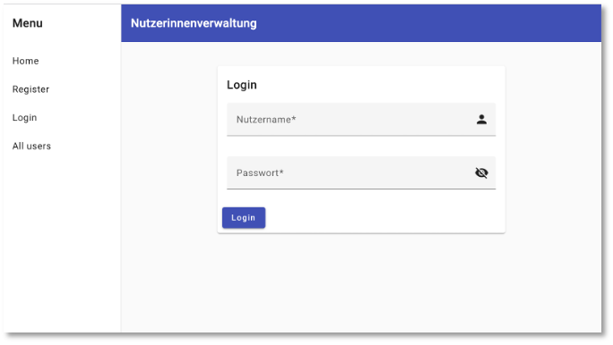

# Subject, Observable, Observer und Guards

Wir wollen am Beispiel einer Nutzerverwaltung die Verwendung von *Subject*, *Observable*, *Observer* und *Guards* demonstrieren. Alle diese Konzepte werden im Frontend verwendet. *Subject*, *Observable*, *Observer* dienen dazu, Werte an *Subscriber* zu propagieren. Eine gute Übersicht über *Subject*, *Observable*, *Observer* bietet die folgende Abbildung ([hier](https://www.tektutorialshub.com/angular/subjects-in-angular) entnommen).


*Subject*, *Observable*, *Observer* finden sich im [RxJS](https://rxjs.dev/)-Paket. [Subject](https://rxjs.dev/guide/subject) hat den großen Vorteil, dass ein (neuer) Wert an viele Subscriber gesendet (*multicast*) werden kann. Wir werden *Subjects* z.B. verwenden, um der `nav`-Komponente mitzuteilen, dass sich eine Nutzerin ein- bzw. ausgelogged hat. Ein *Subject* ist sowohl ein *Observer* als auch ein *Observable*. [Observable]() kann mehrere Werte (nacheinander) *pushen* (an die *Subscriber*). Folgende Tabelle [aus]() gibt einen guten Überblick über die Funktionalität eines *Observable*s.


Ein [Observer](https://rxjs.dev/guide/observer) konsumiert die Werte, die ein Observable liefert. Alle Funktionen des HTTP-Clients sind Observables. Sie liefern die Werte vom Backend (mittels einer `next`-Funktion). Mithilfe eines Observers werden wir diese Werte empfangen (`next`, `error`, `complete`).

Mithilfe von *Guards* wird die Verwendung von Komponenten gesteuert. Eine Komponente soll z.B. nur dann aufgerufen werden können, wenn die Nutzerin eingelogged ist. 

Obwohl alle diese Konzepte zum Frontend gehören, erstellen wir uns zunächst ein Backend für die Nutzerverwaltung. 

## REST-API zur Nutzerverwaltung (Backend)

Folgende Endpunkte soll die REST-API zur Verfügung stellen:

| Endpunkt | Beschreibung |
|----------|--------------|
|`GET /users` |gebe alle `user`-Einträge zurück |
|`POST /users/register` |erstelle einen neuen `user` (`Registrierung`-Funktion)|
|`POST /users/login` |Prüft, ob `username == name` existiert und ob das Passwort stimmt (`Login`-Funktion) |
|`GET /users/:name` |gibt den `user` mit `username == name` zurück |
|`DELETE /users/:id` |löscht den `user` mit `_id == id` |
|`PUT /users/:id` |ändert Daten von `user` mit `_id == id` |

Wir gehen wie in [REST-API (MongoDB)](../backend/#rest-api-mongodb) vor und erstellen uns ein `Node.js`-Projekt:

```bash
mkdir backend
cd backend
npm i
npm i express --save
npm i nodemon --save-dev
npm i mongoose --save
npm i dotenv --save
npm i cors --save
```

Als Einstiegspunkt wählen wir `server.js`. Diese sieht wie folgt aus:

=== "server.js"
	```js linenums="1"
	const express = require('express');
	const cors = require('cors');
	const userRoutes = require('./routes/users');
	const mongoose = require('mongoose');
	require('dotenv').config();

	const app = express();
	const PORT = 3000;

	app.use(express.json());
	app.use(cors());
	app.use('/users', userRoutes);

	// connect to mongoDB
	mongoose.connect(process.env.DB_CONNECTION, { dbName: process.env.DB_NAME });
	const db = mongoose.connection;
	db.on('error', err => {
	  console.log(err);
	});
	db.once('open', () => {
	    console.log('connected to DB');
	});

	app.listen(PORT, (error) => {
	    if (error) {
	        console.log(error);
	    } else {
	        console.log(`Server started and listening on port ${PORT} ... `);
	    }
	});
	```

Die Verbindungsdaten zur MongoDB stehen in der `.env`-Datei unter `DB_CONNECTION` und der Name der Datenbank steht dort unter `DB_NAME` (siehe Zeile `15`). Für die Endpunkte (Routen) haben wir einen Ordner `routes` erstellt, unter dem verschiedene `.js`-Dateien liegen können, in denen unterschiedliche Endpunkte definiert sind. Hier wird zunächst nur die `users.js` dort erstellt:

=== "routes/users.js"
	```js linenums="1"
	const express = require('express');
	const router = express.Router();
	const User = require('../models/users');

	// get all users
	router.get('/', async(req, res) => {
	    const allUsers = await User.find();
	    console.log(allUsers);
	    res.send(allUsers);
	});

	// post one user - register
	router.post('/register', async(req, res) => {
	    const newUser = new User({
	        username: req.body.username,
	        password: req.body.password,
	        email: req.body.email,
	        role: req.body.role
	    })
	    await newUser.save();
	    res.send(newUser);
	});


	module.exports = router;
	```

In der `routes/users.js` sind zunächst nur die beiden Endpunkte `GET /users` und `POST /users` definiert. Wir wollen uns gleich um den Endpunkt `POST /users` nochmal gesondert kümmern. Derzeit ist er so implementiert, wie wir es auch bereits in [REST-API (MongoDB)](../backend/#c-create)	hatten. Ehe wir diese Implementierung nochmal genauer betrachten zunächst noch das zugehörige Model:

=== "models/users.js"
	```js linenums="1"
	const mongoose = require('mongoose');

	const schema = new mongoose.Schema({
	    username: String,
	    password: String,
	    email: String,
	    role: String
	});

	module.exports = mongoose.model('User', schema);
	```

Das Backend ist nun ausführbar. Es können neue `user` angelegt werden (`POST /users`) und alle `user` ausgelesen werden (`GET /users`). 


Jedoch erkennen wir nun ein wesentliches Problem: die Passwörter werden lesbar gespeichert. Das wollen wir natürlich nicht. 

### Passwörter verschlüsseln

Wir verschlüsseln die Passwörter mithilfe von [bcrypt](https://www.npmjs.com/package/bcrypt). Dazu installieren wir uns dieses Paket zunächst

```bash
npm i bcrypt --save
```

und verwenden es dann wie folgt in der `routes/users.js` für den `POST /users`-Endpunkt:


=== "routes/users.js"
	```js linenums="1" hl_lines="4 15 16 19 25"
	const express = require('express');
	const router = express.Router();
	const User = require('../models/users');
	const bcrypt = require('bcrypt');

	// get all users
	router.get('/', async(req, res) => {
	    const allUsers = await User.find();
	    console.log(allUsers);
	    res.send(allUsers);
	});

	// post one user - register
	router.post('/register', async(req, res) => {
	    bcrypt.hash(req.body.password, 10).then(
	        async (hash) => {
	            const newUser = new User({
	                username: req.body.username,
	                password: hash,
	                email: req.body.email,
	                role: req.body.role
	            })
	            await newUser.save();
	            res.send(newUser);
	        }).catch( err => res.status(400).json({ error: 'user not created' }))
	});

	module.exports = router;
	```

In Zeile `15` wird die `hash`-Funktion von `bcrypt` aufgerufen. Das `password` wird als erster Parameter übergeben. Die `10` ist der Wert für die `saltRounds` und ist der empfohlene Wert. Der `hash` wird erzeugt und als Wert der `password`-Eigenschaft in `newUser` und somit in der Datenbank gespeichert. 


Es bleibt anzumerken, dass aus dem `hash` nicht wieder das Passwort rückerzeugt werden kann. Um sich einzuloggen, muss das einegebene Passwort mit dem `hash` verglichen werden. Dazu stellt `bcrypt` ebenfalls eine Funktion zur Verfügung. Wir kommen darauf zurück, wenn es um die `Login`-Funktion geht. 

Zunächst wollen wir noch verhindern, dass sich eine Nutzerin mit einem bereits bekannten `username` bzw. mit einer bereits bekannten `email`-Adresse anmeldet. 

### Doppelte `username` und `email` verhindern

Doppelte Einträge in der `user`-Datenbank für `username` und/oder `email` führen zu Problemen und sollten vermieden werden. Wir passen deshalb die Funktion für das Eintragen eines neuen Datensatzes wie folgt an:


=== "routes/users.js"
	```js linenums="1" hl_lines="15-17 29-31"
	const express = require('express');
	const router = express.Router();
	const User = require('../models/users');
	const bcrypt = require('bcrypt');

	// get all users
	router.get('/', async(req, res) => {
	    const allUsers = await User.find();
	    console.log(allUsers);
	    res.send(allUsers);
	});

	// post one user - register
	router.post('/register', async(req, res) => {
	    const existingUsername = await User.findOne( {username: req.body.username});
	    const existingEmail = await User.findOne( {email: req.body.email});
	    if(!existingUsername && !existingEmail) {
	        bcrypt.hash(req.body.password, 10).then(
	            async (hash) => {
	                const newUser = new User({
	                    username: req.body.username,
	                    password: hash,
	                    email: req.body.email,
	                    role: req.body.role
	                })
	                await newUser.save();
	                res.send(newUser);
	            }).catch( err => res.status(400).json({ error: 'user not created' }))
	    } else {
	        res.status(400).json({ error: 'username and/or email exist(s)' });
	    }
	});

	module.exports = router;
	```

Es wird mithilfe von `findOne()` nach einem Eintrag gesucht, der den neuen `username` bzw. die neue `email` enthält. Wenn kein solcher Eintrag gefunden wird, ist sowohl `existingUsername` als auch `existingEmail` `null` und der neue Eintrag kann erzeugt werden. Ansonsten wird der HTTP-Status `400` mit der `error`-Meldung `username and/or email exist(s)` zurückgesendet. So wird sichergestellt, dass kein neuer `user` erstellt wird, deren `username` und/oder `email` bereits in der Datenbank existiert. 

### `Login`-Funktion

Eine `Login`-Funktion soll überprüfen, ob ein `username` existiert und ob das dazugehörige `password` korrekt ist. Dazu müssen beide Informationen mit dem *Request* übermittelt werden. Deshalb wird als Anfragemethode `POST` verwendet. Um diesen `POST`-Endpunkt vom vorherigen Endpunkt zu unterscheiden, wird der URL anstelle von `/register` hier `/login` angehängt. 

Die Implementierung dieser Funktion in der `routes/users.js` könnte wie folgt aussehen:


=== "routes/users.js"
	```js linenums="34"
	// post username and password - login
	router.post('/login', async(req, res) => {
	    const existingUsername = await User.findOne( {username: req.body.username});
	    if(existingUsername) {
	        bcrypt.compare(req.body.password, existingUsername.password).then((result) => {
	            if(result) {
	                res.status(201).json({ message: 'logged in' });
	            } else {
	                res.status(204).send(); // wrong password
	            }
	        })
	        .catch( (err) => res.status(400).json({ error: 'something went wrong' })) // never happens
	    } else {
	        res.status(400).json({ error: 'username does not exist' });
	    }
	});
	```

Es wird zunächst geprüft, ob es überhaupt einen passenden `username` in der Datenbank gibt. Da `username` nicht doppelt vorkommen kann, muss auch nur `findOne()` verwendet werden. Existiert ein solcher EIntrag nicht, wird HTTP-Status `400` zurückgesendet mit der `error`-Message `username does not exist`.

Existiert ein solcher Eintrag jedoch, wird das `password` dieses Eintrages mit dem `password` aus dem *Request* unter Verwendung der `compare`-Funktion von `bcrypt` miteinander verglichen. Sind die Passwärter gleich ist das `result == true`. Dann wird der Status-Code `201` zusammen mit der `message: logged in` gesendet. Ist jedoch `result == false`, dann war das Passwort falsch und es wird der Statuscode `204` (`no content`) zurückgesendet. 

### Daten ändern

Für das Ändern der Daten haben wir bereits die Standardfunktion betrachtet, siehe [U - update](../backend/#u-update). Bei der Nutzerverwaltung kommt jedoch die Anforderung hinzu, dass das Ändern der Daten (selbst das Ändern des Passwortes) nur dann möglich sein soll, wenn das (alte) Passwort korrekt übermittelt wird. 

Sollte ein neues Passwort übermittelt werden (Eigenschaft `newPassoword`), kann vorher im Frontend geprüft werden (z.B. durch doppelte Eingabe), ob es "korrekt" ist.

Es ist fraglich, ob es überhaupt möglich sein soll, den `username` zu ändern. Generell ist jedoch beim Ändern des `username` und beim Ändern der `email` darauf zu achten, dass die jeweils neuen Werte nicht bereits existieren. 

Zu beachten ist auch, dass der Endpunkt die `_id` enthält. Das bedeutet, dass der Datensatz zuvor aus der Datenbank ausgelesen werden musste, d.h. er muss zwingend bereits existieren. Nur die Angabe von z.B. `username` würde die Sicherheit reduzieren. 

Die Funktion ist somit recht komplex und könnte z.B. wie folgt aussehen:


=== "routes/users.js"
	```js linenums="51"
	// update one user
	router.put('/:id', async(req, res) => {
	    try {
	        const user = await User.findOne({ _id: req.params.id })
	        if(user && req.body.password) {
	            bcrypt.compare(req.body.password, user.password)
	            .then( async(result) => 
	            {
	                if(result) {

	                    if (req.body.newPassword) {
	                        bcrypt.hash(req.body.newPassword, 10)
	                        .then( 
	                            async(hash) => {
	                                console.log('new hash', hash)
	                                await User.updateOne({ _id: req.params.id }, { password: hash });
	                            }
	                        );
	                    }

	                    if (req.body.username) {
	                        const nameExists = await User.findOne({ username: req.body.username })
	                        if(!nameExists) await User.updateOne({ _id: req.params.id }, { username: req.body.username });
	                        else res.status(400).json({ error: 'username exists' });
	                    }

	                    if (req.body.email) {
	                        const emailExists = await User.findOne({ email: req.body.email })
	                        if(!emailExists) await User.updateOne({ _id: req.params.id }, { email: req.body.email });
	                        else res.status(400).json({ error: 'email exists' });
	                    }

	                    if (req.body.role) {
	                        await User.updateOne({ _id: req.params.id }, { role: req.body.role });
	                    }

	                    res.status(200).send()

	                } else {
	                    res.status(204).send(); // wrong password
	                }

	            })
	        } else {
	            res.status(204).send(); // wrong _id or no password
	        }
	    } catch {
	        res.status(404)
	        res.send({ error: "User does not exist!" })
	    }
	});
	```

- Zunächst wird geprüft, ob überhaupt ein `user` mit der aufgerufenen `id` existiert und ob das `password` mitgeschickt wird (Zeile `55`). Nur dann wird überhaupt weitergeprüft. Ansonsten werden die Zeilen `94-96` ausgeführt (HTTP-Status `204` gesendet).
- In Zeile `56` wird geprüft, ob das mitgeschickte `password` dem für `user` gespeicherten `password` entspricht. Das geschieht mithilfe der `compare()`-Funktion von `bcrypt`. Ist das `password` nicht korrekt, werden die Zeilen `89-91` ausgeführt (HTTP-Status `204` gesendet).
- Ist das `password` korrekt, wird geprüft, welche der Daten geändert werden sollen. Dazu wird jeweils geschaut, ob `newPassword` (Zeilen `61-69`), `username` (Zeilen `71-75`), `email` (Zeilen `77-81`) oder `role` (Zeilen `83-85`) mitgesendet werden. Falls ja, wird jeweils der Datensatz mithilfe von `updateOne()` aktualisiert. 

### `user` löschen und lesen

Die beiden Funktionen zum Löschen und Lesen einer Nutzerin sind so, wie wir sie bereits kennen:

=== "routes/users.js"
	```js linenums="103"
	// get one user via username
	router.get('/:name', async(req, res) => {
	    const user = await User.findOne({ username: req.params.name });
	    if(user) {
	        res.send(user);
	    } else {
	        res.status(404);
	        res.send({
	            error: "User does not exist!"
	        });
	    }
	})

	// delete one user via id
	router.delete('/:id', async(req, res) => {
	    try {
	        await User.deleteOne({ _id: req.params.id })
	        res.status(204).send()
	    } catch {
	        res.status(404)
	        res.send({ error: "User does not exist!" })
	    }
	});
	```


## Registrierung und Login (Frontend)

Wir erstellen uns mithilfe von Angular eine kleine Webanwendung, die mindestens eine Regstrierungs- und eine Login-Komponente enthält. Wir wollen dieses Mal [Material Design](https://material.angular.io/) anstelle von Bootstrap als CSS-Framework verwenden. 

Im Terminal geben wir Folgendes ein:

| Terminalbefehl | Beschreibung |
|----------------|--------------|
|`ng new frontend --routing` | erstellt Projekt `frontend` mit Routing |
|`cd frontend` ||
|`ng g c login` | erstellt Komponente `login` |
|`ng g c home` | erstellt Komponente `home` |
|`ng g s shared/auth` | erstellt Service `auth` im Ordner `shared` |
|`ng g i shared/user` | erstellt Interface `user` im Ordner `shared` |
|`ng add @angular/material` | fügt [Material Design](https://material.angular.io/guide/getting-started) hinzu |

Nach dem Hinzufügen von *Material Design* sollte im Terminal ungefähr folgende Ausgabe erscheinen:

```bash
ℹ Using package manager: npm
✔ Found compatible package version: @angular/material@15.0.4.
✔ Package information loaded.

The package @angular/material@15.0.4 will be installed and executed.
Would you like to proceed? Yes
✔ Packages successfully installed.
? Choose a prebuilt theme name, or "custom" for a custom theme: Indigo/Pink        [ Preview: 
https://material.angular.io?theme=indigo-pink ]
? Set up global Angular Material typography styles? Yes
? Include the Angular animations module? Include and enable animations
UPDATE package.json (1105 bytes)
✔ Packages installed successfully.
UPDATE src/app/app.module.ts (654 bytes)
UPDATE angular.json (2844 bytes)
UPDATE src/index.html (576 bytes)
UPDATE src/styles.css (181 bytes)
```

Als `prebuild theme` wurde hier `Indigo/Pink` und sowohl für die `typography styles` als auch für die `animations` wurde `y` ausgewählt.

*Material Design* bietet sogenannte [Schematics](https://material.angular.io/guide/schematics) an. Wir wählen das `navigation`-Schema und geben im Terminal ein:

```bash
ng generate @angular/material:navigation nav
``` 
Es entsteht eine `nav`-Komponente. Außerdem wählen wir das `address-form`-Schema und erstellen damit eine Komponente `register`:

```bash
ng generate @angular/material:address-form register
``` 

Die `app.component.html` ändern wir wie folgt:

=== "app.component.html"
	```html
	<app-nav></app-nav>
	```

Darin wird also nur noch die `nav`-Komponente statisch eingebunden.

Ehe wir an der `nav.component.html` umfangreichere Änderungen vornehmen, defininieren wir zunächst noch folgende Routen:

=== "app-routing.module.ts"
	```js linenums="1" hl_lines="3-5 8-23"
	import { NgModule } from '@angular/core';
	import { RouterModule, Routes } from '@angular/router';
	import { HomeComponent } from './home/home.component';
	import { LoginComponent } from './login/login.component';
	import { RegisterComponent } from './register/register.component';

	const routes: Routes = [
	  {
	    path: "",
	    title: "Home",
	    component: HomeComponent,
	    pathMatch: 'full'
	  },
	  {
	    path: "register",
	    title: "Register",
	    component: RegisterComponent
	  },
	  {
	    path: "login",
	    title: "Login",
	    component: LoginComponent
	  }
	];

	@NgModule({
	  imports: [RouterModule.forRoot(routes)],
	  exports: [RouterModule]
	})
	export class AppRoutingModule { }
	``` 

Nun können wir die `nav.component.html` entsprechend anpassen:

=== "nav.component.html"
	```html linenums="1" hl_lines="8-10 23 26"
	<mat-sidenav-container class="sidenav-container">
	  <mat-sidenav #drawer class="sidenav" fixedInViewport
	      [attr.role]="(isHandset$ | async) ? 'dialog' : 'navigation'"
	      [mode]="(isHandset$ | async) ? 'over' : 'side'"
	      [opened]="(isHandset$ | async) === false">
	    <mat-toolbar>Menu</mat-toolbar>
	    <mat-nav-list>
	      <a mat-list-item [routerLink]="''">Home</a>
	      <a mat-list-item [routerLink]="'register'">Register</a>
	      <a mat-list-item [routerLink]="'login'">Login</a>
	    </mat-nav-list>
	  </mat-sidenav>
	  <mat-sidenav-content>
	    <mat-toolbar color="primary">
	      <button
	        type="button"
	        aria-label="Toggle sidenav"
	        mat-icon-button
	        (click)="drawer.toggle()"
	        *ngIf="isHandset$ | async">
	        <mat-icon aria-label="Side nav toggle icon">menu</mat-icon>
	      </button>
	      <span>Nutzerinnenverwaltung</span>
	    </mat-toolbar>
	    <!-- Add Content Here -->
	    <router-outlet></router-outlet>
	  </mat-sidenav-content>
	</mat-sidenav-container>
	``` 

In den Zeilen `8-10` werden die Menüeinträge geändert und die Verweise auf `routerLinks` geändert. In Zeile `23` wird die Überschrift geändert und in Zeile `26` erscheint der Platzhalter für die per Routing eingebundenen Komponenten. 

Die Anwendung sieht nun wie folgt aus (Desktop- und Mobile-Ansicht):


Die Menüeinträge funktionieren und bei der `register`-Komponente wird bereits ein recht umfangreiches Formular angezeigt (wegen des verwendeten `address-form`-Schemas).

### Registrierung

Wir passen die durch das `address-form`-Schema erstellte `register`-Komponente an. Die Dateien der `register`-Komponente könnten z.B. so aussehen:

=== "register.component.ts"
	```ts linenums="1"
	import { Component } from '@angular/core';
	import { FormControl, FormGroup, Validators } from '@angular/forms';
	import { User } from '../shared/user';

	@Component({
	  selector: 'app-register',
	  templateUrl: './register.component.html',
	  styleUrls: ['./register.component.css']
	})
	export class RegisterComponent {
	  registerForm = new FormGroup({
	    username: new FormControl('', Validators.required),
	    password: new FormControl('', [Validators.required, Validators.minLength(8)]),
	    password2: new FormControl('', [Validators.required, Validators.minLength(8)]),
	    email: new FormControl('', [Validators.required, Validators.email]),
	    role: new FormControl('', Validators.required)
	  });
	  roles = [ "admin", "user"];
	  hide = true;
	  hide2 = true;
	  user!: User;

	  constructor() {}

	  onSubmit(): void {
	    const values = this.registerForm.value;
	    this.user = {
	      username: values.username!,
	      password: values.password!,
	      email: values.email!,
	      role: values.role!
	    };
	    console.log(this.user)
	  }
	}
	```

=== "register.component.html"
	```html linenums="1"
	<form [formGroup]="registerForm" novalidate (ngSubmit)="onSubmit()">
	  <mat-card class="shipping-card">
	    <mat-card-header>
	      <mat-card-title>Registrierung</mat-card-title>
	    </mat-card-header>
	    <mat-card-content>

	      <div class="row">
	        <div class="col">
	          <mat-form-field hintLabel="Einloggen mit Nutzername und Passwort" class="full-width">
	            <input matInput placeholder="Nutzername" formControlName="username">
	            <mat-icon matSuffix >person_add</mat-icon>
	            <mat-error *ngIf="registerForm.controls['username'].hasError('required')">
	              Nutzername <strong>erforderlich</strong>
	            </mat-error>
	          </mat-form-field>
	        </div>
	      </div>
	      <div class="row">
	        <div class="col">
	          <mat-form-field hintLabel="Mind. 8 Zeichen, mind. 1 Groß- und Kleinbuchstaben, Ziffer und Sonderzeichen" class="full-width">
	            <input matInput [type]="hide ? 'password' : 'text'" placeholder="Passwort" formControlName="password">
	            <button mat-icon-button matSuffix (click)="hide = !hide" [attr.aria-label]="'Hide password'" [attr.aria-pressed]="hide">
	              <mat-icon>{{hide ? 'visibility_off' : 'visibility'}}</mat-icon>
	            </button>
	            <mat-error *ngIf="registerForm.controls['password'].hasError('required')">
	              Passwort <strong>erforderlich</strong>
	            </mat-error>
	          </mat-form-field>
	        </div>
	      </div>
	      <div class="row">
	        <div class="col">
	          <mat-form-field hintLabel="Dasselbe Passwort wie oben" class="full-width">
	            <input matInput  [type]="hide2 ? 'password' : 'text'" placeholder="Passwort wiederholen" formControlName="password2">
	            <button mat-icon-button matSuffix (click)="hide2 = !hide2" [attr.aria-label]="'Hide password'" [attr.aria-pressed]="hide">
	              <mat-icon>{{hide2 ? 'visibility_off' : 'visibility'}}</mat-icon>
	            </button>
	            <mat-error *ngIf="registerForm.controls['password2'].hasError('required')">
	              Wiederholung Passwort <strong>erforderlich</strong>
	            </mat-error>
	          </mat-form-field>
	        </div>
	      </div>

	      <div class="row">
	        <div class="col">
	          <mat-form-field hintLabel="E-Mail-Adresse zum Kontaktieren verwendet" class="full-width">
	            <input matInput placeholder="E-Mail" formControlName="email">
	            <mat-icon matSuffix>email</mat-icon>
	            <mat-error *ngIf="registerForm.controls['email'].hasError('required')">
	              E-Mail-Adresse <strong>erforderlich</strong>
	            </mat-error>
	          </mat-form-field>
	        </div>
	      </div>
	      <div class="row">
	        <div class="col">
	          <mat-form-field hintLabel="Wählen Sie eine der beiden Rollen aus" class="full-width">
	            <mat-select placeholder="Rolle" formControlName="role">
	              <mat-option *ngFor="let role of roles" [value]="role">
	                {{ role }}
	              </mat-option>
	            </mat-select>
	            <mat-icon matSuffix>group</mat-icon>
	            <mat-error *ngIf="registerForm.controls['role'].hasError('required')">
	              Rolle <strong>erforderlich</strong>
	            </mat-error>
	          </mat-form-field>
	        </div>
	      </div>

	    </mat-card-content>
	    <mat-card-actions>
	      <button mat-raised-button color="primary" type="submit">Registrieren</button>
	    </mat-card-actions>
	  </mat-card>
	</form>

	```

=== "register.component.css"
	```css linenums="1"
	.full-width {
	  width: 100%;
	}

	.shipping-card {
	  min-width: 120px;
	  max-width: 80%;
	  margin-left: auto;
	  margin-right: auto;
	  margin: 3% auto;
	}

	.mat-radio-button {
	  display: block;
	  margin: 5px 0;
	}

	.row {
	  display: flex;
	  flex-direction: row;
	}

	.col {
	  flex: 1;
	  margin-right: 20px;
	}

	.col:last-child {
	  margin-right: 0;
	}

	```

Das ergibt folgende Ansicht:


### Service verwenden

In dem `auth`-Service binden wir das Backend an und nutzen bspw. die im Registrierungsformular eingegebenen Daten, um die Nutzerin zu registrieren. 

!!! warning "Achtung!"

	Nicht vergessen, das `HttpClientModule` in der `app.module.ts` zu importieren (unter `imports` eintragen und `import { HttpClientModule } from '@angular/common/http';` einfügen lassen)!

	Wichtig ist auch, dass das Backend läuft!

Der Service könnte z.B. so aussehen:

=== "auth.service.js"
	```js linenums="1"
	import { HttpClient } from '@angular/common/http';
	import { Injectable } from '@angular/core';
	import { Observable } from 'rxjs';
	import { User } from './user';

	@Injectable({
	  providedIn: 'root'
	})
	export class AuthService {
	  baseUrl = 'http://localhost:3000';

	  constructor(private http: HttpClient) { }

	  getAllUsers(): Observable<User[]>{
	    return this.http.get<User[]>(this.baseUrl + '/users');
	  }

	  registerUser(user:User): Observable<any> {
	    return this.http.post(this.baseUrl + '/users/register', user);
	  }
	}
	```

und die `submit()`-Funktion in der `register.component.ts` könnte zunächst wie folgt erweitert werden:

```js linenums="26"
  onSubmit(): void {
    const values = this.registerForm.value;
    this.user = {
      username: values.username!,
      password: values.password!,
      email: values.email!,
      role: values.role!
    };
    console.log(this.user)
    this.auth.registerUser(this.user).subscribe({
        next: (response) => console.log('response', response),
        error: (err) => console.log(err),
        complete: () => console.log('register completed')
    });
  }
```

Wenn nun das Registrierungsformular vollständig ausgefüllt wird und weder `username` noch `email` bereits in der Datenbank existieren, wird ein neuer Datensatz in der Datenbank angelegt. Die neue Nutzerin ist registriert. Wenn jedoch der `username` und/oder die `email` bereits existier(t/en), wird nicht die `next`-Eigenschaft des Observers aufgerufen, sondern die `error`-Eigenschaft. Das heißt, entweder gibt es unter `next` eine `response`, nämlich den neu angelegten `user` oder es gibt unter `error` ein Fehlerobjekt, welches selbst eine `error`-Eigenschaft hat (mit `{ error: 'username and/or email exist(s)'}`) und dessen Status `400` ist. 

### Modaler Dialog zur Bestätigung

Derzeit gibt es keine Rückmeldung darüber, ob die neue Nutzerin registriert wurde oder nicht. Wir wollen dazu einen modalen Dialog öffnen, der die entsprechenden Informationen zur Verfügung stellt. Dieser Dialog wird eine Komponente. Da diese Komponente jedoch ausschließlich von der Registrierungskomponente verwendet wird, erstellen wir sie als *Kindkomponente* der Registrierungskomponente. Wir werden dabei insbesondere lernen, wie wir Daten von Elternkomponenten an Kindkomponenten weiterleiten können. 

Zunächst erstellen wir die (Kind-)Komponente `confirm`:

```bash
ng g c register/confirm
```

Unter dem Ordner `register` entsteht ein weiterer Ordner `confirm`, der die `.html`, `.ts` und `.css` der Kindkomponente `confirm` enthält. Wir verwenden [Dialog](https://material.angular.io/components/dialog/overview) von Material Design. Wir gehen vor, wie in [Dialog Examples](https://material.angular.io/components/dialog/examples) gezeigt. Beachten Sie, dass Sie in `app.module.ts` das Modul `MatDialogModule` (aus `@angular/material/dialog`) importieren müssen!

=== "register.component.ts"
	```js linenums="1" hl_lines="4 8-11 45 49 56-58"
	import { ConfirmComponent } from './confirm/confirm.component';
	import { Component } from '@angular/core';
	import { FormControl, FormGroup, Validators } from '@angular/forms';
	import { MatDialog } from '@angular/material/dialog';
	import { AuthService } from '../shared/auth.service';
	import { User } from '../shared/user';

	export interface DialogData {
	  headline: string;
	  info: string;
	}

	@Component({
	  selector: 'app-register',
	  templateUrl: './register.component.html',
	  styleUrls: ['./register.component.css']
	})
	export class RegisterComponent {
	  registerForm = new FormGroup({
	    username: new FormControl('', Validators.required),
	    password: new FormControl('', [Validators.required, Validators.minLength(8)]),
	    password2: new FormControl('', [Validators.required, Validators.minLength(8)]),
	    email: new FormControl('', [Validators.required, Validators.email]),
	    role: new FormControl('', Validators.required)
	  });
	  roles = [ "admin", "user"];
	  hide = true;
	  hide2 = true;
	  user!: User;

	  constructor(private auth: AuthService, public dialog: MatDialog) {}

	  onSubmit(): void {
	    const values = this.registerForm.value;
	    this.user = {
	      username: values.username!,
	      password: values.password!,
	      email: values.email!,
	      role: values.role!
	    };
	    console.log(this.user)
	    this.auth.registerUser(this.user).subscribe({
	        next: (response) => {
	          console.log('response', response)
	          this.openDialog({ headline: "Erfolg", info: "User " + response.username + " registriert!" });
	        },
	        error: (err) => {
	          console.log('error', err.error.error)
	          this.openDialog({ headline: "Fehler", info: "username und/oder E-Mail existiert bereits" });
	        },
	        complete: () => console.log('register completed')
	    });

	  }

	    openDialog(data: DialogData) {
	      this.dialog.open(ConfirmComponent, { data });
	  }
	}

	```

=== "confirm.component.ts"
	```js linenums="1" 
	import { Component, Inject } from '@angular/core';
	import { MAT_DIALOG_DATA} from '@angular/material/dialog';
	import { DialogData } from '../register.component';

	@Component({
	  selector: 'app-confirm',
	  templateUrl: './confirm.component.html',
	  styleUrls: ['./confirm.component.css']
	})
	export class ConfirmComponent {
	  constructor(@Inject(MAT_DIALOG_DATA) public data: DialogData) {}
	}
	```

=== "confirm.component.html"
	```html linenums="1" 
	<h1 mat-dialog-title>{{ data.headline }}</h1>
	<div mat-dialog-content>
	  {{ data.info }}
	</div>
	<div mat-dialog-actions>
	  <button mat-button mat-dialog-close cdkFocusInitial>Ok</button>
	</div>
	```

Wenn nun die Registrierung erfolgreich war, erscheint ein entsprechender modaler Dialog und ebenso, wenn die Registrierung nicht erfolgt ist:


## Guards

Mithilfe von [Guards](https://angular.io/guide/router-tutorial-toh#milestone-5-route-guards) können wir festlegen, dass Komponenten z.B. nur dann aufgerufen werden können, wenn man eingelogged ist (aber nicht, wenn man nicht eingelogged ist) oder wenn man z.B. als `admin` eingelogged (und nicht nur als `user`) eingelogged ist. Wir werden hier demonstrieren, wie man solche Guards implementiert und verwendet. Dazu erstellen wir uns zunächst eine weitere Komponente. Die Komponente `userlist` soll alle `user` aus der Datenbank auflisten (als Tabelle). Diese Komponente soll nur aufgerufen werden können, wenn man als `admin` eingelogged ist. Außerdem werden wir den Aufruf der `HomeComponent` nur für den Fall erlauben, dass man eingelogged ist.

### `userlist`-Komponente

Die `userlist`-Komponente erstellen wir mithilfe des Material-Design-Schemas [table](https://material.angular.io/guide/schematics#table-schematic):

```bash
ng generate @angular/material:table userlist
```

Für das vereinfachte Beispiel hier haben wir jedoch die z.B. die [Paginierung](https://material.angular.io/components/table/overview#pagination) weggelassen. Viele Beispiele zu Tabellen mit Sortierung, Filterung, Paginierung usw. finden Sie [hier](https://material.angular.io/components/table/overview).

=== "userlist.component.ts"
	```js linenums="1"
	import { Component, OnInit } from '@angular/core';
	import { AuthService } from '../shared/auth.service';
	import { User } from '../shared/user';

	@Component({
	  selector: 'app-userlist',
	  templateUrl: './userlist.component.html',
	  styleUrls: ['./userlist.component.css']
	})
	export class UserlistComponent implements OnInit {

	  users: User[] = [];

	  /** Columns displayed in the table. Columns IDs can be added, removed, or reordered. */
	  displayedColumns = ['username', 'email', 'role'];

	  constructor(private auth: AuthService) {

	  }
	  ngOnInit(): void {
	    this.auth.getAllUsers().subscribe({
	      next: (response) => {
	        this.users = response;
	        console.log('this.users', this.users)
	      }
	    })
	  }

	}
	```

=== "userlist.component.html"
	```html linenums="1"
	<div class="mat-elevation-z8">
	  <table mat-table class="full-width-table" [dataSource]="users" aria-label="Elements">
	    <!-- username Column -->
	    <ng-container matColumnDef="username">
	      <th mat-header-cell *matHeaderCellDef>Nutzername</th>
	      <td mat-cell *matCellDef="let user">{{user.username}}</td>
	    </ng-container>

	    <!-- email Column -->
	    <ng-container matColumnDef="email">
	      <th mat-header-cell *matHeaderCellDef>E-Mail</th>
	      <td mat-cell *matCellDef="let user">{{user.email}}</td>
	    </ng-container>

	    <!-- role Column -->
	    <ng-container matColumnDef="role">
	      <th mat-header-cell *matHeaderCellDef>Rolle</th>
	      <td mat-cell *matCellDef="let user">{{user.role}}</td>
	    </ng-container>

	    <tr mat-header-row *matHeaderRowDef="displayedColumns"></tr>
	    <tr mat-row *matRowDef="let user; columns: displayedColumns;"></tr>
	  </table>

	  <mat-paginator #paginator
	      [length]="users.length"
	      [pageIndex]="0"
	      [pageSize]="10"
	      [pageSizeOptions]="[5, 10, 20]"
	      aria-label="Select page">
	  </mat-paginator>
	</div>

	```

Die Tabelle sieht dann wie folgt aus:


### Guard für den Komponentenzugriff - Logged in

In [Routen absichern mit Guards](../routing/#routen-absichern-mit-guards) haben wir bereits die Grundidee von *Guards* vorgestellt. Wir wollen diese hier anwenden und beschränken uns dabei auf den *Guard-Typ* `CanActivate`. Wir wollen sicherstellen, dass die `HomeComponent` nur aktiviert werden kann, wenn man eingelogged ist und die `RegisterComponent` nur dann, wenn man als `admin` eingelogged ist, um das Prinzip zu verdeutlichen. Wir erstellen uns also einen `CanActivate`-Guard (im Ordner `guards`):

```bash
ng g guard shared/authguard --implements CanActivate
```

Diesen `AuthGuard` implementieren wir wie folgt: 

=== "shared/authguard.guards.ts"
    ```js linenums="1"
    import { Injectable } from '@angular/core';
    import { ActivatedRouteSnapshot, CanActivate, Router, RouterStateSnapshot, UrlTree } from '@angular/router';
    import { AuthService } from './auth.service';

    @Injectable({
      providedIn: 'root'
    })
    export class AuthguardGuard implements CanActivate {

      constructor(
        private as: AuthService,
        private router: Router
      ) {}

      canActivate(
        route: ActivatedRouteSnapshot,
        state: RouterStateSnapshot): boolean | UrlTree {
        return this.as.isLoggedin()
          ? true
          : this.router.parseUrl('/login');
      }

    }
    ```

Dieser *Guard* gibt bei Aufruf der `canActivate()`-Funktion ein `true` zurück, wenn eine Nutzerin eingelogged ist (`isLoggedin()` aus dem `AuthService`). Wenn niemand eingelogged ist, (wenn also `isLoggedin()` ein `false` zurückgibt), dann wird die aktuelle Route nach `/login` umgeleitet. Die Funktion `isLoggedin()` sieht im `auth.service.ts` wie folgt aus (außerdem erweitern wir den Service gleich noch um einige weitere nützliche Funktionen):

=== "shared/auth.service.ts"
	```js linenums="1"
	import { HttpClient } from '@angular/common/http';
	import { Injectable } from '@angular/core';
	import { Observable } from 'rxjs';
	import { User } from './user';

	@Injectable({
	  providedIn: 'root'
	})
	export class AuthService {
	  baseUrl = 'http://localhost:3000';
	  user!: User | null;
	  loggedIn = false;

	  constructor(private http: HttpClient) { }

	  getAllUsers(): Observable<User[]>{
	    return this.http.get<User[]>(this.baseUrl + '/users');
	  }

	  getOneUser(username: string): Observable<User>{
	    return this.http.get<User>(this.baseUrl + '/users/' + username);
	  }

	  registerUser(user:User): Observable<any> {
	    return this.http.post(this.baseUrl + '/users/register', user);
	  }

	  isLoggedin(): boolean {
	    return this.loggedIn;
	  }
	  
	  loginUser(username: string, password: string ): Observable<any>{
	    return this.http.post(this.baseUrl + '/users/login/', { username: username, password: password }, {observe: 'response'});
	  }

	  logout(): void {
	    this.loggedIn = false;
	    this.user = null;
	  }

	  getUser(): User | null {
	    return this.user;
	  }

	  isAdmin(): boolean {
	    if(this.user?.role === 'admin')
	    {
	      return true;
	    }
	    return false;
	  }

	  isUser(): boolean {
	    if(this.user?.role === 'user')
	    {
	      return true;
	    }
	    return false;
	  }
	}

	```

Beachten Sie, dass der `post()`-Funktion in `loginUser()` noch die Option `observe: 'response'` hinzugefügt wurde, um die gesamte Response zu erhalten und nicht nur den `body` als `json`. Das gibt uns die Möglichkeit, den `status` der Response auszuwerten. Schauen Sie sich dazu auch den `POST /users/login`-Endpunkt im Backend an. Der schickt verschiedene Status zurück, je nachdem, ob das Login erfolgreich war (`201`) oder nicht (`204` bzw. `400`). 

In der `RegisterComponent` können wir nun auch noch die `login()`-Funktion des Services aufrufen, wenn die Registrierung erfolgreich war:

=== "register.component.ts"
	```js linenums="33" hl_lines="13-14"
	  onSubmit(): void {
    const values = this.registerForm.value;
    this.user = {
      username: values.username!,
      password: values.password!,
      email: values.email!,
      role: values.role!
    };
    console.log(this.user)
    this.auth.registerUser(this.user).subscribe({
        next: (response) => {
          console.log('response', response)
          this.user = response;
          this.auth.login(this.user)
          this.openDialog({ headline: "Erfolg", info: "User " + response.username + " registriert!" });
        },
        error: (err) => {
          console.log('error', err.error.error)
          this.openDialog({ headline: "Fehler", info: "username und/oder E-Mail existiert bereits" });
        },
        complete: () => console.log('register completed')
    });
    ```

Wir fügen diesen Guard nun in die `app-routing.module.ts` ein:

=== "app-routing.module.ts"
    ```js linenums="1" hl_lines="6 15"
	import { NgModule } from '@angular/core';
	import { RouterModule, Routes } from '@angular/router';
	import { HomeComponent } from './home/home.component';
	import { LoginComponent } from './login/login.component';
	import { RegisterComponent } from './register/register.component';
	import { AuthguardGuard } from './shared/authguard.guard';
	import { UserlistComponent } from './userlist/userlist.component';

	const routes: Routes = [
	  	{
		    path: "",
		    title: "Home",
		    component: HomeComponent,
		    pathMatch: 'full',
	      	canActivate: [AuthguardGuard]
		},
		{
		    path: "register",
		    title: "Register",
		    component: RegisterComponent
		},
		{
		    path: "login",
		    title: "Login",
		    component: LoginComponent
		},
		{
		    path: "users",
		    title: "All Users",
		    component: UserlistComponent
		}
	];

	@NgModule({
	  imports: [RouterModule.forRoot(routes)],
	  exports: [RouterModule]
	})
	export class AppRoutingModule { }

    ```

Wenn wir nun die Anwendung öffnen, dann kommen wir gar nicht auf `HomeComponent`, sondern werden stets zur `LoginComponent` geleitet. Erst wenn wir eingelogged sind, ist die `HomeComponent` erreichbar. 

### Login-Komponente

Ehe wir noch einen weiteren Guard zur Erkennung implementieren, ob wir als `admin` eingelogged sind oder nicht, implementieren wir der Vollständigkeit halber noch die Login-Komponente.

=== "login.component.ts"
	```js linenums="1"
	import { Component } from '@angular/core';
	import { FormBuilder, Validators } from '@angular/forms';
	import { Router } from '@angular/router';
	import { AuthService } from '../shared/auth.service';

	@Component({
	  selector: 'app-login',
	  templateUrl: './login.component.html',
	  styleUrls: ['./login.component.css']
	})
	export class LoginComponent {
	  hide = true;

	  loginForm = this.fb.group({
	    username: [null, Validators.required],
	    password: [null, Validators.required]
	  });

	  constructor(private fb: FormBuilder, private auth: AuthService, private router: Router) {}

	  onSubmit(): void {
	    const values = this.loginForm.value;
	    const username = values.username;
	    const password =  values.password;
	    console.log('values username', username)
	    console.log('values password', password)

	    this.auth.loginUser(username!, password!).subscribe({
	       next: (response) => {
	          console.log('login response',response);
	          if(response.status == 201)
	          {
	            this.auth.getOneUser(username!).subscribe(
	              (response) => {
	                  this.auth.login(response);
	                  this.router.navigate(['/home'])
	              }
	            )
	          } else {
	            console.log('kein Login - Nutzername und/oder Passwort stimmen nicht')
	          }
	      },
	      error: (err) => {
	        console.log('login error',err);
	      },
	      complete: () => console.log('login completed')
	    }
	    )

	  }
	}

	```

=== "login.component.html"
	```html linenums="1"
	<form [formGroup]="loginForm" novalidate (ngSubmit)="onSubmit()">
	  <mat-card class="shipping-card">
	    <mat-card-header>
	      <mat-card-title>Login</mat-card-title>
	    </mat-card-header>
	    <mat-card-content>
	      <p>
	        <mat-form-field class="full-width">
	          <mat-label>Nutzername</mat-label>
	          <input matInput placeholder="Nutzername" formControlName="username">
	          <mat-icon matSuffix>person</mat-icon>
	          <mat-error *ngIf="loginForm.controls['username'].hasError('required')">
	            Nutzername <strong>erforderlich</strong>
	          </mat-error>
	        </mat-form-field>
	      </p>
	      <p>
	        <mat-form-field class="full-width" >
	          <mat-label>Passwort</mat-label>
	          <input matInput placeholder="Passwort" formControlName="password" [type]="hide ? 'password' : 'text'">
	          <button mat-icon-button matSuffix (click)="hide = !hide" [attr.aria-label]="'Hide password'"
	            [attr.aria-pressed]="hide">
	            <mat-icon>{{hide ? 'visibility_off' : 'visibility'}}</mat-icon>
	          </button>
	        </mat-form-field>
	      </p>
	    </mat-card-content>
	    <mat-card-actions>
	      <button mat-raised-button color="primary" type="submit">Login</button>
	    </mat-card-actions>
	  </mat-card>
	</form>

	```

=== "login.component.css"
	```css linenums="1"
	mat-card {
	  margin: 5% 20%;
	}

	.full-width {
	  width: 100%;
	}

	mat-card-header {
	  margin-bottom: 3%;
	}
	```

Das ergibt folgende Ansicht:



Wenn das Login erfolgreich war, wird direkt die `home`-Komponente aufgerufen. Ist das Login nicht erfolgreich, wird bei der Login-Komponente verblieben. Es erfolgt nur eine Nachricht auf der Konsole - hier könnte (sollte!) natürlich auch ein modaler Dialog erscheinen, wie bei der Registrierung.


### Guard für den Komponentenzugriff - `admin`


Wir erstellen noch einen weiteren Guard, um auch abzuprüfen, ob wir als `admin` eingelogged sind und wollen mit diesem Guard die `UserlistComponent` sichern, d.h. diese Komponente soll nur aufgerufen werden dürfen, wenn die eingeloggte Nutzerin die Rolle `admin` besitzt (nicht `user`). 

```bash
ng g guard shared/adminguard --implements CanActivate
```

=== "shared/adminguard.guards.ts"
    ```js linenums="1"
	import { Injectable } from '@angular/core';
	import { ActivatedRouteSnapshot, CanActivate, Router, RouterStateSnapshot, UrlTree } from '@angular/router';
	import { AuthService } from './auth.service';

	@Injectable({
	  providedIn: 'root'
	})
	export class AdminguardGuard implements CanActivate {

	  constructor(
	    private auth: AuthService,
	    private router: Router
	  ) {}

	  canActivate(
	    route: ActivatedRouteSnapshot,
	    state: RouterStateSnapshot): boolean | UrlTree {
	    return this.auth.isAdmin()
	      ? true
	      : this.router.parseUrl('');
	  }

	}

    ```

Dieses Mal wird geprüft, ob die Nutzerin eingelogged **und** in der `admin`-Rolle ist. Diesen Guard fügen wir der `/users`-Route hinzu (also für die `UserlistComponent)`. Nur ein `admin` darf alle Nutzerinnen sehen (wird hier exemplarisch angenommen).


=== "app-routing.module.ts"
    ```js linenums="1" hl_lines="3 11 20"
	import { NgModule } from '@angular/core';
	import { RouterModule, Routes } from '@angular/router';
	import { HomeComponent } from './home/home.component';
	import { LoginComponent } from './login/login.component';
	import { RegisterComponent } from './register/register.component';
	import { AdminguardGuard } from './shared/adminguard.guard';
	import { AuthguardGuard } from './shared/authguard.guard';
	import { UserlistComponent } from './userlist/userlist.component';

	const routes: Routes = [
	  	{
		    path: "",
		    title: "Home",
		    component: HomeComponent,
		    pathMatch: 'full',
	      canActivate: [AuthguardGuard]
		  },
	    { path: 'home',   redirectTo: ''},
		  {
		    path: "register",
		    title: "Register",
		    component: RegisterComponent
		  },
		  {
		    path: "login",
		    title: "Login",
		    component: LoginComponent
		  },
		  {
		    path: "users",
		    title: "All Users",
		    component: UserlistComponent,
	      canActivate: [AdminguardGuard]
		  },
	    { path: '**',   redirectTo: '/home'}
	];

	@NgModule({
	  imports: [RouterModule.forRoot(routes)],
	  exports: [RouterModule]
	})
	export class AppRoutingModule { }

    ```

Wenn nun eine `admin`-Userin eingelogged ist, kann sie alle Komponenten öffnen. Ist eine `user`-Userin eingelogged, hat sie keinen Zugriff auf die `UserlistComponent`, aber auf alle anderen Komponenten. Ist niemand eingelogged, kann nur die `Login`- und die `RegisterComponent` verwendet werden. 

### Subjects für Login/Logout

Wir wollen in der `nav`-Komponente ein Login-Icon eintegrieren, wenn keine Nutzerin eingelogged ist bzw. den Nutzernamen der eingeloggten Nutzerin. Die `nav`-Komponente muss also darüber informiert werden, wenn sich eine Nutzerin einlogged bzw. auslogged. Dazu verwenden wir [Subjects](https://rxjs.dev/guide/subject).

Wir erweitern dazu den `AuthService`:

=== "auth.service.ts"
	```js linenums="1" hl_lines="3 12-15 18-23 48 50 56 58"
	import { HttpClient } from '@angular/common/http';
	import { Injectable } from '@angular/core';
	import { Observable, Subject } from 'rxjs';
	import { User } from './user';

	@Injectable({
	  providedIn: 'root'
	})

	export class AuthService {
	  baseUrl = 'http://localhost:3000';
	  user: User = {username: '', password: '', email: '', role: ''};
	  userChange: Subject<User> = new Subject<User>();
	  loggedIn = false;
	  loggedInChange: Subject<boolean> = new Subject<boolean>();

	  constructor(private http: HttpClient) {
	    this.loggedInChange.subscribe((value) => {
	            this.loggedIn = value
	    });
	    this.userChange.subscribe((value) => {
	            this.user = value
	    });
	  }

	  getAllUsers(): Observable<User[]>{
	    return this.http.get<User[]>(this.baseUrl + '/users');
	  }

	  getOneUser(username: string): Observable<User>{
	    return this.http.get<User>(this.baseUrl + '/users/' + username);
	  }

	  registerUser(user:User): Observable<any> {
	    return this.http.post(this.baseUrl + '/users/register', user);
	  }

	  loginUser(username: string, password: string ): Observable<any>{
	    return this.http.post(this.baseUrl + '/users/login/', { username: username, password: password }, {observe: 'response'});
	  }

	  isLoggedin(): boolean {
	    return this.loggedIn;
	  }

	  login(user: User): void {
	    this.loggedIn = true
	    this.loggedInChange.next(this.loggedIn);
	    this.user = user;
	    this.userChange.next(this.user);
	    console.log('login() : ', this.user);
	  }

	  logout(): void {
	    this.loggedIn = false;
	    this.loggedInChange.next(this.loggedIn);
	    this.user = {username: '', password: '', email: '', role: ''};
	    this.userChange.next(this.user);
	  }

	  isAdmin(): boolean {
	    if(this.user?.role === 'admin')
	    {
	      return true;
	    }
	    return false;
	  }

	  isUser(): boolean {
	    if(this.user?.role === 'user')
	    {
	      return true;
	    }
	    return false;
	  }
	}

	```

Wir haben nun *Subjects*, die darüber informieren (`next()`), wenn sich ein bestimmter Wert ändert. In der `NavComponent` melden wir uns an diese *Subjects* an (`subscribe`):

=== "nav.component.ts"
	```js linenums="1" hl_lines="25 28"
	import { Router } from '@angular/router';
	import { Component } from '@angular/core';
	import { BreakpointObserver, Breakpoints } from '@angular/cdk/layout';
	import { Observable } from 'rxjs';
	import { map, shareReplay } from 'rxjs/operators';
	import { AuthService } from '../shared/auth.service';
	import { User } from '../shared/user';

	@Component({
	  selector: 'app-nav',
	  templateUrl: './nav.component.html',
	  styleUrls: ['./nav.component.css']
	})
	export class NavComponent {
	  isLoggedIn = false;
	  username: string = '';

	  isHandset$: Observable<boolean> = this.breakpointObserver.observe(Breakpoints.Handset)
	    .pipe(
	      map(result => result.matches),
	      shareReplay()
	    );

	  constructor(private breakpointObserver: BreakpointObserver, private auth: AuthService, private router: Router) {
	    this.auth.loggedInChange.subscribe( value => {
	      this.isLoggedIn = value
	      if(this.isLoggedIn) {
	        this.auth.userChange.subscribe( val => {
	          console.log('nav user', val)
	          this.username = val?.username;
	          console.log('nav username', this.username)
	        })

	      }
	    })
	  }

	  callLogin() {
	    this.router.navigate(['/login'])
	  }

	  callLogout() {
	    this.isLoggedIn = false;
	    this.auth.logout();
	    this.router.navigate(['/login'])
	  }

	}

	```

=== "nav.component.html"
	```html linenums="1" hl_lines="25-33"
	<mat-sidenav-container class="sidenav-container">
	  <mat-sidenav #drawer class="sidenav" fixedInViewport
	      [attr.role]="(isHandset$ | async) ? 'dialog' : 'navigation'"
	      [mode]="(isHandset$ | async) ? 'over' : 'side'"
	      [opened]="(isHandset$ | async) === false">
	    <mat-toolbar>Menu</mat-toolbar>
	    <mat-nav-list>
	        <a mat-list-item [routerLink]="''">Home</a>
	        <a mat-list-item [routerLink]="'register'">Register</a>
	        <a mat-list-item [routerLink]="'login'">Login</a>
	        <a mat-list-item [routerLink]="'users'">All users</a>
	    </mat-nav-list>
	  </mat-sidenav>
	  <mat-sidenav-content>
	    <mat-toolbar color="primary" class="flex">
	      <button class="left"
	        type="button"
	        aria-label="Toggle sidenav"
	        mat-icon-button
	        (click)="drawer.toggle()"
	        *ngIf="isHandset$ | async">
	        <mat-icon aria-label="Side nav toggle icon">menu</mat-icon>
	      </button>
	      <span class="left">Nutzerinnenverwaltung</span>
	      <button *ngIf="!isLoggedIn" mat-icon-button class="right" (click)="callLogin()">
	        <mat-icon>login</mat-icon>
	      </button>
	      <div *ngIf="isLoggedIn" class="right">
	        <span>{{username}} </span>
	        <button mat-icon-button (click)="callLogout()">
	          <mat-icon>logout</mat-icon>
	        </button>
	      </div>

	    </mat-toolbar>
	    <!-- Add Content Here -->
	    <router-outlet></router-outlet>
	  </mat-sidenav-content>
	</mat-sidenav-container>

	```

=== "nav.component.css"
	```css linenums="1"
	.sidenav-container {
	  height: 100%;
	}

	.sidenav {
	  width: 200px;
	}

	.sidenav .mat-toolbar {
	  background: inherit;
	}

	.mat-toolbar.mat-primary {
	  position: sticky;
	  top: 0;
	  z-index: 1;
	}


	.flex {
	  display: flex;
	  justify-content: space-between;
	  flex-direction: row;
	  width: 100%;
	}

	.left,
	.right {
	  display:block;
	}

	.left {
	  float: left;
	}

	.right {
	  text-align: right;
	  float: right;
	}

	```

Die `nav`-Komponente hat nun oben rechts ein Login-Icon (Button), wenn niemand eingelogged ist bzw. den `username` und einen Logout-Icon (Button) der Nutzerin, die eingelogged ist. Mithilfe von *Subject* wird sofort darauf reagiert, wenn sich jemand ein- bzw. ausloggt.

!!! success
    Wir haben eine (sehr einfache) Nutzerverwaltung implementiert. Eine Nutzerin kann sich registrieren und einloggen. Die Registrierungsdaten werden in der Datenbank gespeichert. Das Passwort wird verschlüsselt abgelegt. Jeder Nutzerin kann eine Rolle zugewiesen werden. Abhängig davon, ob jemand eingelogged ist bzw. in welcher Rolle, sind die Komponenten unterschiedlich erreichbar. Dies wurde mit Guards realisiert. Für das Layout wurde Angular Material verwendet. Die Nutzerverwaltung ist noch sehr rudimentär. Es fehlt z.B. noch das Ausloggen. Es wäre auch gut, wenn die Nutzerin nach misslungenem Einloggen eine entsprechende Nachricht bekäme. Die Konzepte für eine Dialoggestaltung, für die Erweitereung und Anbindung des Backends sowie für eine Weitereleitung auf eine andere Komponente wurden jedoch alle exemplarisch gezeigt.  