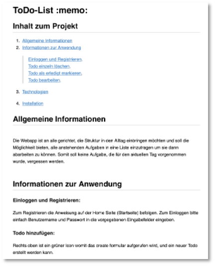
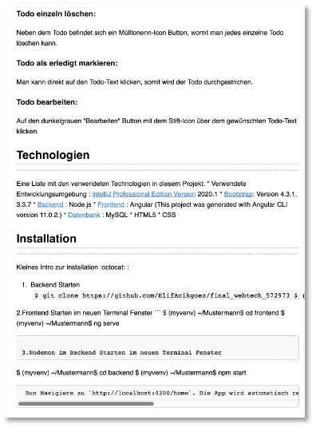

# Web-Technologien

Herzlich willkommen zur WebTech-Veranstaltung im Wintersemester 2023/24! 

### Grober Inhalt

In dieser Veranstaltung lernen Sie, was das World Wide Web ist und wie man eigene Webseiten und -anwendungen realisiert. Sie lernen die Protokolle und Sprachen ``http``, ``HTML``, ``CSS``und ``JavaScript`` kennen und machen sich mit ``Angular``, ``Node.js`` und ``REST`` vertraut. Zentrales Thema ist der sogenannte [MEAN](https://www.ibm.com/cloud/learn/mean-stack-explained)-Stack, d.h. Sie lernen die Entwicklung mithilfe von <b>M</b>ongoDB, <b>E</b>xpress.js, <b>A</b>ngular und <b>N</b>ode.js kennen.

Nachfolgend der vorläufige Wochenplan (wird eventuell angepasst). 

| | Woche | Themen (Vorlesung) | Übung | Aufgabe (Stand) | Abgabe Übung bis | 
|-|-------|--------------------|-------|-----------------|------------------|
| 1. | 16.-20.10.2023 | [Einführung](./einfuehrung/#webtechnologien-einfuhrung) und [Organisatorisches](./#organisatorisches) | [Übung 0](./uebungen/#ubung-0) | - | - | 
| 2. | 23.-27.10.2023 | [HTML](./html/) | [Übung 1](./uebungen/#ubung-1) | Idee | 25.10.2022 | 
| 3. | 30.-03.11.2023 | [CSS (Eigenschaften und Selektoren](./css/#css) | [Übung 2](./uebungen/#ubung-2) | - | 01.11.2022 | 
| 4. | 06.-10.11.2023 | [CSS (Grid)](./css/#grid) | [Übung 3](./uebungen/#ubung-3) | Konzept | 08.11.2022 | 
| 5. | 13.-17.11.2023 | [RWD (responsive Webdesign)](./rwd/#responsive-web-design) | [Übung 4](./uebungen/#ubung-4) | - | 15.11.2022 | 
| 6. | 20.-24.11.2023 | [JavaScript (DOM)](./javascript/#javascript) | [Übung 5](./uebungen/#ubung-5) | Datenmodell | 22.11.2022 | 
| 7. | 27.-01.12.2023 | [Angular (Einführung und Komponenten)](./angular/#angular) | [Übung 6](./uebungen/#ubung-6) | Schnittstelle | 29.11.2022 | 
| 8. | 04.-08.12.2023 | [Angular (Bindings und Direktiven) + JSON](./angular2/#json-und-direktiven) | [Übung 7](./uebungen/#ubung-7) | Frontend (c+r)| 06.12.2022 | 
| 9. | 11.-15.12.2023 | [Angular (Routing und Services)](./routing/#routing-und-services) |  | Frontend (u+d)| 13.12.2022 | 
| 10. | 18.-22.12.2023 | [Node.js + Express (REST-Server + MongoDB)](./backend/#rest-api-mongodb) |  | Frontend fertig | 20.12.2021 | 
| | | | | | | |
| 11. | 01.-05.01.2024 | [Angular (Anbindung ans Backend)](./fe-be-anbindung/#frontend-backend-anbindung) |  | Backend ( c ) | 10.01.2023 | 
| 12. | 08.-12.01.2024 | [Nutzerverwaltung und Material](./guards/#subject-observable-observer-und-guards) | - | Backend (r + u) | 17.01.2023 |
| 13. | 15.-19.01.2024 | Wiederholung  | - | Backend (d + fertig)| 24.01.2023 |
| 14. | 22.-26.01.2024 | Wiederholung | - | fertig stellen | 31.01.2023 |
| 15. | 29.-02.02.2024 | - | Fragen | - | - |
| 16. | 05.-09.02.2024 | - | Fragen | Abgabe 1.PZ 8.2.2024, Gespräche 9.2.2024  |
|  |  |  |  |Abgabe 2.PZ 26.3.2024, Gespräche 27.3.2024 | - |

### Organisatorisches 

Zur erfolgreichen Durchführung der Veranstaltung müssen Sie die Übungen lösen und zu den jeweiligen Fristen per Git auf einen Server (GitHub oder GitLab) laden. Am Ende des Semesters ist eine Aufgabe abzugeben. Diese Aufgabe wird bewertet. Die Bewertung entspricht dann der Modulnote. 

[Hier](./uebungen/#ubungen) sind die Übungen beschrieben, die Sie in jeder Woche ausführen sollen. Damit Sie dies erfolgreich erledigen können, ist jeweils angegeben, welche Themen Sie dafür durcharbeiten müssen. Das Durcharbeiten der jeweiligen Themen entspricht jeweils einer Vorlesung. Diese wird also selbständig durchgeführt. 

Für die Kommunikation untereinander verwenden wir [**Slack**](https://slack.com/intl/de-de/). Dort können Sie alle inhaltlichen und organisatorischen Fragen stellen. Ich fände es gut, wenn ich dort möglichst wenig Fragen - zumindest die inhaltlichen - beantworten müsste, sondern eine Art internes Diskussionsforum entsteht. Es ist sehr gewünscht, dort Fragen zu stellen und noch mehr gewünscht, diese von Ihnen dort beantwortet zu sehen. Damit wäre allen geholfen und ich kann besser erkennen, wo noch Nachhol- bzw. Erläuterungsbedarf bei den meisten besteht.  

## Code aus der Vorlesung

??? question "Code Vorlesung 14.11.2023"
	```html
	<!DOCTYPE html>
	<html lang="en">

	<head>
	    <meta charset="UTF-8">
	    <meta name="viewport" content="width=device-width, initial-scale=1.0">
	    <title>JavaScript</title>

	</head>

	<body>
	    <h1>JavaScript</h1>
	    <main>
	        <h4>Eigenschaften</h4>
	        <ul>
	            <li>Skriptsprache (aus Performanzgründen aber compiliert - z.B. V8 in Chrome, SpiderMonkey in Firefox)</li>
	            <li>dynamische Typisierung</li>
	            <li>keine unterschiedlichen Referenztypen</li>
	            <li>Vererbung durch <code>prototype</code></li>
	            <li>Objekteigenschaften und -funktionen können einfach dem Objekt hinzugefügt werden</li>
	        </ul>
	        <h4>Nützliche Links</h4>
	        <ul>
	            <li><a href="https://www.ecma-international.org/publications-and-standards/standards/ecma-262/">ECMA-262</a>
	            </li>
	            <li><a href="https://dom.spec.whatwg.org/">Document Object Model (DOM)</a></li>
	            <li><a href="https://developer.mozilla.org/en-US/docs/Web/JavaScript/Guide">JavaScript Guide</a></li>
	            <li><a href="https://www.w3schools.com/js/default.asp">JavaScript Tutorial</a></li>
	            <li><a href="https://learnjavascript.online/">Learn JavaScript</a></li>
	            <li><a href="https://developer.mozilla.org/en-US/docs/Web/JavaScript/Reference">JavaScript Reference</a>
	            </li>
	            <li><a href="https://developer.mozilla.org/en-US/docs/Web/API/Node/nodeType?retiredLocale=de">Objekttypen im DOM</a>
	            </li>
	        </ul>
	        <h4>Ergebnisliste</h4>
	        <ul id="ulresult">
	            <li id="liresult1"></li>
	        </ul>
	        <input onchange="inputToList()" type="text" id="input"  placeholder="Name" />
	        <button type="button">Klick Mich!</button>
	    </main>
	    <script>
	        function helloFIW(name = 'World') {
	            console.log('Hello ' + name)
	        }

	        function inputToList() {
	            let input = document.getElementById('input');
	            let inputValue = input.value;
	            console.log('value :', inputValue)
	            let output = document.querySelector('#liresult1');
	            if(output.innerHTML == "") {
	                output.innerHTML = inputValue;
	                output.style.color = 'red';
	            } else {
	                let newLi = document.createElement('li');
	                let liste = document.querySelector('#ulresult');
	                console.log('ul : ', liste);
	                let newText = document.createTextNode(inputValue);
	                newLi.appendChild(newText);
	                liste.appendChild(newLi);
	            }
	            input.value = "";
	        }
	    </script>
	</body>

	</html>
	```


??? question "Code Vorlesung 21.11.2023"
	```html
	<!DOCTYPE html>
	<html lang="en">
	<head>
	    <meta charset="UTF-8">
	    <meta name="viewport" content="width=device-width, initial-scale=1.0">
	    <link href="https://cdn.jsdelivr.net/npm/bootstrap@5.3.2/dist/css/bootstrap.min.css" rel="stylesheet"
	        integrity="sha384-T3c6CoIi6uLrA9TneNEoa7RxnatzjcDSCmG1MXxSR1GAsXEV/Dwwykc2MPK8M2HN" crossorigin="anonymous">
	    <title>Asynchron</title>
	</head>
	<body class="container">
	    <h1>Themen</h1>
	<div class="list-group">
	   <a class="list-group-item list-group-item-action" href="https://developer.mozilla.org/en-US/docs/Learn/JavaScript/Asynchronous/Introducing">asynchron</a>
	    <a class="list-group-item list-group-item-action" href="https://developer.mozilla.org/en-US/docs/Web/API/Fetch_API/Using_Fetch">fetch-API</a>
	    <a class="list-group-item list-group-item-action" href="https://developer.mozilla.org/en-US/docs/Learn/JavaScript/Objects/Basics">Objekte</a>
	    <a class="list-group-item list-group-item-action" href="https://www.json.org/json-de.html">JSON</a>
	    <a class="list-group-item list-group-item-action" href="https://angular.io/">Angular</a>
	</div>
	<script>
	    function asyncBehaviour() {

	        let a = 1;
	        let b = 1;

	        setTimeout(  () => {
	            console.log('timeout a = ', a)
	        }, 100)

	        fetch('https://jsonplaceholder.typicode.com/posts')
	        .then( response => {
	            console.log(response)
	            return response.json() // Rueckgabe des body unserer Response
	        })
	        .then ( body => {
	            console.log('body', body)
	            return body[0]
	        })
	        .then( obj0 => console.log(obj0))

	        console.log("a = ", a)
	        console.log("b = ", b)

	        a = 10;
	    }

	    let person = {
	        name: "Musterfrau",
	        vorname: "Maria",
	        adresse: {
	            strasse: "Wilhelminenhofstr.",
	            nummer: 75,
	            plz: 12459,
	            stadt: "Berlin"
	        },
	        getName: () => `${person.vorname} ${person.name}` 
	    }

	    person.alter = 42

	    console.log('person', person)
	    console.log('name', person.name)
	    console.log('strasse', person.adresse?.strasse)
	    console.log('name + vorname', person.getName())

	    let personJSON = JSON.stringify(person)
	    console.log(personJSON)
	    let personObj = JSON.parse(personJSON)
	    console.log(personObj)

	    asyncBehaviour();
	</script>
	</body>
	</html>
	```


??? question "Code Vorlesung 28.11.2023"
	Angulat-Projekt `first` - siehe [hier](https://github.com/jfreiheit/WT23)


??? question "Code Vorlesung 05.12.2023"
	=== "shared/my.service.ts"
	```js
	import { Injectable } from '@angular/core';
	import { Member } from './member';

	@Injectable({
	  providedIn: 'root'
	})
	export class MyService {

	  async getAllMembers(): Promise<Member[]> {
	    let response = await fetch('../../assets/members.json')
	    let membersArray = response.json();
	    return membersArray;
	  }
	}
	```

	=== "shard/member.ts"
	```js
	export interface Member {
	  firstname: string;
	  lastname: string;
	  email: string;
	  ipaddress: string;
	}
	```

	=== "table.component.ts"
	```js
	import { Component, OnInit, inject } from '@angular/core';
	import { CommonModule } from '@angular/common';
	import { MyService } from '../shared/my.service';
	import { Member } from '../shared/member';
	import { FormControl, ReactiveFormsModule } from '@angular/forms';

	@Component({
	  selector: 'app-table',
	  standalone: true,
	  imports: [CommonModule, ReactiveFormsModule],
	  templateUrl: './table.component.html',
	  styleUrl: './table.component.css'
	})
	export class TableComponent implements OnInit{

	  members: Member[] = [];
	  filterMem: Member[] = [];
	  search = new FormControl('');
	  private myservice = inject(MyService);


	  async ngOnInit(): Promise<void> {
	    this.members = await this.myservice.getAllMembers();
	    this.filterMem = this.members;
	    console.log('members', this.filterMem)
	  }

	  filterMembers(): void{
	    let searchstring = this.search.value ? this.search.value : "";
	    console.log(searchstring)
	    this.filterMem = this.members.filter( (member) =>
	      member.firstname.toLowerCase().includes(searchstring) );
	    console.log(this.filterMem)
	  }
	}
	```

	=== "table.component.html"
	```html
	<h1>Alle Teilnehmerinnen</h1>
	<input type="text" placeholder="Filtern" [formControl]="search" (input)="filterMembers()"/>
	<table>
	  <thead>
	    <tr>
	      <th>Nr</th>
	      <th>Vorname</th>
	      <th>Nachname</th>
	      <th>E-Mail</th>
	      <th>IP-Adresse</th>
	    </tr>
	  </thead>
	  <tbody>
	    <tr *ngFor="let member of filterMem; let i = index;">
	      <td>{{ i }}</td>
	      <td>{{ member.firstname }}</td>
	      <td>{{ member.lastname }}</td>
	      <td>{{ member.email }}</td>
	      <td>{{ member.ipaddress }}</td>
	    </tr>
	  </tbody>
	</table>
	```

??? hint "Video aus Vorlesung 05.12.2023"
	<iframe src="https://mediathek.htw-berlin.de/media/embed?key=bb3c140407d5a0b09e4379af729c3c01&width=720&height=405&autoplay=false&controls=true&autolightsoff=false&loop=false&chapters=false&playlist=false&related=false&responsive=false&t=0&loadonclick=true&thumb=true" data-src="https://mediathek.htw-berlin.de/media/embed?key=bb3c140407d5a0b09e4379af729c3c01&width=720&height=405&autoplay=false&controls=true&autolightsoff=false&loop=false&chapters=false&playlist=false&related=false&responsive=false&t=0&loadonclick=true" class="" width="720" height="405" title="10_Services" frameborder="0" allowfullscreen="allowfullscreen" allowtransparency="true" scrolling="no" aria-label="media embed code" style=""></iframe>


??? question "Code Vorlesung 12.12.2023"
	=== "server.js"
		```js
		const express = require('express');
		const cors = require('cors');
		require('dotenv').config();
		const routes = require('./routes');
		const init = require('./initdb')

		const app = express();
		const PORT = 4000;

		app.use(express.json());
		app.use(cors());
		app.use('/init', init)
		app.use('/', routes);

		app.listen(PORT, (error) => {
		    if(error) {
		        console.log('error! ', error)
		    } else {
		        console.log(`server running on port ${PORT} ...`)
		    }
		})
		```

	=== "routes.js"
		```js
		const express = require('express');
		const client = require('./db')
		const router = express.Router();

		// CRUD

		// get all members
		router.get('/members', async(req, res) => {
		    const query = `SELECT * FROM public.members `;

		    try {
		        const result = await client.query(query)
		        console.log(result)
		        res.send(result.rows);
		    } catch (err) {
		        console.log('error - select' , err.stack)
		    }
		});

		module.exports = router;
		```

	=== "db.js"
		```js
		const pg = require('pg')
		require('dotenv').config();

		const client = new pg.Client({
		    user: process.env.PGUSER,
		    host: process.env.PGHOST,
		    database: process.env.PGDATABASE,
		    password: process.env.PGPASSWORD,
		    port: process.env.PGPORT
		})

		client.connect( (err) => {
		    if(err) {
		        console.log('database NOT connected', err)
		    } else {
		        console.log('database connected ...')
		    }
		})

		module.exports = client;	/* hier fehlte ein s hinter export im Video */
		```

	=== "initdb.js"
		```js
		const express = require('express');
		const client = require('./db');
		const initdb = express.Router();
		const format = require('pg-format');


		initdb.get('/', async(req, res) => {

		    // Anlegen der Tabelle members
		    let query = `
		            DROP TABLE IF EXISTS members;
		            CREATE TABLE members(id serial PRIMARY KEY, firstname VARCHAR(50), lastname VARCHAR(50), email VARCHAR(50));
		            `;

		    try {
		        await client.query(query)
		        console.log("Table created successfully ...")
		    } catch (err) {
		        console.log(err)
		    }

		    // Befüllen der Tabelle members mit 50 Einträgen
		    const values = [
		        ["Catherine", "Williams", "cwilliamsl@360.cn"],
		        ["Adam", "Anderson", "aanderson8@google.fr"],
		        ["Susan", "Andrews", "sandrewsn@google.co.jp"],
		        ["Catherine", "Andrews", "candrewsp@noaa.gov"],
		        ["Alan", "Bradley", "abradley1c@globo.com"],
		        ["Anne", "Brooks", "abrooks16@bravesites.com"],
		        ["Russell", "Brown", "rbrownq@nifty.com"],
		        ["Ryan", "Burton", "rburton18@foxnews.com"],
		        ["Roy", "Campbell", "rcampbell1@geocities.com"],
		        ["Russell", "Campbell", "rcampbell17@eventbrite.com"],
		        ["Bonnie", "Coleman", "bcoleman11@fc2.com"],
		        ["Ernest", "Coleman", "ecoleman15@businessweek.com"],
		        ["Richard", "Cruz", "rcruz7@unc.edu"],
		        ["Sean", "Cruz", "scruz10@answers.com"],
		        ["Rebecca", "Cunningham", "rcunninghamd@mac.com"],
		        ["Margaret", "Evans", "mevansh@pcworld.com"],
		        ["Jeffrey", "Ford", "jford14@cnet.com"],
		        ["Andrea", "Gardner", "agardnerv@woothemes.com"],
		        ["Deborah", "George", "dgeorge6@furl.net"],
		        ["Sean", "Gibson", "sgibsony@alexa.com"],
		        ["Virginia", "Graham", "vgrahamk@aol.com"],
		        ["Steven", "Hamilton", "shamiltonu@state.tx.us"],
		        ["Virginia", "Hawkins", "vhawkinsf@ehow.com"],
		        ["Edward", "Hicks", "ehicksc@pcworld.com"],
		        ["Mark", "Johnson", "mjohnsonj@hostgator.com"],
		        ["Ruth", "Jordan", "rjordan1a@smugmug.com"],
		        ["Antonio", "Kim", "akim4@odnoklassniki.ru"],
		        ["Jennifer", "Marshall", "jmarshallt@gnu.org"],
		        ["Eric", "Matthews", "ematthews5@independent.co.uk"],
		        ["Raymond", "Mcdonald", "rmcdonald2@ihg.com"],
		        ["Eric", "Miller", "emillere@creativecommons.org"],
		        ["Jonathan", "Morales", "jmoralesa@ovh.net"],
		        ["Marie", "Morgan", "mmorganb@cloudflare.com"],
		        ["Amanda", "Nelson", "anelson13@indiatimes.com"],
		        ["Lisa", "Olson", "lolsonr@telegraph.co.uk"],
		        ["Alice", "Ortiz", "aortizw@histats.com"],
		        ["Peter", "Phillips", "pphillipss@1688.com"],
		        ["Matthew", "Porter", "mporter9@europa.eu"],
		        ["Tammy", "Ray", "trayx@weather.com"],
		        ["Mark", "Richardson", "mrichardson1d@ihg.com"],
		        ["Joan", "Roberts", "jroberts12@alibaba.com"],
		        ["Kathleen", "Rose", "kroseg@pinterest.com"],
		        ["Steve", "Sanders", "ssanders1b@wikispaces.com"],
		        ["Shirley", "Scott", "sscottm@macromedia.com"],
		        ["Lillian", "Stephens", "lstephens19@hugedomains.com"],
		        ["Nicole", "Thompson", "nthompson3@admin.ch"],
		        ["Marie", "Thompson", "mthompsonz@yelp.com"],
		        ["Alan", "Vasquez", "avasquezo@miibeian.gov.cn"],
		        ["Mildred", "Watkins", "mwatkins0@miibeian.gov.cn"],
		        ["Eugene", "Williams", "ewilliamsi@deliciousdays.com"]
		    ];
		    const paramquery = format('INSERT INTO members(firstname, lastname, email) VALUES %L RETURNING *', values);


		    try {
		        const result = await client.query(paramquery)
		        console.log("50 members inserted ...")
		        res.status(200)
		        res.send(result.rows)
		    } catch (err) {
		        console.log(err)
		    }

		});


		module.exports = initdb;
		```

	=== ".env (Anpassen!)"
		```
		PGUSER=ihr_username
		PGHOST=psql.f4.htw-berlin.de
		PGPASSWORD=ihr_passwort
		PGDATABASE=ihre_datenbank
		PGPORT=5432
		```

	=== "package,json"
		```
		{
		  "name": "backend1",
		  "version": "1.0.0",
		  "description": "Backend mit PostgreSQL",
		  "main": "server.js",
		  "scripts": {
		    "start": "nodemon server.js",
		    "test": "echo \"Error: no test specified\" && exit 1"
		  },
		  "author": "",
		  "license": "ISC",
		  "dependencies": {
		    "cors": "^2.8.5",
		    "dotenv": "^16.3.1",
		    "express": "^4.18.2",
		    "nodemon": "^3.0.2",
		    "pg": "^8.11.3",
		    "pg-format": "^1.0.4"
		  }
		}

		```


??? hint "Video aus Vorlesung 12.12.2023"
	<iframe src="https://mediathek.htw-berlin.de/media/embed?key=1622721f44d0a01a63ceaff2514405e7&width=720&height=405&autoplay=false&controls=true&autolightsoff=false&loop=false&chapters=false&playlist=false&related=false&responsive=false&t=0&loadonclick=true&thumb=true" data-src="https://mediathek.htw-berlin.de/media/embed?key=1622721f44d0a01a63ceaff2514405e7&width=720&height=405&autoplay=false&controls=true&autolightsoff=false&loop=false&chapters=false&playlist=false&related=false&responsive=false&t=0&loadonclick=true" class="" width="720" height="405" title="11_backend_postgresql" frameborder="0" allowfullscreen="allowfullscreen" allowtransparency="true" scrolling="no" aria-label="media embed code" style=""></iframe>


??? hint "Video aus Vorlesung 19.12.2023"
	<iframe src="https://mediathek.htw-berlin.de/media/embed?key=4d3b91dff946a0efb441c10c1e1ede53&width=720&height=405&autoplay=false&controls=true&autolightsoff=false&loop=false&chapters=false&playlist=false&related=false&responsive=false&t=0&loadonclick=true&thumb=true" data-src="https://mediathek.htw-berlin.de/media/embed?key=4d3b91dff946a0efb441c10c1e1ede53&width=720&height=405&autoplay=false&controls=true&autolightsoff=false&loop=false&chapters=false&playlist=false&related=false&responsive=false&t=0&loadonclick=true" class="" width="720" height="405" title="Webtech_Backend2" frameborder="0" allowfullscreen="allowfullscreen" allowtransparency="true" scrolling="no" aria-label="media embed code" style=""></iframe>


??? question "Code Vorlesung 2.1.2024"
	=== "register.component.html"
		```html
		<div class="container">
		  <h1 class="mt-5">Registrierung</h1>

		    <div class="mb-3 row">
		      <label for="idUsername" class="col-sm-2 col-form-label">Username</label>
		      <div class="col-sm-10">
		        <input type="text" class="form-control" id="idUsername" placeholder="username" [formControl]="usernameFC" [class]="usernameFC.valid ? 'is-valid' : 'is-invalid'">
		      </div>

		    </div>

		    <div class="mb-3 row">
		      <label for="staticEmail" class="col-sm-2 col-form-label">Email</label>
		      <div class="col-sm-10">
		        <input type="email" class="form-control" id="staticEmail" placeholder="email@example.com" [formControl]="emailFC" [class]="emailFC.valid ? 'is-valid' : 'is-invalid'">
		      </div>
		    </div>

		    <div class="mb-3 row">
		      <label for="inputPassword" class="col-sm-2 col-form-label">Password</label>
		      <div class="col-sm-10">
		        <input type="password" class="form-control" id="inputPassword" [formControl]="passwordFC" [class]="passwordFC.valid ? 'is-valid' : 'is-invalid'">
		      </div>
		    </div>

		    <div class="mb-3 row">
		    <label for="roleID" class="col-sm-2 col-form-label">Role</label>
		    <div class="col-sm-10">
		    <select class="form-select" id="roleID" [formControl]="roleFC" [class]="roleFC.valid ? 'is-valid' : 'is-invalid'">
		      <option value="admin">Admin</option>
		      <option value="user">User</option>
		      <option value="reader">Reader</option>
		    </select>
		    </div>
		    </div>

		    <div class="mb-3 row">
		      <button type="button" class="offset-2 col-10 btn btn-success" (click)="register()">Register</button>
		    </div>
		</div>
		```

	=== "register.component.ts"
		```js
		import { Component } from '@angular/core';
		import { FormControl, ReactiveFormsModule, Validators } from '@angular/forms';

		@Component({
		  selector: 'app-register',
		  standalone: true,
		  imports: [ReactiveFormsModule],
		  templateUrl: './register.component.html',
		  styleUrl: './register.component.css'
		})
		export class RegisterComponent {
		  usernameFC = new FormControl('', Validators.required);
		  passwordFC = new FormControl('', Validators.required);
		  emailFC = new FormControl('', [Validators.required, Validators.email]);
		  roleFC = new FormControl('', Validators.required);

		  register() {
		    console.log('button geklickt')

		    if(this.usernameFC.valid) {
		      console.log('valid')
		    }
		    else {
		      console.log('invalid');
		      if(this.usernameFC.errors?.['required']) console.log('username required')
		    }
		    let usernameValue = this.usernameFC.value;
		    let passwordValue = this.passwordFC.value;
		    let emailValue = this.emailFC.value;
		    let roleValue = this.roleFC.value;

		    let user = {
		      username: usernameValue,
		      password: passwordValue,
		      email: emailValue,
		      role: roleValue
		    }

		    console.log('user : ', user)
		  }
		}
		```


??? hint "Video aus Vorlesung 2.1.2024"
	<iframe src="https://mediathek.htw-berlin.de/media/embed?key=361e14872bb0d3da49435d2bcb6d77d1&width=720&height=405&autoplay=false&controls=true&autolightsoff=false&loop=false&chapters=false&playlist=false&related=false&responsive=false&t=0&loadonclick=true&thumb=true" data-src="https://mediathek.htw-berlin.de/media/embed?key=361e14872bb0d3da49435d2bcb6d77d1&width=720&height=405&autoplay=false&controls=true&autolightsoff=false&loop=false&chapters=false&playlist=false&related=false&responsive=false&t=0&loadonclick=true" class="" width="720" height="405" title="Webtech_Formulare" frameborder="0" allowfullscreen="allowfullscreen" allowtransparency="true" scrolling="no" aria-label="media embed code" style=""></iframe>


??? question "Code Vorlesung 9.1. und 16.1.2024"
	siehe [GitHub-Repo Frontend](https://github.com/jfreiheit/frontend_bs_23) und [Backend](https://github.com/jfreiheit/backend_23)

??? hint "Video aus Vorlesung 16.1.2024"
	<iframe src="https://mediathek.htw-berlin.de/media/embed?key=0253a00e5afe7b184ab31ca3a2881664&width=720&height=405&autoplay=false&controls=true&autolightsoff=false&loop=false&chapters=false&playlist=false&related=false&responsive=false&t=0&loadonclick=true&thumb=true" data-src="https://mediathek.htw-berlin.de/media/embed?key=0253a00e5afe7b184ab31ca3a2881664&width=720&height=405&autoplay=false&controls=true&autolightsoff=false&loop=false&chapters=false&playlist=false&related=false&responsive=false&t=0&loadonclick=true" class="" width="720" height="405" title="WebTech_Vorl0116" frameborder="0" allowfullscreen="allowfullscreen" allowtransparency="true" scrolling="no" aria-label="media embed code" style=""></iframe>


	
## Semesteraufgabe

Am Ende des Kurses geben Sie eine Webanwendung ab. Diese wird bewertet und bildet die Modulnote für "WebTech" (es gibt also keine Klausur o.ä.). Überlegen Sie sich früh, was Sie implementieren wollen. Ihrer Kreativität sind keine Grenzen gesetzt. Es können 2 Studentinnen gemeinsam ein Projekt durchführen und abgeben. Sie erhalten dann (höchstwahrscheinlich) die gleiche Note. Es muss an den Commits erkennbar sein, welchen Anteil am Ergebnis jede der beiden Studentinnen hatte.

??? question "Mindestanforderungen"
	Folgende Anforderungen werden an Ihr Projekt gestellt:

	* das Frontend soll mit Angular entwickelt werden,
	* das Backend mit Node.js,
	* es soll eine Datenbank (MongoDB, kann aber auch MySQL oder PostgreSQL oder MariaDB - aber **nicht** Firebase) verwendet werden,
	* es soll CRUD implementiert sein, d.h. Sie benötigen 
	    * eine Komponente zur Erstellung und Speicherung eines Datenbankeintrages (<b>C</b>reate),
	    * eine Komponente zur Änderung eines Datenbankeintrages (<b>U</b>pdate),
	    * eine Komponente zur Anzeige *aller* Datenbankeinträge (<b>R</b>ead),
	    * eine Komponente zum Löschen eines Datenbankeintrages (<b>D</b>elete).
    * wenn Sie die Anwendung alleine umsetzen, dann genügen 3 der 4 CRUD-Funktionalitäten
    * wenn Sie die Anwendung zu zweit entwickeln, dann
    	* sollen alle 4 CRUD-Funktionalitäten umgesetzt werden und
    	* Login (Username + Passwort) und
    	* ich schaue mir die Commit-Hiostorie im Git genauer an, um sicherzugehen, dass beide Studentinnen gleich viel an der Anwendung mitentwickelt haben

	Datenbankeinträge können Bücher, CDs, ToDos, Einkaufslisten, Vorlesungen, Kühlschrankinhalte usw. sein - wie gesagt, Ihrer Kreativität sind keine Grenzen gesetzt. 

	Die Anwendung soll in einem Git-Dienst (GitHub, GitLab, ...) verfügbar sein. 

	Verwenden Sie ein CSS-Framework, wie z.B. Materialize, Bootstrap o.ä.! Ihre Anwendung soll "modern" aussehen und responsive sein. 

	Erstellen Sie eine **informative (ausführliche) README**-Datei (`README.md`). Diese Datei sollte beinhalten:

	 - Eine Beschreibung Ihrer Anwendung. Am besten mit Screenshots, so dass sie Ihren Kommilitoninnen aus den nächsten Jahren hilft, ein Verständnis dafür zu entwickeln, was mögliche Semesteraufgaben sein können.
	 - Eine Anleitung zur Installation Ihrer Anwendung. 

	Super wäre es, wenn Sie die Datenbank, die Sie verwenden, per Skript vorausfüllen, d.h. es wäre schön, wenn zum Testen der Anwendung nur das Frontend und das Backend gestartet werden müssten und alles andere automatisch passieren würde. Super wäre es auch, wenn Sie Ihre Anwendung deployen würden. 
	
	Nach Abgabe vereinbaren wir ein Online-Meeting, in dem Sie mir Ihre Anwendung nochmal zeigen können und ich Ihnen Fragen zu Ihrem Code stellen werde. Ist keine Prüfung, sondern eher ein fachliches Gespräch. 

## Abgabe- und Gesprächstermine

Die Lösung für die Semesteraufgabe pushen Sie in Ihr Respository. In einem Gespräch führen Sie die Lösung vor und wir unterhalten uns über Ihre Lösung. Dafür stehen verschiedene Termine zur Verfügung. 

- 1. Prüfungszeitraum: 13.2. Abgabe und 14.2. Gespräch
- 2. Püfungszeitraum: 26.3. Abgabe und 27.3. Gespräch

Bitte tragen Sie sich in [Moodle](https://moodle.htw-berlin.de/course/view.php?id=38845) in den von Ihnen gewünschten Gesprächstermin ein! Wenn Sie im 1.PZ abgeben, tragen Sie sich im LSF zum ersten PZ zur Prüfung ein, ansonsten im 2.PZ. 

### Einige Beispiele

#### Mieter- und Zahlungsinformationen verwalten

- 
- 
	

#### ToDo-Liste

- 
- 
- 	

- 
- 


#### Dog-O-Mat

- 


#### Reiseplaner

- 
- 

