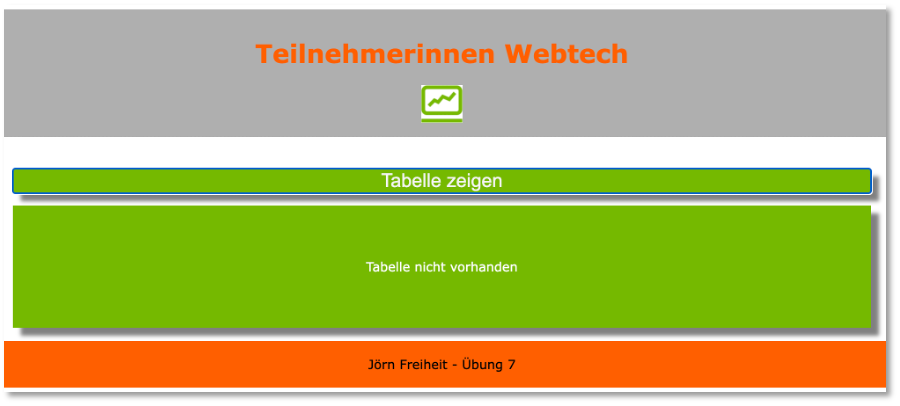

# Übungen

#### Übung 0

??? question "Infrastruktur einrichten"
    - wählen Sie eine [**IDE**](../tools/#integrated-development-environment-ide) aus und installieren Sie diese 
    - richten Sie sich ein Git-Repository ein (z.B. `WebTech22`) und pushen Sie es auf einen zentralen Dienst ([**siehe**](../tools/#git))
    - laden Sie mich zu Ihrem Git-Dienst ein ([**siehe**](../tools/#git))
    - commiten und pushen Sie Ihr Repository


#### Übung 1

??? question "Übungsaufgabe 1 (HTML)"
    - Erstellen Sie in einem `Uebung1`-Ordner eine Datei `uebung1.html`. Das `body`-Element soll ein `header`-Element, ein `nav`-Element, ein `section`-Element und ein `footer`-Element enthalten. 
    - Unter dieser Übungsaufgabe (siehe `mockupdata`) ist der HTML-Code einer Tabelle mit allen Teilnehmerinnen einer Veranstaltung. Kopieren Sie den Inhalt der Datei so in Ihren HTML-Code, dass folgende Seite erscheint:
    

    - Es sollen 4 Unterseiten erstellt werden. Bei Klick auf diese Seiten soll die Tabelle jeweils nur die Teilnehmerinnen enthalten, deren Nachname mit dem entsprechenden Anfangsbuchstaben beginnt (also in `ag.html` nur alle Nachnamen, die mit A bis G beginnen). Die Seiten `ag.html`, `hl.html`, `mr.html` und `sz.html` sollen im Ordner `NN` abgelegt werden, der Unterordner von `Uebung1` ist.
    - Achten Sie darauf, dass man von jeder Unterseite auf jede andere Unterseite und auch auf die Hauptseite (`uebung1.html`) wechseln können muss.
    - Das einzubindende Logo des Studiengangs liegt [hier](./files/fiw.jpg). Es soll in einen `images`-Ordner gespeichert werden, der in der Ordner-Hierarchie neben dem `Uebung1`-Ordner liegt. Um die Größe des Bildes festzulegen, können Sie mit Hilfe des `style`-Attributes die Höhe und die Breite bestimmen: `style="width:53px; height:48px;"` 
    - Nächste Woche wird Uebung1 um CSS erweitert. 

??? "mockupdata"
    ```html
    <table>
        <thead>
            <tr>
                <th>Vorname</th>
                <th>Nachname</th>
                <th>E-Mail-Adresse</th>
                <th>IP-Adresse</th>
            </tr>
        </thead>
        <tbody>
            <tr>
                <td>Adam</td>
                <td>Anderson</td>
                <td>aanderson8@google.fr</td>
                <td>118.93.83.157</td>
            </tr>
            <tr>
                <td>Susan</td>
                <td>Andrews</td>
                <td>sandrewsn@google.co.jp</td>
                <td>228.214.9.251</td>
            </tr>
            <tr>
                <td>Catherine</td>
                <td>Andrews</td>
                <td>candrewsp@noaa.gov</td>
                <td>112.111.87.178</td>
            </tr>
            <tr>
                <td>Alan</td>
                <td>Bradley</td>
                <td>abradley1c@globo.com</td>
                <td>229.152.117.127</td>
            </tr>
            <tr>
                <td>Anne</td>
                <td>Brooks</td>
                <td>abrooks16@bravesites.com</td>
                <td>243.159.39.234</td>
            </tr>
            <tr>
                <td>Russell</td>
                <td>Brown</td>
                <td>rbrownq@nifty.com</td>
                <td>215.38.120.242</td>
            </tr>
            <tr>
                <td>Ryan</td>
                <td>Burton</td>
                <td>rburton18@foxnews.com</td>
                <td>159.60.107.14</td>
            </tr>
            <tr>
                <td>Roy</td>
                <td>Campbell</td>
                <td>rcampbell1@geocities.com</td>
                <td>237.232.34.20</td>
            </tr>
            <tr>
                <td>Russell</td>
                <td>Campbell</td>
                <td>rcampbell17@eventbrite.com</td>
                <td>251.2.92.63</td>
            </tr>
            <tr>
                <td>Bonnie</td>
                <td>Coleman</td>
                <td>bcoleman11@fc2.com</td>
                <td>109.150.122.102</td>
            </tr>
            <tr>
                <td>Ernest</td>
                <td>Coleman</td>
                <td>ecoleman15@businessweek.com</td>
                <td>213.173.4.7</td>
            </tr>
            <tr>
                <td>Richard</td>
                <td>Cruz</td>
                <td>rcruz7@unc.edu</td>
                <td>235.124.23.221</td>
            </tr>
            <tr>
                <td>Sean</td>
                <td>Cruz</td>
                <td>scruz10@answers.com</td>
                <td>92.255.49.227</td>
            </tr>
            <tr>
                <td>Rebecca</td>
                <td>Cunningham</td>
                <td>rcunninghamd@mac.com</td>
                <td>65.79.191.52</td>
            </tr>
            <tr>
                <td>Margaret</td>
                <td>Evans</td>
                <td>mevansh@pcworld.com</td>
                <td>162.10.86.196</td>
            </tr>
            <tr>
                <td>Jeffrey</td>
                <td>Ford</td>
                <td>jford14@cnet.com</td>
                <td>210.216.54.14</td>
            </tr>
            <tr>
                <td>Andrea</td>
                <td>Gardner</td>
                <td>agardnerv@woothemes.com</td>
                <td>179.91.0.30</td>
            </tr>
            <tr>
                <td>Deborah</td>
                <td>George</td>
                <td>dgeorge6@furl.net</td>
                <td>201.76.47.162</td>
            </tr>
            <tr>
                <td>Sean</td>
                <td>Gibson</td>
                <td>sgibsony@alexa.com</td>
                <td>48.114.103.55</td>
            </tr>
            <tr>
                <td>Virginia</td>
                <td>Graham</td>
                <td>vgrahamk@aol.com</td>
                <td>165.219.171.1</td>
            </tr>
            <tr>
                <td>Steven</td>
                <td>Hamilton</td>
                <td>shamiltonu@state.tx.us</td>
                <td>38.194.91.201</td>
            </tr>
            <tr>
                <td>Virginia</td>
                <td>Hawkins</td>
                <td>vhawkinsf@ehow.com</td>
                <td>93.120.46.203</td>
            </tr>
            <tr>
                <td>Edward</td>
                <td>Hicks</td>
                <td>ehicksc@pcworld.com</td>
                <td>199.153.27.1</td>
            </tr>
            <tr>
                <td>Mark</td>
                <td>Johnson</td>
                <td>mjohnsonj@hostgator.com</td>
                <td>73.87.135.206</td>
            </tr>
            <tr>
                <td>Ruth</td>
                <td>Jordan</td>
                <td>rjordan1a@smugmug.com</td>
                <td>193.140.80.64</td>
            </tr>
            <tr>
                <td>Antonio</td>
                <td>Kim</td>
                <td>akim4@odnoklassniki.ru</td>
                <td>168.244.191.78</td>
            </tr>
            <tr>
                <td>Jennifer</td>
                <td>Marshall</td>
                <td>jmarshallt@gnu.org</td>
                <td>104.191.49.94</td>
            </tr>
            <tr>
                <td>Eric</td>
                <td>Matthews</td>
                <td>ematthews5@independent.co.uk</td>
                <td>138.194.30.1</td>
            </tr>
            <tr>
                <td>Raymond</td>
                <td>Mcdonald</td>
                <td>rmcdonald2@ihg.com</td>
                <td>161.24.42.24</td>
            </tr>
            <tr>
                <td>Eric</td>
                <td>Miller</td>
                <td>emillere@creativecommons.org</td>
                <td>122.159.17.218</td>
            </tr>
            <tr>
                <td>Jonathan</td>
                <td>Morales</td>
                <td>jmoralesa@ovh.net</td>
                <td>97.65.110.105</td>
            </tr>
            <tr>
                <td>Marie</td>
                <td>Morgan</td>
                <td>mmorganb@cloudflare.com</td>
                <td>226.79.152.112</td>
            </tr>
            <tr>
                <td>Amanda</td>
                <td>Nelson</td>
                <td>anelson13@indiatimes.com</td>
                <td>161.185.121.245</td>
            </tr>
            <tr>
                <td>Lisa</td>
                <td>Olson</td>
                <td>lolsonr@telegraph.co.uk</td>
                <td>77.245.172.100</td>
            </tr>
            <tr>
                <td>Alice</td>
                <td>Ortiz</td>
                <td>aortizw@histats.com</td>
                <td>179.52.222.21</td>
            </tr>
            <tr>
                <td>Peter</td>
                <td>Phillips</td>
                <td>pphillipss@1688.com</td>
                <td>11.158.255.76</td>
            </tr>
            <tr>
                <td>Matthew</td>
                <td>Porter</td>
                <td>mporter9@europa.eu</td>
                <td>174.81.178.88</td>
            </tr>
            <tr>
                <td>Tammy</td>
                <td>Ray</td>
                <td>trayx@weather.com</td>
                <td>192.243.38.190</td>
            </tr>
            <tr>
                <td>Mark</td>
                <td>Richardson</td>
                <td>mrichardson1d@ihg.com</td>
                <td>209.217.14.154</td>
            </tr>
            <tr>
                <td>Joan</td>
                <td>Roberts</td>
                <td>jroberts12@alibaba.com</td>
                <td>4.91.143.62</td>
            </tr>
            <tr>
                <td>Kathleen</td>
                <td>Rose</td>
                <td>kroseg@pinterest.com</td>
                <td>222.172.140.56</td>
            </tr>
            <tr>
                <td>Steve</td>
                <td>Sanders</td>
                <td>ssanders1b@wikispaces.com</td>
                <td>91.61.109.245</td>
            </tr>
            <tr>
                <td>Shirley</td>
                <td>Scott</td>
                <td>sscottm@macromedia.com</td>
                <td>219.237.108.82</td>
            </tr>
            <tr>
                <td>Lillian</td>
                <td>Stephens</td>
                <td>lstephens19@hugedomains.com</td>
                <td>89.85.137.204</td>
            </tr>
            <tr>
                <td>Nicole</td>
                <td>Thompson</td>
                <td>nthompson3@admin.ch</td>
                <td>13.183.208.155</td>
            </tr>
            <tr>
                <td>Marie</td>
                <td>Thompson</td>
                <td>mthompsonz@yelp.com</td>
                <td>162.164.5.231</td>
            </tr>
            <tr>
                <td>Alan</td>
                <td>Vasquez</td>
                <td>avasquezo@miibeian.gov.cn</td>
                <td>178.109.86.172</td>
            </tr>
            <tr>
                <td>Mildred</td>
                <td>Watkins</td>
                <td>mwatkins0@miibeian.gov.cn</td>
                <td>150.67.132.64</td>
            </tr>
            <tr>
                <td>Eugene</td>
                <td>Williams</td>
                <td>ewilliamsi@deliciousdays.com</td>
                <td>67.208.26.182</td>
            </tr>
            <tr>
                <td>Catherine</td>
                <td>Williams</td>
                <td>cwilliamsl@360.cn</td>
                <td>154.87.204.51</td>
            </tr>
        </tbody>
    </table>
    ```


#### Übung 2

??? question "Übungsaufgabe 2 (CSS)"
    - Erstellen Sie (falls noch nicht geschehen) eine `index.html`-Datei in Ihrem Repository-Ordner (also z.B. `DocumentRoot/Webtech22`) derart, dass diese direkte Links auf Ihre Lösungen der Übungen enthalten (z.B. in einer Tabelle oder einer Liste).
    - Kopieren Sie den Ordner `Uebung1` in den Ordner `Uebung2` (also inkl. Ordner `NN`). Ändern Sie darin die Datei `uebung1.html` zu `uebung2.html` (umbenennen). Ändern Sie entsprechend alle Links innerhalb der Datei, damit Sie z.B. auf den Ordner `Uebung2/NN` zugreifen und nicht mehr auf `Uebung1/NN`.
    - Legen Sie sich im `Uebung2`-Ordner einen Ordner `styles` an. Erstellen Sie in dem `styles`-Ordner eine Datei `mystyles.css`.
    - Fügen Sie im `<head>`-Bereich der `uebung2.html` eine logische Verknüpfung zur `mystyles.css`-Datei ein (`<link href="./styles/mystyles.css" rel="stylesheet">`). 
    - In `mystyles.css` definieren Sie (versuchen Sie mind. 6 der genannten 8 Punkte umzusetzen):
        - Verdana als Schriftart für das ganze Dokument
        - der `<header>` soll das HTW-Grau als Hintergrundfarbe, HTW-Orange als Schriftfarbe und der Text zentriert sein (siehe [**HTW Corporate Design**](http://corporatedesign.htw-berlin.de/schrift-farbe/markenfarben/)).
        - die Tabelle soll ungefähr wie dargestellt aussehen: 
           
        - d.h. mit Rahmen, mit einem Schatten, die Spaltenüberschriften in weiß, mit HTW-grünem Hintergrund.   
        - Das `<nav>`-Feld hat einen Abstand nach oben und nach unten von jeweils `50px`.
        - `<a>`-Elemente in einem `<nav>`-Element haben einen grauen Rand, deren Ecken abgerundet sind. Die Hintergrundfarbe ist HTW-blau. Schriftart ist weiß und bold. `<a>`-Elemente in einem `<nav>`-Element sind nicht unterstrichen!
        - Fährt man mit der Maus über ein `<a>`-Element in einem `<nav>`-Element ändert sich die Hintergrundfarbe in HTW-grau und die Schriftfarbe in HTW-orange. 
            
        - Die Tabelle hat eine Breite von 80% des `<section>`-Elements. 
        - Der `<footer>` ist in HTW-Orange, die Schrift ist schwarz, der Text ist mittig und die Schrift ist kleiner. Die Höhe des footers entsteht dadurch, dass die Schrift einen Abstand nach oben und nach unten von jeweils `20px` hat.
    - Am Ende soll es *ungefähr* so aussehen:  
       


#### Übung 3

??? question "Übungsaufgabe 3 (Grid und Box-Model)"
    - Erstellen Sie einen `Uebung3`-Ordner und darin eine Datei `uebung3.html`. 
    - Laden Sie sich [hier die Datei images.zip](./files/images.zip) herunter, entpacken Sie sie und schieben Sie den `images`-Ordner samt Inhalt in den `Uebung3`-Ordner.
    - Implementieren Sie die `uebung3.html` so, dass *ungefähr* folgendes Aussehen entsteht:
       
    - Sie können die CSS-Eigenschaften innerhalb der `uebung3.html` im `<style>`-Element definieren oder wieder in einer externen Datei. 
    - Ziele der Übung sind die Anwendung von *CSS-Grid* und ein Verständnis vom *Box-Model* sowie die Verwendung von Größen. Lassen Sie Ihrer Kreativität freien Lauf!


#### Übung 4

??? question "Übungsaufgabe 4 (Bootstrap und JavaScript)"
    - Erstellen Sie einen `Uebung4`-Ordner und darin eine Datei `uebung4.html`. 
    - Implementieren Sie die `uebung4.html` mithilfe von Bootstrap so, dass *ungefähr* folgendes Aussehen entsteht:
      { width="300" }
    - Sind in das Formular Daten eingegeben und wird der `Registrieren`-Button gedrückt, dann erscheint mithilfe einer JavaScript-Funktion:
        { width="300" } 
    - Wird der `Abbrechen`-Button gedrückt, werden alle bereits eingegebenen Daten wieder aus den Textfeldern entfernt.   
    - Ziele der Übung sind die Anwendung von *CSS-Bootstrap* und *JavaScript*.


#### Übung 5
    
??? question "Übungsaufgabe 5 (JavaScript, DOM)"
    - Laden Sie [hier](./files/Uebung5.zip) die Datei `Uebung5.zip` herunter, entpacken Sie sie und schieben den Ordner `Uebung5` in Ihren Projektordner.
    - In der Datei `uebung5.html` sind einige Dinge vorbereitet:
        - eine Tabelle mit leerem `<tbody>`. Der `<tbody>` hat die `id='tbody'`,
        - wird die Seite geladen, wird die `init()`-Funktion aufgerufen (`onload='init()'`),
        - eine JavaScript-Funktion `getStaedte()`. Diese Funktion "holt" die Datei `staedte.json` (liegt im `Uebung5`-Ordner) und gibt sie zurück,
        - eine Variable `staedtearr`, in der das Array geladen werden soll, das die `staedte.json` enthält. **Achtung!** das Array selbst ist der Wert, der im JSON unter dem Schlüssel `staedte` steht (schauen Sie sich die Datei `staedte.json` an),
        - eine JavaScript-Funktion `createTable()`, die Sie verwenden sollen, um die Tabelle mit Werten zu befüllen. Schauen Sie sich auch die Kommentare in `uebung5.html` an.  
    - Befüllen Sie die Tabelle unter Verwendung der Daten aus `staedte.json`
        - für jede neu entstehende Tabellenzeile müssen Sie fünf neue `td`-Objekte kreieren und diese an ein neu kreiertes `tr`-Objekt anhängen. Das `tr`-Obejkt hängen Sie wiederum an den `tbody`.
        - die Nummer in der ersten Spalte erstellen Sie einfach fortlaufend mit dem Wert von `nr`, den Sie für jede Zeile erhöhen.
        - der `Info`-Button ist ein Hyperlink mit der Bootstrap-Klasse `btn`; also `<a class="btn btn-success btn-sm" href="">Info</a>`. Der Wert für `href` findet sich jeweils unter dem `link`-Eintrag für jede Stadt in `staedte.json`.
        - für das Bild verwenden Sie den `bild`-Link aus `staedte.json` als `src`. Geben Sie auch dem Attribut `alt` einen Wert (die `stadt` aus `staedte.json`).
        - die Tabelle sieht dann so aus:
            
    - Bei Eingabe in das Textfeld von `Filter` wird bei jedem Zeichen, das eingegeben wird, die Funktion `createTable()` aufgerufen (siehe `oninput="createTable()"`). Es sollen nun nur noch die Städte angezeigt werden, deren Stadtnamen oder deren Gründungsjahr zur Eingabe passt. <br/>
        - Wird also z.B. `br` eingegeben, dann erscheinen nur die Städte, die mit `Br` beginnen (Groß- und Kleinschreibung egal, siehe `toLowerCase()`):<br/>
             <br/>
        - Wird also z.B. `12` eingegeben, dann erscheinen nur die Städte, deren Gründungsjahr mit `12` beginnt:  <br/>
             <br/>
        - **Tipp:** Sie laufen in einer Schleife durch das Array, um alle Städte auszulesen. Fügen Sie darin eine Bedingung ein, dass Sie nur die Städte der Tabelle hinzufügen, die der Filter-Eingabe entsprechen.


??? "Quellcode Lösung Übung5"
    Die [Uebung5 finden Sie hier](https://github.com/jfreiheit/WebTechUebungen/tree/main/Uebung5).  


#### Übung 6
    
??? question "Übungsaufgabe 6 (JSON, Direktiven, Bindings)"
    - Erstellen Sie ein neues Angular-Projekt `Uebung6` (siehe  [hier](../angular/#erstes-projekt-erstellen)). 
    - Erstellen Sie mindestens eine `main`-Komponente (gerne auch noch `header` und `footer` - so ähnlich wie auf den Bildern, kann aber ganz anders aussehen). 
    - Erstellen Sie im `assets`-Ordner eine Datei `members.json` mit folgendem Inhalt:

        ??? "assets/members.json"

            ```json
            [{
                "forename": "Catherine",
                "surname": "Williams",
                "email": "cwilliamsl@360.cn"
            },
            {
                "forename": "Adam",
                "surname": "Anderson",
                "email": "aanderson8@google.fr"
            },
            {
                "forename": "Susan",
                "surname": "Andrews",
                "email": "sandrewsn@google.co.jp"
            },
            {
                "forename": "Catherine",
                "surname": "Andrews",
                "email": "candrewsp@noaa.gov"
            },
            {
                "forename": "Alan",
                "surname": "Bradley",
                "email": "abradley1c@globo.com"
            },
            {
                "forename": "Anne",
                "surname": "Brooks",
                "email": "abrooks16@bravesites.com"
            },
            {
                "forename": "Russell",
                "surname": "Brown",
                "email": "rbrownq@nifty.com"
            },
            {
                "forename": "Ryan",
                "surname": "Burton",
                "email": "rburton18@foxnews.com"
            },
            {
                "forename": "Roy",
                "surname": "Campbell",
                "email": "rcampbell1@geocities.com"
            },
            {
                "forename": "Russell",
                "surname": "Campbell",
                "email": "rcampbell17@eventbrite.com"
            },
            {
                "forename": "Bonnie",
                "surname": "Coleman",
                "email": "bcoleman11@fc2.com"
            },
            {
                "forename": "Ernest",
                "surname": "Coleman",
                "email": "ecoleman15@businessweek.com"
            },
            {
                "forename": "Richard",
                "surname": "Cruz",
                "email": "rcruz7@unc.edu"
            },
            {
                "forename": "Sean",
                "surname": "Cruz",
                "email": "scruz10@answers.com"
            },
            {
                "forename": "Rebecca",
                "surname": "Cunningham",
                "email": "rcunninghamd@mac.com"
            },
            {
                "forename": "Margaret",
                "surname": "Evans",
                "email": "mevansh@pcworld.com"
            },
            {
                "forename": "Jeffrey",
                "surname": "Ford",
                "email": "jford14@cnet.com"
            },
            {
                "forename": "Andrea",
                "surname": "Gardner",
                "email": "agardnerv@woothemes.com"
            },
            {
                "forename": "Deborah",
                "surname": "George",
                "email": "dgeorge6@furl.net"
            },
            {
                "forename": "Sean",
                "surname": "Gibson",
                "email": "sgibsony@alexa.com"
            },
            {
                "forename": "Virginia",
                "surname": "Graham",
                "email": "vgrahamk@aol.com"
            },
            {
                "forename": "Steven",
                "surname": "Hamilton",
                "email": "shamiltonu@state.tx.us"
            },
            {
                "forename": "Virginia",
                "surname": "Hawkins",
                "email": "vhawkinsf@ehow.com"
            },
            {
                "forename": "Edward",
                "surname": "Hicks",
                "email": "ehicksc@pcworld.com"
            },
            {
                "forename": "Mark",
                "surname": "Johnson",
                "email": "mjohnsonj@hostgator.com"
            },
            {
                "forename": "Ruth",
                "surname": "Jordan",
                "email": "rjordan1a@smugmug.com"
            },
            {
                "forename": "Antonio",
                "surname": "Kim",
                "email": "akim4@odnoklassniki.ru"
            },
            {
                "forename": "Jennifer",
                "surname": "Marshall",
                "email": "jmarshallt@gnu.org"
            },
            {
                "forename": "Eric",
                "surname": "Matthews",
                "email": "ematthews5@independent.co.uk"
            },
            {
                "forename": "Raymond",
                "surname": "Mcdonald",
                "email": "rmcdonald2@ihg.com"
            },
            {
                "forename": "Eric",
                "surname": "Miller",
                "email": "emillere@creativecommons.org"
            },
            {
                "forename": "Jonathan",
                "surname": "Morales",
                "email": "jmoralesa@ovh.net"
            },
            {
                "forename": "Marie",
                "surname": "Morgan",
                "email": "mmorganb@cloudflare.com"
            },
            {
                "forename": "Amanda",
                "surname": "Nelson",
                "email": "anelson13@indiatimes.com"
            },
            {
                "forename": "Lisa",
                "surname": "Olson",
                "email": "lolsonr@telegraph.co.uk"
            },
            {
                "forename": "Alice",
                "surname": "Ortiz",
                "email": "aortizw@histats.com"
            },
            {
                "forename": "Peter",
                "surname": "Phillips",
                "email": "pphillipss@1688.com"
            },
            {
                "forename": "Matthew",
                "surname": "Porter",
                "email": "mporter9@europa.eu"
            },
            {
                "forename": "Tammy",
                "surname": "Ray",
                "email": "trayx@weather.com"
            },
            {
                "forename": "Mark",
                "surname": "Richardson",
                "email": "mrichardson1d@ihg.com"
            },
            {
                "forename": "Joan",
                "surname": "Roberts",
                "email": "jroberts12@alibaba.com"
            },
            {
                "forename": "Kathleen",
                "surname": "Rose",
                "email": "kroseg@pinterest.com"
            },
            {
                "forename": "Steve",
                "surname": "Sanders",
                "email": "ssanders1b@wikispaces.com"
            },
            {
                "forename": "Shirley",
                "surname": "Scott",
                "email": "sscottm@macromedia.com"
            },
            {
                "forename": "Lillian",
                "surname": "Stephens",
                "email": "lstephens19@hugedomains.com"
            },
            {
                "forename": "Nicole",
                "surname": "Thompson",
                "email": "nthompson3@admin.ch"
            },
            {
                "forename": "Marie",
                "surname": "Thompson",
                "email": "mthompsonz@yelp.com"
            },
            {
                "forename": "Alan",
                "surname": "Vasquez",
                "email": "avasquezo@miibeian.gov.cn"
            },
            {
                "forename": "Mildred",
                "surname": "Watkins",
                "email": "mwatkins0@miibeian.gov.cn"
            },
            {
                "forename": "Eugene",
                "surname": "Williams",
                "email": "ewilliamsi@deliciousdays.com"
            }
            ]
            ```

    - Erstellen Sie einen Service `members.service.ts`, in dem die `members.json` per `fetch()` eingelesen wird und der eine Funktion zur Verfügung stellt, die alle `members` als Array zurückgibt. Erstellen Sie ein passendes `Members`-Interface, um die Typsicherheit zu verbessern.

    - Erstellen Sie in der `main`-Komponente eine Tabelle mit 3 Spalten (Vorname, Nachname, E-Mail-Adresse) und fügen Sie die Daten aus der `members.json` in die Tabelle mithilfe der Strukturdirektive `*ngFor` (siehe [hier](../angular2/#strukturdirektiven)) und Interpolation (siehe [hier](../angular2/#interpolation)) ein. 
    - Fügen Sie oberhalb der Tabelle einen Button hinzu. Verwenden Sie `buttonText` aus der `main.component.ts` als  Text im Button. Behandeln Sie das Klick-Ereignis des Buttons in der `tableOnOff()`-Funktion (siehe [hier](../angular2/#event-bindings)). 
    - Ändern Sie in der `tableOnOff()`-Funktion die Werte von `tableOn` und `buttonText`. Vewenden Sie die Strukturdirektive `*ngIf` so, dass abhängig vom Wert von `tableOn` entweder die Tabelle erscheint oder das folgende Bild erscheint: 
        

        Achten Sie auch auf die Änderung der Inschrift des Buttons:
         

    - Alle Bilder sind nur Anregungen, kann gerne ganz anders aussehen. Gerne können Sie auch Bootstrap einbinden und verwenden (siehe [hier](https://www.npmjs.com/package/@ng-bootstrap/ng-bootstrap)).


??? "Quellcode Lösung Übung6"
    Die [Uebung6 finden Sie hier](https://github.com/jfreiheit/WebTechUebungen/tree/main/Uebung6). Der `node_modules`-Ordner darin ist leer. Sie müssen zunächst `npm i` ausführen, um ihn wieder zu befüllen. 


#### Übung 7
    
??? question "Übungsaufgabe 7 (REST-API)"
    - Erstellen Sie eine REST-API mit folgenden Endpunkten:

        - `GET /users`          /* gebe alle `user`-Einträge zurück */
        - `POST /users`         /* erstelle einen neuen `user` */
        - `GET /users/:name`    /* gibt den `user` mit `username == name` zurück */
        - `DELETE /users/:id`   /* löscht den `user` mit `_id == id` */
        - `PUT /users/:id`      /* ändert Daten von `user` mit `_id == id` */

    - Geben Sie am Anfang Folgendes im Terminal innerhalb Ihres Projekteordners ein (ohne die Kommentare):

        - `mkdir Uebung7`
        - `cd Uebung7`
        - `npm i`                    /* Erstellt das [Node.js](https://nodejs.dev/en/download/)-Projekt  */
        - `npm i express --save`     /* [express.js](https://expressjs.com/de/)  */
        - `npm i nodemon --save-dev` /* [nodemon](https://www.npmjs.com/package/nodemon) */
        - `npm i mongoose --save`    /* [mongoose](https://mongoosejs.com/) */
        - `npm i dotenv --save`      /* [dotenv](https://www.npmjs.com/package/dotenv)  */

    - Vewenden Sie [MongoDB](https://www.mongodb.com/home) als Datenbankmanagementsystem. Installieren Sie sich entweder eine lokale Instanz ([MongoDB Community Server](https://www.mongodb.com/try/download/community)) oder verwenden Sie [MongoDB Atlas](https://www.mongodb.com/atlas/database). Für Letzteres benötigen Sie einen MongoDB-Account.

    - Erstellen Sie folgendes Mongoose-Schema (Datenmodell):

        ```js            
        const schema = new mongoose.Schema({
            username: String,
            password: String,
            email: String,
            role: String
        });
        ```

    - Beachten Sie!: Es soll **kein** neuer `User` angelegt werden, wenn der `username` bereits verwendet wird und/oder wenn die `email` bereits verwendet wird:

        - Weder `username` noch `email` exitieren bereits:
            
        - `username` existiert bereits:
            
        - `email` existiert bereits:
            

    - `GET /user/:name` sucht nach dem `username`:

        -  