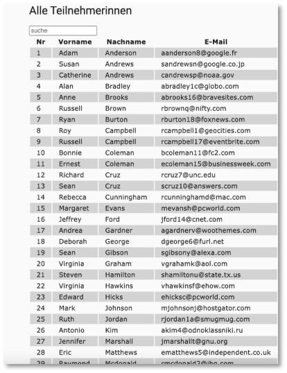
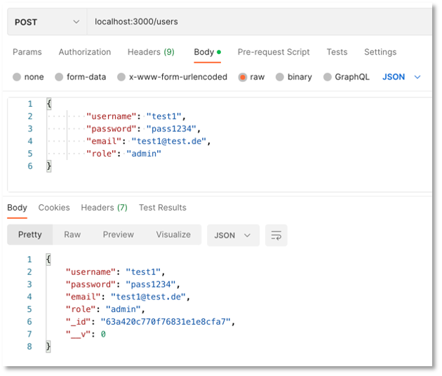

# Übungen

#### Übung 0

??? question "Infrastruktur einrichten"
    - wählen Sie eine [**IDE**](../tools/#integrated-development-environment-ide) aus und installieren Sie diese 
    - richten Sie sich ein Git-Repository ein (z.B. `WebTech23`)
    - erstellen Sie im Ordner `WebTech23` eine `index.html` und versuchen Sie darin bereits einige Inhalte einzupflegen, z.B. eine kleine persönliche Webseite oder eine Startseite von der aus alle Übungen erreichbar sind o.ä.
    - commiten und pushen Sie Ihr Repository auf einen zentralen Dienst ([**siehe**](../tools/#git))
    - laden Sie mich zu Ihrem Git-Dienst ein ([**siehe**](../tools/#git))


#### Übung 1

??? question "Übungsaufgabe 1 (HTML)"
    - Erstellen Sie in einem `Uebung1`-Ordner eine Datei `uebung1.html`. Das `body`-Element soll ein `header`-Element, ein `nav`-Element, ein `section`-Element und ein `footer`-Element enthalten. 
    - Unter dieser Übungsaufgabe (siehe `mockupdata`) ist der HTML-Code einer Tabelle mit allen Teilnehmerinnen einer Veranstaltung. Kopieren Sie den Inhalt der Datei so in Ihren HTML-Code, dass folgende Seite erscheint:
    

    - Es sollen 4 Unterseiten erstellt werden. Bei Klick auf diese Seiten soll die Tabelle jeweils nur die Teilnehmerinnen enthalten, deren Nachname mit dem entsprechenden Anfangsbuchstaben beginnt (also in `ag.html` nur alle Nachnamen, die mit A bis G beginnen). Die Seiten `ag.html`, `hl.html`, `mr.html` und `sz.html` sollen im Ordner `NN` abgelegt werden, der Unterordner von `Uebung1` ist.
    - Achten Sie darauf, dass man von jeder Unterseite auf jede andere Unterseite und auch auf die Hauptseite (`uebung1.html`) wechseln können muss.
    - Das einzubindende Logo des Studiengangs liegt [hier](./files/fiw.jpg). Es soll in einen `images`-Ordner gespeichert werden, der in der Ordner-Hierarchie neben dem `Uebung1`-Ordner liegt. Um die Größe des Bildes festzulegen, können Sie mit Hilfe des `style`-Attributes die Höhe und die Breite bestimmen: `style="width:53px; height:48px;"` 
    - Nächste Woche wird Uebung1 um CSS erweitert. 

??? "mockupdata"
    ```html
    <table>
        <thead>
            <tr>
                <th>Vorname</th>
                <th>Nachname</th>
                <th>E-Mail-Adresse</th>
                <th>IP-Adresse</th>
            </tr>
        </thead>
        <tbody>
            <tr>
                <td>Adam</td>
                <td>Anderson</td>
                <td>aanderson8@google.fr</td>
                <td>118.93.83.157</td>
            </tr>
            <tr>
                <td>Susan</td>
                <td>Andrews</td>
                <td>sandrewsn@google.co.jp</td>
                <td>228.214.9.251</td>
            </tr>
            <tr>
                <td>Catherine</td>
                <td>Andrews</td>
                <td>candrewsp@noaa.gov</td>
                <td>112.111.87.178</td>
            </tr>
            <tr>
                <td>Alan</td>
                <td>Bradley</td>
                <td>abradley1c@globo.com</td>
                <td>229.152.117.127</td>
            </tr>
            <tr>
                <td>Anne</td>
                <td>Brooks</td>
                <td>abrooks16@bravesites.com</td>
                <td>243.159.39.234</td>
            </tr>
            <tr>
                <td>Russell</td>
                <td>Brown</td>
                <td>rbrownq@nifty.com</td>
                <td>215.38.120.242</td>
            </tr>
            <tr>
                <td>Ryan</td>
                <td>Burton</td>
                <td>rburton18@foxnews.com</td>
                <td>159.60.107.14</td>
            </tr>
            <tr>
                <td>Roy</td>
                <td>Campbell</td>
                <td>rcampbell1@geocities.com</td>
                <td>237.232.34.20</td>
            </tr>
            <tr>
                <td>Russell</td>
                <td>Campbell</td>
                <td>rcampbell17@eventbrite.com</td>
                <td>251.2.92.63</td>
            </tr>
            <tr>
                <td>Bonnie</td>
                <td>Coleman</td>
                <td>bcoleman11@fc2.com</td>
                <td>109.150.122.102</td>
            </tr>
            <tr>
                <td>Ernest</td>
                <td>Coleman</td>
                <td>ecoleman15@businessweek.com</td>
                <td>213.173.4.7</td>
            </tr>
            <tr>
                <td>Richard</td>
                <td>Cruz</td>
                <td>rcruz7@unc.edu</td>
                <td>235.124.23.221</td>
            </tr>
            <tr>
                <td>Sean</td>
                <td>Cruz</td>
                <td>scruz10@answers.com</td>
                <td>92.255.49.227</td>
            </tr>
            <tr>
                <td>Rebecca</td>
                <td>Cunningham</td>
                <td>rcunninghamd@mac.com</td>
                <td>65.79.191.52</td>
            </tr>
            <tr>
                <td>Margaret</td>
                <td>Evans</td>
                <td>mevansh@pcworld.com</td>
                <td>162.10.86.196</td>
            </tr>
            <tr>
                <td>Jeffrey</td>
                <td>Ford</td>
                <td>jford14@cnet.com</td>
                <td>210.216.54.14</td>
            </tr>
            <tr>
                <td>Andrea</td>
                <td>Gardner</td>
                <td>agardnerv@woothemes.com</td>
                <td>179.91.0.30</td>
            </tr>
            <tr>
                <td>Deborah</td>
                <td>George</td>
                <td>dgeorge6@furl.net</td>
                <td>201.76.47.162</td>
            </tr>
            <tr>
                <td>Sean</td>
                <td>Gibson</td>
                <td>sgibsony@alexa.com</td>
                <td>48.114.103.55</td>
            </tr>
            <tr>
                <td>Virginia</td>
                <td>Graham</td>
                <td>vgrahamk@aol.com</td>
                <td>165.219.171.1</td>
            </tr>
            <tr>
                <td>Steven</td>
                <td>Hamilton</td>
                <td>shamiltonu@state.tx.us</td>
                <td>38.194.91.201</td>
            </tr>
            <tr>
                <td>Virginia</td>
                <td>Hawkins</td>
                <td>vhawkinsf@ehow.com</td>
                <td>93.120.46.203</td>
            </tr>
            <tr>
                <td>Edward</td>
                <td>Hicks</td>
                <td>ehicksc@pcworld.com</td>
                <td>199.153.27.1</td>
            </tr>
            <tr>
                <td>Mark</td>
                <td>Johnson</td>
                <td>mjohnsonj@hostgator.com</td>
                <td>73.87.135.206</td>
            </tr>
            <tr>
                <td>Ruth</td>
                <td>Jordan</td>
                <td>rjordan1a@smugmug.com</td>
                <td>193.140.80.64</td>
            </tr>
            <tr>
                <td>Antonio</td>
                <td>Kim</td>
                <td>akim4@odnoklassniki.ru</td>
                <td>168.244.191.78</td>
            </tr>
            <tr>
                <td>Jennifer</td>
                <td>Marshall</td>
                <td>jmarshallt@gnu.org</td>
                <td>104.191.49.94</td>
            </tr>
            <tr>
                <td>Eric</td>
                <td>Matthews</td>
                <td>ematthews5@independent.co.uk</td>
                <td>138.194.30.1</td>
            </tr>
            <tr>
                <td>Raymond</td>
                <td>Mcdonald</td>
                <td>rmcdonald2@ihg.com</td>
                <td>161.24.42.24</td>
            </tr>
            <tr>
                <td>Eric</td>
                <td>Miller</td>
                <td>emillere@creativecommons.org</td>
                <td>122.159.17.218</td>
            </tr>
            <tr>
                <td>Jonathan</td>
                <td>Morales</td>
                <td>jmoralesa@ovh.net</td>
                <td>97.65.110.105</td>
            </tr>
            <tr>
                <td>Marie</td>
                <td>Morgan</td>
                <td>mmorganb@cloudflare.com</td>
                <td>226.79.152.112</td>
            </tr>
            <tr>
                <td>Amanda</td>
                <td>Nelson</td>
                <td>anelson13@indiatimes.com</td>
                <td>161.185.121.245</td>
            </tr>
            <tr>
                <td>Lisa</td>
                <td>Olson</td>
                <td>lolsonr@telegraph.co.uk</td>
                <td>77.245.172.100</td>
            </tr>
            <tr>
                <td>Alice</td>
                <td>Ortiz</td>
                <td>aortizw@histats.com</td>
                <td>179.52.222.21</td>
            </tr>
            <tr>
                <td>Peter</td>
                <td>Phillips</td>
                <td>pphillipss@1688.com</td>
                <td>11.158.255.76</td>
            </tr>
            <tr>
                <td>Matthew</td>
                <td>Porter</td>
                <td>mporter9@europa.eu</td>
                <td>174.81.178.88</td>
            </tr>
            <tr>
                <td>Tammy</td>
                <td>Ray</td>
                <td>trayx@weather.com</td>
                <td>192.243.38.190</td>
            </tr>
            <tr>
                <td>Mark</td>
                <td>Richardson</td>
                <td>mrichardson1d@ihg.com</td>
                <td>209.217.14.154</td>
            </tr>
            <tr>
                <td>Joan</td>
                <td>Roberts</td>
                <td>jroberts12@alibaba.com</td>
                <td>4.91.143.62</td>
            </tr>
            <tr>
                <td>Kathleen</td>
                <td>Rose</td>
                <td>kroseg@pinterest.com</td>
                <td>222.172.140.56</td>
            </tr>
            <tr>
                <td>Steve</td>
                <td>Sanders</td>
                <td>ssanders1b@wikispaces.com</td>
                <td>91.61.109.245</td>
            </tr>
            <tr>
                <td>Shirley</td>
                <td>Scott</td>
                <td>sscottm@macromedia.com</td>
                <td>219.237.108.82</td>
            </tr>
            <tr>
                <td>Lillian</td>
                <td>Stephens</td>
                <td>lstephens19@hugedomains.com</td>
                <td>89.85.137.204</td>
            </tr>
            <tr>
                <td>Nicole</td>
                <td>Thompson</td>
                <td>nthompson3@admin.ch</td>
                <td>13.183.208.155</td>
            </tr>
            <tr>
                <td>Marie</td>
                <td>Thompson</td>
                <td>mthompsonz@yelp.com</td>
                <td>162.164.5.231</td>
            </tr>
            <tr>
                <td>Alan</td>
                <td>Vasquez</td>
                <td>avasquezo@miibeian.gov.cn</td>
                <td>178.109.86.172</td>
            </tr>
            <tr>
                <td>Mildred</td>
                <td>Watkins</td>
                <td>mwatkins0@miibeian.gov.cn</td>
                <td>150.67.132.64</td>
            </tr>
            <tr>
                <td>Eugene</td>
                <td>Williams</td>
                <td>ewilliamsi@deliciousdays.com</td>
                <td>67.208.26.182</td>
            </tr>
            <tr>
                <td>Catherine</td>
                <td>Williams</td>
                <td>cwilliamsl@360.cn</td>
                <td>154.87.204.51</td>
            </tr>
        </tbody>
    </table>
    ```


#### Übung 2

??? question "Übungsaufgabe 2 (CSS)"
    - Erstellen Sie (falls noch nicht geschehen) eine `index.html`-Datei in Ihrem Repository-Ordner (also z.B. `DocumentRoot/Webtech22`) derart, dass diese direkte Links auf Ihre Lösungen der Übungen enthalten (z.B. in einer Tabelle oder einer Liste).
    - Kopieren Sie den Ordner `Uebung1` in den Ordner `Uebung2` (also inkl. Ordner `NN`). Ändern Sie darin die Datei `uebung1.html` zu `uebung2.html` (umbenennen). Ändern Sie entsprechend alle Links innerhalb der Datei, damit Sie z.B. auf den Ordner `Uebung2/NN` zugreifen und nicht mehr auf `Uebung1/NN`.
    - Legen Sie sich im `Uebung2`-Ordner einen Ordner `styles` an. Erstellen Sie in dem `styles`-Ordner eine Datei `mystyles.css`.
    - Fügen Sie im `<head>`-Bereich der `uebung2.html` eine logische Verknüpfung zur `mystyles.css`-Datei ein (`<link href="./styles/mystyles.css" rel="stylesheet">`). 
    - In `mystyles.css` definieren Sie (versuchen Sie mind. 6 der genannten 8 Punkte umzusetzen):
        - Verdana als Schriftart für das ganze Dokument
        - der `<header>` soll das HTW-Grau als Hintergrundfarbe, HTW-Orange als Schriftfarbe und der Text zentriert sein (siehe [**HTW Corporate Design**](http://corporatedesign.htw-berlin.de/schrift-farbe/markenfarben/)).
        - die Tabelle soll ungefähr wie dargestellt aussehen: 
           
        - d.h. mit Rahmen, mit einem Schatten, die Spaltenüberschriften in weiß, mit HTW-grünem Hintergrund.   
        - Das `<nav>`-Feld hat einen Abstand nach oben und nach unten von jeweils `50px`.
        - `<a>`-Elemente in einem `<nav>`-Element haben einen grauen Rand, deren Ecken abgerundet sind. Die Hintergrundfarbe ist HTW-blau. Schriftart ist weiß und bold. `<a>`-Elemente in einem `<nav>`-Element sind nicht unterstrichen!
        - Fährt man mit der Maus über ein `<a>`-Element in einem `<nav>`-Element ändert sich die Hintergrundfarbe in HTW-grau und die Schriftfarbe in HTW-orange. 
            
        - Die Tabelle hat eine Breite von 80% des `<section>`-Elements. 
        - Der `<footer>` ist in HTW-Orange, die Schrift ist schwarz, der Text ist mittig und die Schrift ist kleiner. Die Höhe des footers entsteht dadurch, dass die Schrift einen Abstand nach oben und nach unten von jeweils `20px` hat.
    - Am Ende soll es *ungefähr* so aussehen:  
       


??? note "Eine mögliche Lösung für Übung 2"
    === "uebung2.html"
        ```html
        <!DOCTYPE html>
        <html lang="en">

        <head>
            <meta charset="UTF-8">
            <meta name="viewport" content="width=device-width, initial-scale=1.0">
            <title>Uebung 2</title>
            <link href="./styles/mystyles.css" rel="stylesheet">
        </head>

        <body>
            <header>
                <h1>Teilnehmerinnen Webtech</h1>
                
            </header>
            <nav>
                <a href="#">ALLE</a>
                <a href="NN/ag.html" title="Alle Nachnamen A-G">A-G</a>
                <a href="NN/hl.html">H-L</a>
                <a href="NN/mr.html">M-R</a>
                <a href="NN/sz.html">S-Z</a>
                <a href="../index.html">Startseite</a>
            </nav>
            <section>
                <table>
                    <thead>
                        <tr>
                            <th>Vorname</th>
                            <th>Nachname</th>
                            <th>E-Mail-Adresse</th>
                            <th>IP-Adresse</th>
                        </tr>
                    </thead>
                    <tbody>
                        <tr>
                            <td>Adam</td>
                            <td>Anderson</td>
                            <td>aanderson8@google.fr</td>
                            <td>118.93.83.157</td>
                        </tr>
                        <tr>
                            <td>Susan</td>
                            <td>Andrews</td>
                            <td>sandrewsn@google.co.jp</td>
                            <td>228.214.9.251</td>
                        </tr>
                        <tr>
                            <td>Catherine</td>
                            <td>Andrews</td>
                            <td>candrewsp@noaa.gov</td>
                            <td>112.111.87.178</td>
                        </tr>
                        <tr>
                            <td>Alan</td>
                            <td>Bradley</td>
                            <td>abradley1c@globo.com</td>
                            <td>229.152.117.127</td>
                        </tr>
                        <tr>
                            <td>Anne</td>
                            <td>Brooks</td>
                            <td>abrooks16@bravesites.com</td>
                            <td>243.159.39.234</td>
                        </tr>
                        <tr>
                            <td>Russell</td>
                            <td>Brown</td>
                            <td>rbrownq@nifty.com</td>
                            <td>215.38.120.242</td>
                        </tr>
                        <tr>
                            <td>Ryan</td>
                            <td>Burton</td>
                            <td>rburton18@foxnews.com</td>
                            <td>159.60.107.14</td>
                        </tr>
                        <tr>
                            <td>Roy</td>
                            <td>Campbell</td>
                            <td>rcampbell1@geocities.com</td>
                            <td>237.232.34.20</td>
                        </tr>
                        <tr>
                            <td>Russell</td>
                            <td>Campbell</td>
                            <td>rcampbell17@eventbrite.com</td>
                            <td>251.2.92.63</td>
                        </tr>
                        <tr>
                            <td>Bonnie</td>
                            <td>Coleman</td>
                            <td>bcoleman11@fc2.com</td>
                            <td>109.150.122.102</td>
                        </tr>
                        <tr>
                            <td>Ernest</td>
                            <td>Coleman</td>
                            <td>ecoleman15@businessweek.com</td>
                            <td>213.173.4.7</td>
                        </tr>
                        <tr>
                            <td>Richard</td>
                            <td>Cruz</td>
                            <td>rcruz7@unc.edu</td>
                            <td>235.124.23.221</td>
                        </tr>
                        <tr>
                            <td>Sean</td>
                            <td>Cruz</td>
                            <td>scruz10@answers.com</td>
                            <td>92.255.49.227</td>
                        </tr>
                        <tr>
                            <td>Rebecca</td>
                            <td>Cunningham</td>
                            <td>rcunninghamd@mac.com</td>
                            <td>65.79.191.52</td>
                        </tr>
                        <tr>
                            <td>Margaret</td>
                            <td>Evans</td>
                            <td>mevansh@pcworld.com</td>
                            <td>162.10.86.196</td>
                        </tr>
                        <tr>
                            <td>Jeffrey</td>
                            <td>Ford</td>
                            <td>jford14@cnet.com</td>
                            <td>210.216.54.14</td>
                        </tr>
                        <tr>
                            <td>Andrea</td>
                            <td>Gardner</td>
                            <td>agardnerv@woothemes.com</td>
                            <td>179.91.0.30</td>
                        </tr>
                        <tr>
                            <td>Deborah</td>
                            <td>George</td>
                            <td>dgeorge6@furl.net</td>
                            <td>201.76.47.162</td>
                        </tr>
                        <tr>
                            <td>Sean</td>
                            <td>Gibson</td>
                            <td>sgibsony@alexa.com</td>
                            <td>48.114.103.55</td>
                        </tr>
                        <tr>
                            <td>Virginia</td>
                            <td>Graham</td>
                            <td>vgrahamk@aol.com</td>
                            <td>165.219.171.1</td>
                        </tr>
                        <tr>
                            <td>Steven</td>
                            <td>Hamilton</td>
                            <td>shamiltonu@state.tx.us</td>
                            <td>38.194.91.201</td>
                        </tr>
                        <tr>
                            <td>Virginia</td>
                            <td>Hawkins</td>
                            <td>vhawkinsf@ehow.com</td>
                            <td>93.120.46.203</td>
                        </tr>
                        <tr>
                            <td>Edward</td>
                            <td>Hicks</td>
                            <td>ehicksc@pcworld.com</td>
                            <td>199.153.27.1</td>
                        </tr>
                        <tr>
                            <td>Mark</td>
                            <td>Johnson</td>
                            <td>mjohnsonj@hostgator.com</td>
                            <td>73.87.135.206</td>
                        </tr>
                        <tr>
                            <td>Ruth</td>
                            <td>Jordan</td>
                            <td>rjordan1a@smugmug.com</td>
                            <td>193.140.80.64</td>
                        </tr>
                        <tr>
                            <td>Antonio</td>
                            <td>Kim</td>
                            <td>akim4@odnoklassniki.ru</td>
                            <td>168.244.191.78</td>
                        </tr>
                        <tr>
                            <td>Jennifer</td>
                            <td>Marshall</td>
                            <td>jmarshallt@gnu.org</td>
                            <td>104.191.49.94</td>
                        </tr>
                        <tr>
                            <td>Eric</td>
                            <td>Matthews</td>
                            <td>ematthews5@independent.co.uk</td>
                            <td>138.194.30.1</td>
                        </tr>
                        <tr>
                            <td>Raymond</td>
                            <td>Mcdonald</td>
                            <td>rmcdonald2@ihg.com</td>
                            <td>161.24.42.24</td>
                        </tr>
                        <tr>
                            <td>Eric</td>
                            <td>Miller</td>
                            <td>emillere@creativecommons.org</td>
                            <td>122.159.17.218</td>
                        </tr>
                        <tr>
                            <td>Jonathan</td>
                            <td>Morales</td>
                            <td>jmoralesa@ovh.net</td>
                            <td>97.65.110.105</td>
                        </tr>
                        <tr>
                            <td>Marie</td>
                            <td>Morgan</td>
                            <td>mmorganb@cloudflare.com</td>
                            <td>226.79.152.112</td>
                        </tr>
                        <tr>
                            <td>Amanda</td>
                            <td>Nelson</td>
                            <td>anelson13@indiatimes.com</td>
                            <td>161.185.121.245</td>
                        </tr>
                        <tr>
                            <td>Lisa</td>
                            <td>Olson</td>
                            <td>lolsonr@telegraph.co.uk</td>
                            <td>77.245.172.100</td>
                        </tr>
                        <tr>
                            <td>Alice</td>
                            <td>Ortiz</td>
                            <td>aortizw@histats.com</td>
                            <td>179.52.222.21</td>
                        </tr>
                        <tr>
                            <td>Peter</td>
                            <td>Phillips</td>
                            <td>pphillipss@1688.com</td>
                            <td>11.158.255.76</td>
                        </tr>
                        <tr>
                            <td>Matthew</td>
                            <td>Porter</td>
                            <td>mporter9@europa.eu</td>
                            <td>174.81.178.88</td>
                        </tr>
                        <tr>
                            <td>Tammy</td>
                            <td>Ray</td>
                            <td>trayx@weather.com</td>
                            <td>192.243.38.190</td>
                        </tr>
                        <tr>
                            <td>Mark</td>
                            <td>Richardson</td>
                            <td>mrichardson1d@ihg.com</td>
                            <td>209.217.14.154</td>
                        </tr>
                        <tr>
                            <td>Joan</td>
                            <td>Roberts</td>
                            <td>jroberts12@alibaba.com</td>
                            <td>4.91.143.62</td>
                        </tr>
                        <tr>
                            <td>Kathleen</td>
                            <td>Rose</td>
                            <td>kroseg@pinterest.com</td>
                            <td>222.172.140.56</td>
                        </tr>
                        <tr>
                            <td>Steve</td>
                            <td>Sanders</td>
                            <td>ssanders1b@wikispaces.com</td>
                            <td>91.61.109.245</td>
                        </tr>
                        <tr>
                            <td>Shirley</td>
                            <td>Scott</td>
                            <td>sscottm@macromedia.com</td>
                            <td>219.237.108.82</td>
                        </tr>
                        <tr>
                            <td>Lillian</td>
                            <td>Stephens</td>
                            <td>lstephens19@hugedomains.com</td>
                            <td>89.85.137.204</td>
                        </tr>
                        <tr>
                            <td>Nicole</td>
                            <td>Thompson</td>
                            <td>nthompson3@admin.ch</td>
                            <td>13.183.208.155</td>
                        </tr>
                        <tr>
                            <td>Marie</td>
                            <td>Thompson</td>
                            <td>mthompsonz@yelp.com</td>
                            <td>162.164.5.231</td>
                        </tr>
                        <tr>
                            <td>Alan</td>
                            <td>Vasquez</td>
                            <td>avasquezo@miibeian.gov.cn</td>
                            <td>178.109.86.172</td>
                        </tr>
                        <tr>
                            <td>Mildred</td>
                            <td>Watkins</td>
                            <td>mwatkins0@miibeian.gov.cn</td>
                            <td>150.67.132.64</td>
                        </tr>
                        <tr>
                            <td>Eugene</td>
                            <td>Williams</td>
                            <td>ewilliamsi@deliciousdays.com</td>
                            <td>67.208.26.182</td>
                        </tr>
                        <tr>
                            <td>Catherine</td>
                            <td>Williams</td>
                            <td>cwilliamsl@360.cn</td>
                            <td>154.87.204.51</td>
                        </tr>
                    </tbody>
                </table>
            </section>
            <footer>
                Jörn Freiheit - Übung 2
            </footer>
        </body>

        </html>
        ```
    === "mystyles.css"
        ```css
        body {
            font-family: Verdana;
        }
        
        header {
            background-color: #AFAFAF;
            color: #FF5F00;
            text-align: center;
        }
        
        nav {
            margin-top: 3%;
            margin-bottom: 3%;
        }
        
        table {
            border-collapse: collapse;
            width: 80%;
            box-shadow: 10px 10px 5px grey;
        }
        
        table thead {
            background-color: #76B900;
            color: white;
        }
        
        table td,
        table th {
            border: 1px solid #ddd;
            padding: 8px;
        }
        
        table tr:nth-child(even) {
            background-color: #f2f2f2;
        }
        
        table tr:hover {
            background-color: #ddd;
        }
        
        nav a {
            text-decoration: none;
            border: 1px solid #0082D1;
            background-color: #0082D1;
            border-radius: 7px;
            color: white;
            font-weight: bold;
            text-align: center;
            padding: 10px;
            box-shadow: 5px 5px 5px grey;
        }
        
        nav a:hover {
            border: 1px solid #AFAFAF;
            background-color: #AFAFAF;
            color: #FF5F00;
        }
        
        footer {
            background-color: #FF5F00;
            color: black;
            text-align: center;
            padding: 20px;
        }
        ```

#### Übung 3

??? question "Übungsaufgabe 3 (Grid und Einheiten)"
    - Erstellen Sie einen `Uebung3`-Ordner und darin eine Datei `uebung3.html`. Kopieren Sie [diesen Inhalt](./files/uebung3.html) in `uebung3.html` (Rechtsklick auf die Seite und `Seitenquelltext anzeigen` - das `<script>`-Element unten können Sie löschen).
    - Laden Sie sich [hier die Datei images.zip](./files/images.zip) herunter, entpacken Sie sie und schieben Sie den `images`-Ordner samt Inhalt in den `Uebung3`-Ordner.
    - Implementieren Sie die `uebung3.html` so, dass *ungefähr* folgendes Aussehen entsteht:
       
    - Sie können die CSS-Eigenschaften innerhalb der `uebung3.html` im `<style>`-Element definieren oder wieder in einer externen Datei. 
    - Ziele der Übung sind die Anwendung von *CSS-Grid* (siehe z.B. [hier](https://css-tricks.com/snippets/css/complete-guide-grid/)) sowie die Verwendung von Größen und Einheiten (siehe z.B. [hier](https://developer.mozilla.org/en-US/docs/Learn/CSS/Building_blocks/Values_and_units)). Lassen Sie Ihrer Kreativität freien Lauf!


??? note "Eine mögliche Lösung für Übung 3"
    === "uebung3.html"
        ```html
        <!DOCTYPE html>
        <html lang="en">

        <head>
            <meta charset="UTF-8">
            <meta http-equiv="X-UA-Compatible" content="IE=edge">
            <meta name="viewport" content="width=device-width, initial-scale=1.0">
            <title>Uebung 3</title>
            <style>
                .wrapper {
                    display: grid;
                    grid-template-columns: repeat(2, 1fr);
                    column-gap: 1em;
                    row-gap: 1em;
                }
                
                .citycard {
                    display: grid;
                    grid-template-rows: 4fr 1fr;
                    /* background-color: rgb(251, 237, 220); */
                    box-shadow: rgba(100, 100, 111, 0.2) 0px 7px 29px 0px;

                }

                .cityimage {
                    text-align: center;
                }

                .cityimage img {
                    margin: 1em;
                    width: 5em;

                }

                .citycard:nth-Child(even) .cityname{
                    text-align: center;
                    background-color: aliceblue;
                }

                .citycard:nth-Child(odd) .cityname{
                    text-align: center;
                    background-color: rgb(244, 220, 220);
                }

                .cityname:hover {
                    background-color: blue;
                    color: white;
                }

                @media (min-width: 1600px) {
                    .wrapper {
                        display: grid;
                        grid-template-columns: repeat(4, 1fr);
                    }
                }
            </style>
        </head>

        <body>
            <header>
                <h2>STÄDTE</h2>
            </header>
            <main>


                <section class="wrapper">

                    <div class="citycard">
                        <div class="cityimage">
                            
                        </div>
                        <div class="cityname">
                            <p>Berlin</p>
                        </div>
                    </div>

                    <div class="citycard">
                        <div class="cityimage">
                            
                        </div>
                        <div class="cityname">
                            <p>Bernau</p>
                        </div>
                    </div>

                    <div class="citycard">
                        <div class="cityimage">
                            
                        </div>
                        <div class="cityname">
                            <p>Brandenburg</p>
                        </div>
                    </div>

                    <div class="citycard">
                        <div class="cityimage">
                            
                        </div>
                        <div class="cityname">
                            <p>Bremen</p>
                        </div>
                    </div>

                    <div class="citycard">
                        <div class="cityimage">
                            
                        </div>
                        <div class="cityname">
                            <p>Bremerhaven</p>
                        </div>
                    </div>

                    <div class="citycard">
                        <div class="cityimage">
                            
                        </div>
                        <div class="cityname">
                            <p>Madrid</p>
                        </div>
                    </div>

                    <div class="citycard">
                        <div class="cityimage">
                            
                        </div>
                        <div class="cityname">
                            <p>Magdeburg</p>
                        </div>
                    </div>

                    <div class="citycard">
                        <div class="cityimage">
                            
                        </div>
                        <div class="cityname">
                            <p>Mainz</p>
                        </div>
                    </div>

                    <div class="citycard">
                        <div class="cityimage">
                            
                        </div>
                        <div class="cityname">
                            <p>Mannheim</p>
                        </div>
                    </div>

                    <div class="citycard">
                        <div class="cityimage">
                            
                        </div>
                        <div class="cityname">
                            <p>Marburg</p>
                        </div>
                    </div>

                    <div class="citycard">
                        <div class="cityimage">
                            
                        </div>
                        <div class="cityname">
                            <p>New York</p>
                        </div>
                    </div>

                    <div class="citycard">
                        <div class="cityimage">
                            
                        </div>
                        <div class="cityname">
                            <p>Stockholm</p>
                        </div>
                    </div>

                </section>
            </main>
            <footer>

            </footer>
        </body>

        </html>
        ```


#### Übung 4

??? question "Übungsaufgabe 4 (Bootstrap und JavaScript)"
    - Erstellen Sie einen `Uebung4`-Ordner und darin eine Datei `uebung4.html`. 
    - Implementieren Sie die `uebung4.html` mithilfe von Bootstrap so, dass *ungefähr* folgendes Aussehen entsteht:
      { width="300" }
    - Sind in das Formular Daten eingegeben und wird der `Registrieren`-Button gedrückt, dann erscheint mithilfe einer JavaScript-Funktion:
        { width="300" } 
    - Wird der `Abbrechen`-Button gedrückt, werden alle bereits eingegebenen Daten wieder aus den Textfeldern entfernt.   
    - Ziele der Übung sind die Anwendung von *CSS-Bootstrap* und *JavaScript*.


??? note "Eine mögliche Lösung für Übung 4"
    === "uebung4.html"
        ```html
        <!DOCTYPE html>
        <html lang="en">
        <head>
            <meta charset="UTF-8">
            <meta name="viewport" content="width=device-width, initial-scale=1.0">
            <link rel="stylesheet" href="../css/bootstrap.min.css">
            <title>Übung 4</title>
        </head>
        <body>
            <div class="container">
                <h1 class="my-3">Teilnehmerin Registrierung</h1>
                <div class="row">
                    <div class="my-3 col-12 col-sm-6 col-md-4 col-lg-3">
                        <input class="form-control" type="text" placeholder="First name" id="first" />
                    </div>
                    <div class="my-3 col-12 col-sm-6 col-md-4 col-lg-3">
                        <input class="form-control" type="text" placeholder="Last name" id="last" />
                    </div>
                    <div class="my-3 col-12 col-sm-6 col-md-4 col-lg-3">
                        <input class="form-control" type="email" placeholder="E-Mail" id="email" />
                    </div>
                    <div class="my-3 col-12 col-sm-6 col-md-4 col-lg-3">
                        <input class="form-control" type="text" placeholder="IP-Address" id="ipaddr" />
                    </div>

                    <div class="my-3 col-12 col-sm-6 col-md-4 col-lg-3">
                        <input class="btn btn-secondary" type="text" value="Abbrechen"/>
                    </div>
                    <div class="my-3 col-12 col-sm-6 col-md-4 col-lg-3">
                        <input onclick="register()" class="btn btn-success" type="text" value="Registrieren" />
                    </div>
                </div>
                <h2 class="my-4">Eingegebene Werte</h2>
                <div id="output"></div>
            </div>
            <script>
                function register() 
                {

                    // Eingaben auslesen
                    console.log("Registrieren geklickt");
                    let firstInput = document.getElementById('first');
                    let firstValue = firstInput.value;
                    let lastValue = document.querySelector('#last').value;
                    let emailValue = document.querySelector('#email').value;
                    let ipaddrValue = document.querySelector('#ipaddr').value;

                    // Eingaben auf Konsole ausgeben
                    console.log('firstValue : ', firstValue)
                    console.log('lastValue : ', lastValue)
                    console.log('emailValue : ', emailValue)
                    console.log('ipaddrValue : ', ipaddrValue)

                    if(firstValue == "") {
                        firstInput.classList.remove('is-valid')
                        firstInput.classList.add('is-invalid')
                    } else {
                        firstInput.classList.remove('is-invalid')
                        firstInput.classList.add('is-valid')
                    }

                    let output = document.getElementById('output');
                    output.innerHTML = `
                    <ul>
                        <li>${firstValue}</li>
                        <li>${lastValue}</li>
                        <li>${emailValue}</li>
                        <li>${ipaddrValue}</li>
                    </ul>`; 

                }
            </script>
        </body>
        </html>
        ```


#### Übung 5
    
??? question "Übungsaufgabe 5 (JavaScript, DOM)"
    - Laden Sie [hier](https://github.com/jfreiheit/WT23/blob/main/Uebung5.zip) die Datei `Uebung5.zip` herunter, entpacken Sie sie und schieben den Ordner `Uebung5` in Ihren Projektordner.
    - In der Datei `uebung5.html` sind einige Dinge vorbereitet:
        - eine Tabelle mit leerem `<tbody>`. Der `<tbody>` hat die `id='tbody'`,
        - wird die Seite geladen, wird die `init()`-Funktion aufgerufen (`onload='init()'`),
        - eine JavaScript-Funktion `getStaedte()`. Diese Funktion "holt" die Datei `staedte.json` (liegt im `Uebung5`-Ordner) und gibt sie zurück,
        - eine Variable `staedtearr`, in der das Array geladen werden soll, das die `staedte.json` enthält. **Achtung!** das Array selbst ist der Wert, der im JSON unter dem Schlüssel `staedte` steht (schauen Sie sich die Datei `staedte.json` an),
        - eine JavaScript-Funktion `createTable()`, die Sie verwenden sollen, um die Tabelle mit Werten zu befüllen. Schauen Sie sich auch die Kommentare in `uebung5.html` an.  
    - Befüllen Sie die Tabelle unter Verwendung der Daten aus `staedte.json`
        - für jede neu entstehende Tabellenzeile müssen Sie fünf neue `td`-Objekte kreieren und diese an ein neu kreiertes `tr`-Objekt anhängen. Das `tr`-Obejkt hängen Sie wiederum an den `tbody`.
        - die Nummer in der ersten Spalte erstellen Sie einfach fortlaufend mit dem Wert von `nr`, den Sie für jede Zeile erhöhen.
        - der `Info`-Button ist ein Hyperlink mit der Bootstrap-Klasse `btn`; also `<a class="btn btn-success btn-sm" href="">Info</a>`. Der Wert für `href` findet sich jeweils unter dem `link`-Eintrag für jede Stadt in `staedte.json`.
        - für das Bild verwenden Sie den `bild`-Link aus `staedte.json` als `src`. Geben Sie auch dem Attribut `alt` einen Wert (die `stadt` aus `staedte.json`).
        - die Tabelle sieht dann so aus:
            
    - Bei Eingabe in das Textfeld von `Filter` wird bei jedem Zeichen, das eingegeben wird, die Funktion `createTable()` aufgerufen (siehe `oninput="createTable()"`). Es sollen nun nur noch die Städte angezeigt werden, deren Stadtnamen oder deren Gründungsjahr zur Eingabe passt. <br/>
        - Wird also z.B. `br` eingegeben, dann erscheinen nur die Städte, die mit `Br` beginnen (Groß- und Kleinschreibung egal, siehe `toLowerCase()`):<br/>
             <br/>
        - Wird also z.B. `12` eingegeben, dann erscheinen nur die Städte, deren Gründungsjahr mit `12` beginnt:  <br/>
             <br/>
        - **Tipp:** Sie laufen in einer Schleife durch das Array, um alle Städte auszulesen. Fügen Sie darin eine Bedingung ein, dass Sie nur die Städte der Tabelle hinzufügen, die der Filter-Eingabe entsprechen.


??? note "Eine mögliche Lösung für Übung 5"
    === "uebung5.html"
        ```html
        <!DOCTYPE html>
        <html lang="en">
        <head>
            <meta charset="UTF-8">
            <meta name="viewport" content="width=device-width, initial-scale=1.0">
            <link href="../css/bootstrap.min.css" rel="stylesheet">
            <title>Übung 5</title>
            <style>
                img {
                    width: 50px;
                }
            </style>
        </head>
        <body class="container" onload="init()">
            <h1>Städte</h1>
            <div class="row my-4">
                <div class="col-2">
                    <label for="filter">Filter:</label>
                </div>
                <div class="col-10">
                    <input type="text" class="form-control" id="filter" oninput="createTable()"/>
                </div>     
            </div>
            <table class="table table-striped table-hover align-middle">
                <thead>
                    <tr>
                        <th scope="col">Nr</th>
                        <th scope="col">Jahr</th>
                        <th scope="col">Stadt</th>
                        <th scope="col">Link</th>
                        <th scope="col">Bild</th>
                    </tr>
                </thead>
                <tbody id="tbody">
                    
                </tbody>
            </table>
            <script>
                let staedtearr = [];

                async function getStaedte() {

                    const request = new Request('staedte.json', {
                            method: 'GET',      // GET ist default
                            headers: {
                                'Accept': 'application/json'
                            }
                        });

                    const response = await fetch('staedte.json');
                    console.log(response);
                    return response.json();
                }

                function createTable() {
                    let input = document.getElementById('filter').value; 

                    if(staedtearr.length > 0)
                    {
                        let tbody = document.getElementById('tbody');
                        tbody.innerHTML = '';
                        let nr = 1;
                        for(let stadtObj of staedtearr) {
                            console.log('stadt : ', stadtObj.stadt)
                            if(input.toLowerCase() == stadtObj.stadt.substring(0,input.length).toLowerCase()) {
                                let tr = document.createElement('tr');

                                let td1 = document.createElement('td');
                                td1.innerText = nr++;
                                tr.appendChild(td1);

                                let td2 = document.createElement('td');
                                td2.innerText = stadtObj.jahr;
                                tr.appendChild(td2);

                                let td3 = document.createElement('td');
                                td3.innerText = stadtObj.stadt;
                                tr.appendChild(td3);

                                let td4 = document.createElement('td');
                                td4.innerHTML = `<a class="btn btn-success btn-sm" href="${stadtObj.link}">Link</a>`;
                                tr.appendChild(td4);

                                let td5 = document.createElement('td');
                                td5.innerHTML = ``;
                                tr.appendChild(td5);

                                tbody.appendChild(tr);
                            }
                        }
                        
                        
                        // hier muessen jetzt die einzelnen Zeilen in die Tabelle eingelesen werden
                        // das Staedte-Array muss ausgelesen werden (z.B. for(stadt of staedtearr)
                        // Tipp: zunaechst einfach alle anzeigen lassen und erst dann das Filtern einbauen
                        // Filtern: die Eingabe mit dem jeweiligen Gruendungsjahr bzw. der jeweiligen Stadt
                        // vergleichen (siehe z.B. substring(0, input.length) und toLowerCase())
                        // wenn match, dann entsprechende Zeile einfuegen; sonst nicht
                    }
                }

                function init() {

                    getStaedte()
                    .then( jsonObj => {
                        console.log( 'body --> ', jsonObj);
                        return jsonObj.staedte;
                    })
                    .then (alleStaedteAlsArray => {
                        console.log('staedte array -->', alleStaedteAlsArray);
                        staedtearr = alleStaedteAlsArray;
                        createTable();
                    })
                            
                    // hier getStaedte() aufrufen und
                    // staedtearr befuellen!
                    // siehe Promises!

                    

                }

                
            </script>
        </body>
        </html>
        ```


#### Übung 6
    
??? question "Übungsaufgabe 6 (Angular - Komponenten)"
    - Erstellen Sie ein neues Angular-Projekt `Uebung6` (siehe  [hier](../angular/#erstes-projekt-erstellen)). 
    - Erstellen Sie mindestens folgende Komponenten: `header`, `nav`, `footer`, `table` und `form`. 
    - Gestalten Sie `header`, `nav` und `footer` so, dass es ungefähr so aussieht:

        { width=50% }

        Diese drei Komponenten sollen mittels Komponentenselektoren in die `AppComponent` eingebunden werden.

    - Erstellen Sie für die `TableComponent` die Route `read` und für die `FormComponent` die Route `create`, so dass für `localhost:4200/create` ungefähr folgende Ansicht erscheint:

        { width=50% }

        Diese Komponente enthält ein Formular. Für `localhost:4200/read` erscheint ungefähr folgende Ansicht:

        { width=50% }

        Diese Komponente enthält eine Tabelle. Es ist nur der Tabellenkopf mit den Spaltenüberschriften zu sehen. 

    - In der nächsten Übung befüllen wir die Tabelle mithilfe eines Services. 


??? note "Eine mögliche Lösung für Übung 6"
    [siehe mein GitHub-Repository](https://github.com/jfreiheit/WT23.git)


#### Übung 7
    
??? question "Übungsaufgabe 7 (JSON, Direktiven, Bindings)"
    - Erstellen Sie ein neues Angular-Projekt `Uebung7` (siehe  [hier](../angular/#erstes-projekt-erstellen)) oder nutzen Sie Ihre Implementierung aus `Uebung6`. 
    - Erstellen Sie im `assets`-Ordner eine Datei `members.json` mit folgendem Inhalt:

        ??? "assets/members.json"

            ```json
            [{
                "forename": "Catherine",
                "surname": "Williams",
                "email": "cwilliamsl@360.cn"
            },
            {
                "forename": "Adam",
                "surname": "Anderson",
                "email": "aanderson8@google.fr"
            },
            {
                "forename": "Susan",
                "surname": "Andrews",
                "email": "sandrewsn@google.co.jp"
            },
            {
                "forename": "Catherine",
                "surname": "Andrews",
                "email": "candrewsp@noaa.gov"
            },
            {
                "forename": "Alan",
                "surname": "Bradley",
                "email": "abradley1c@globo.com"
            },
            {
                "forename": "Anne",
                "surname": "Brooks",
                "email": "abrooks16@bravesites.com"
            },
            {
                "forename": "Russell",
                "surname": "Brown",
                "email": "rbrownq@nifty.com"
            },
            {
                "forename": "Ryan",
                "surname": "Burton",
                "email": "rburton18@foxnews.com"
            },
            {
                "forename": "Roy",
                "surname": "Campbell",
                "email": "rcampbell1@geocities.com"
            },
            {
                "forename": "Russell",
                "surname": "Campbell",
                "email": "rcampbell17@eventbrite.com"
            },
            {
                "forename": "Bonnie",
                "surname": "Coleman",
                "email": "bcoleman11@fc2.com"
            },
            {
                "forename": "Ernest",
                "surname": "Coleman",
                "email": "ecoleman15@businessweek.com"
            },
            {
                "forename": "Richard",
                "surname": "Cruz",
                "email": "rcruz7@unc.edu"
            },
            {
                "forename": "Sean",
                "surname": "Cruz",
                "email": "scruz10@answers.com"
            },
            {
                "forename": "Rebecca",
                "surname": "Cunningham",
                "email": "rcunninghamd@mac.com"
            },
            {
                "forename": "Margaret",
                "surname": "Evans",
                "email": "mevansh@pcworld.com"
            },
            {
                "forename": "Jeffrey",
                "surname": "Ford",
                "email": "jford14@cnet.com"
            },
            {
                "forename": "Andrea",
                "surname": "Gardner",
                "email": "agardnerv@woothemes.com"
            },
            {
                "forename": "Deborah",
                "surname": "George",
                "email": "dgeorge6@furl.net"
            },
            {
                "forename": "Sean",
                "surname": "Gibson",
                "email": "sgibsony@alexa.com"
            },
            {
                "forename": "Virginia",
                "surname": "Graham",
                "email": "vgrahamk@aol.com"
            },
            {
                "forename": "Steven",
                "surname": "Hamilton",
                "email": "shamiltonu@state.tx.us"
            },
            {
                "forename": "Virginia",
                "surname": "Hawkins",
                "email": "vhawkinsf@ehow.com"
            },
            {
                "forename": "Edward",
                "surname": "Hicks",
                "email": "ehicksc@pcworld.com"
            },
            {
                "forename": "Mark",
                "surname": "Johnson",
                "email": "mjohnsonj@hostgator.com"
            },
            {
                "forename": "Ruth",
                "surname": "Jordan",
                "email": "rjordan1a@smugmug.com"
            },
            {
                "forename": "Antonio",
                "surname": "Kim",
                "email": "akim4@odnoklassniki.ru"
            },
            {
                "forename": "Jennifer",
                "surname": "Marshall",
                "email": "jmarshallt@gnu.org"
            },
            {
                "forename": "Eric",
                "surname": "Matthews",
                "email": "ematthews5@independent.co.uk"
            },
            {
                "forename": "Raymond",
                "surname": "Mcdonald",
                "email": "rmcdonald2@ihg.com"
            },
            {
                "forename": "Eric",
                "surname": "Miller",
                "email": "emillere@creativecommons.org"
            },
            {
                "forename": "Jonathan",
                "surname": "Morales",
                "email": "jmoralesa@ovh.net"
            },
            {
                "forename": "Marie",
                "surname": "Morgan",
                "email": "mmorganb@cloudflare.com"
            },
            {
                "forename": "Amanda",
                "surname": "Nelson",
                "email": "anelson13@indiatimes.com"
            },
            {
                "forename": "Lisa",
                "surname": "Olson",
                "email": "lolsonr@telegraph.co.uk"
            },
            {
                "forename": "Alice",
                "surname": "Ortiz",
                "email": "aortizw@histats.com"
            },
            {
                "forename": "Peter",
                "surname": "Phillips",
                "email": "pphillipss@1688.com"
            },
            {
                "forename": "Matthew",
                "surname": "Porter",
                "email": "mporter9@europa.eu"
            },
            {
                "forename": "Tammy",
                "surname": "Ray",
                "email": "trayx@weather.com"
            },
            {
                "forename": "Mark",
                "surname": "Richardson",
                "email": "mrichardson1d@ihg.com"
            },
            {
                "forename": "Joan",
                "surname": "Roberts",
                "email": "jroberts12@alibaba.com"
            },
            {
                "forename": "Kathleen",
                "surname": "Rose",
                "email": "kroseg@pinterest.com"
            },
            {
                "forename": "Steve",
                "surname": "Sanders",
                "email": "ssanders1b@wikispaces.com"
            },
            {
                "forename": "Shirley",
                "surname": "Scott",
                "email": "sscottm@macromedia.com"
            },
            {
                "forename": "Lillian",
                "surname": "Stephens",
                "email": "lstephens19@hugedomains.com"
            },
            {
                "forename": "Nicole",
                "surname": "Thompson",
                "email": "nthompson3@admin.ch"
            },
            {
                "forename": "Marie",
                "surname": "Thompson",
                "email": "mthompsonz@yelp.com"
            },
            {
                "forename": "Alan",
                "surname": "Vasquez",
                "email": "avasquezo@miibeian.gov.cn"
            },
            {
                "forename": "Mildred",
                "surname": "Watkins",
                "email": "mwatkins0@miibeian.gov.cn"
            },
            {
                "forename": "Eugene",
                "surname": "Williams",
                "email": "ewilliamsi@deliciousdays.com"
            }
            ]
            ```

    - Erstellen Sie einen Service `members.service.ts`, in dem die `members.json` per `fetch()` eingelesen wird und der eine Funktion zur Verfügung stellt, die alle `members` als Array zurückgibt. Erstellen Sie ein passendes `Members`-Interface, um die Typsicherheit zu verbessern.

    - Befüllen Sie mit den Daten aus `members.json` eine Tabelle:

        

    - Implementieren Sie für das Suchfeld die Behandlung des `input`-Ereignisses so, dass nur die Teilnehmerinnen in der Tabelle erscheinen, deren Vor- oder Nachnamen den Suchstring enthalten:

        

    - Alle Bilder sind nur Anregungen, kann gerne ganz anders aussehen. Gerne können Sie auch Bootstrap einbinden und verwenden (siehe [hier](https://www.npmjs.com/package/@ng-bootstrap/ng-bootstrap)).

    
??? hint "Video zur Übung 7"
    <iframe src="https://mediathek.htw-berlin.de/media/embed?key=b1caa5255020214b5fab27cc84ac36bb&width=720&height=405&autoplay=false&controls=true&autolightsoff=false&loop=false&chapters=false&playlist=false&related=false&responsive=false&t=0&loadonclick=true&thumb=true" data-src="https://mediathek.htw-berlin.de/media/embed?key=b1caa5255020214b5fab27cc84ac36bb&width=720&height=405&autoplay=false&controls=true&autolightsoff=false&loop=false&chapters=false&playlist=false&related=false&responsive=false&t=0&loadonclick=true" class="" width="720" height="405" title="Uebung7" frameborder="0" allowfullscreen="allowfullscreen" allowtransparency="true" scrolling="no" aria-label="media embed code" style=""></iframe>


??? note "Eine mögliche Lösung für Übung 7"
    === "table.component.ts"
        ```js
        import { Component, OnInit, inject } from '@angular/core';
        import { MembersService } from '../shared/members.service';
        import { Member } from '../shared/member';
        import { CommonModule } from '@angular/common';
        import { FormControl, ReactiveFormsModule } from '@angular/forms';

        @Component({
          selector: 'app-table',
          standalone: true,
          imports: [CommonModule, ReactiveFormsModule],
          templateUrl: './table.component.html',
          styleUrl: './table.component.css'
        })
        export class TableComponent implements OnInit {
          private service = inject(MembersService);
          allmembers: Member[] = [];
          filterarray: Member[] = [];
          search = new FormControl();

          async ngOnInit(): Promise<void> {
            this.allmembers = await this.service.getAllMembers();
            this.filterarray = this.allmembers;
            console.log('in ngOnInit -> allmembers', this.allmembers)
          }

          filterMembers(){
            let searchstring = this.search.value.toLowerCase();
            console.log(searchstring);
            this.filterarray = this.allmembers.filter( (member) => {
              return (member.forename.toLowerCase().includes(searchstring) || member.surname.toLowerCase().includes(searchstring)) 
            });
          }

        }
        ```

    === "table.component.html"
        ```html
        <h1>Alle Teilnehmerinnen</h1>

        <input type="text" [formControl]="search" (input)="filterMembers()" />
        <table>
          <thead>
            <tr>
              <th>Nr</th>
              <th>Vorname</th>
              <th>Nachname</th>
              <th>E-Mail</th>
            </tr>
          </thead>
          <tbody>
            <tr *ngFor="let item of filterarray; index as i;">
              <td>{{ i+1 }}</td>
              <td>{{ item.forename }}</td>
              <td>{{ item.surname }}</td>
              <td>{{ item.email }}</td>
            </tr>
          </tbody>
        </table>
        ```

    === "shared/members.service.ts"
        ```js
        import { Injectable } from '@angular/core';
        import { Member } from './member';

        @Injectable({
          providedIn: 'root'
        })
        export class MembersService {

          async getAllMembers(): Promise<Member[]> {
            let response = await fetch('../../assets/members.json')
            console.log('in service -> response', response)
            let members = await response.json();
            console.log('in service -> members', members)
            return members;
          }
        }

        ```

    === "shared/member.ts"
        ```js
        export interface Member {
          forename: string;
          surname: string;
          email: string;
        }
        ```


#### Übung 8
    
??? question "Übungsaufgabe 8 (REST-API mit PostgreSQL)"

    <ul>
    <li>Erstellen Sie eine [REST-API](../webtech/backend_pg/#rest-api-postgresql) mit folgenden Endpunkten:</li>

    <table>
        <thead>
        <tr>
        <th>Endpunkt</th>
        <th>Erläuterung </th>
        </tr>
        </thead>
        <tbody>
         <tr>
         <td>`GET /users`  </td>        
         <td>gebe alle `user`-Einträge zurück</td>
         </tr>
         <tr>
         <td>`POST /users`  </td>        
         <td>erstelle einen neuen `user` </td>
         </tr>
         <tr>
         <td>`GET /users/:name`  </td>        
         <td>gibt den `user` mit `username == name` zurück </td>
         </tr>
         <tr>
         <td>`DELETE /users/:id`  </td>        
         <td>löscht den `user` mit `_id == id` </td>
         </tr>
         <tr>
         <td>`PUT /users/:id`  </td>        
         <td>ändert Daten von `user` mit `_id == id` </td>
         </tr>
        </tbody>
    </table>

    <li>Geben Sie am Anfang Folgendes im Terminal innerhalb Ihres Projekteordners ein (ohne die Kommentare):</li>

    <table>
        <thead>
        <tr>
        <th>Anweisung</th>
        <th>Webseite</th>
        </tr>
        </thead>
        <tbody>
         <tr>
         <td>`mkdir Uebung8`  </td>        
         <td>Ordner `Uebung8`erstellen</td>
         </tr>
         <tr>
         <td>`npm init`  </td>        
         <td>Erstellt das [Node.js](https://nodejs.dev/en/download/)-Projekt  </td>
         </tr>
         <tr>
         <td>`npm i express`  </td>        
         <td>[express.js](https://expressjs.com/de/)</td>
         </tr>
         <tr>
         <td>`npm i nodemon --save-dev`  </td>        
         <td>[nodemon](https://www.npmjs.com/package/nodemon) </td>
         </tr>
         <tr>
         <td>`npm i dotenv`  </td>        
         <td>[dotenv](https://www.npmjs.com/package/dotenv) </td>
         </tr>
         <tr>
         <td>`npm i cors`  </td>        
         <td>[cors](https://www.npmjs.com/package/cors)  </td>
         </tr>
         <tr>
         <td>`npm i pg`  </td>        
         <td>[pg](https://www.npmjs.com/package/pg) </td>
         </tr>
         <tr>
         <td>`npm i pg-format`  </td>        
         <td>[pg-format](https://www.npmjs.com/package/pg-format) </td>
         </tr>
        </tbody>
    </table>

    <li>Vewenden Sie [PostgreSQL](https://www.postgresql.org) als Datenbankmanagementsystem. Sie können sich entweder eine lokale Instanz [installieren](https://www.postgresql.org/download/) oder den HTW-Server [Ocean.f4.htw-berlin.de](https://ocean.f4.htw-berlin.de/) nutzen. </li>

    <li>Implementieren Sie obige CRUD-Funktionalitäten. </li>

    <li>Beachten Sie!: Es soll **kein** neuer `User` angelegt werden, wenn der `username` bereits verwendet wird und/oder wenn die `email` bereits verwendet wird:
        <ul>
        <li>Weder `username` noch `email` exitieren bereits (Response-Body-Datensatz hier von MongoDB erstellt - sieht in Postgres etwas anders aus `_id`, `__v`):</li>
            { width=50% }
        <li>`username` existiert bereits:</li>
            { width=50% }
        <li>`email` existiert bereits:</li>
            { width=50% }
        </ul></li>
    <li>`GET /user/:name` sucht nach dem `username` (Response-Body-Datensatz hier von MongoDB erstellt - sieht in Postgres etwas anders aus `_id`, `__v`):</li>        
            { width=50% } 

    <li>Die `SQL-Query` für die Erstellung der **Tabelle** `users` kann so aussehen: `let query = '
            DROP TABLE IF EXISTS users;
            CREATE TABLE users(id serial PRIMARY KEY, username VARCHAR(50), password VARCHAR(50), email VARCHAR(50), role VARCHAR(50));'
            `; </li>
    </ul>


??? note "Eine mögliche Lösung für Übung 8"
    [siehe mein GitHub-Repository](https://github.com/jfreiheit/WT23.git)

    
??? hint "Video zur Übung 8"
    <iframe src="https://mediathek.htw-berlin.de/media/embed?key=e122c97c6c8937e1ee12c9df44d9d84b&width=720&height=405&autoplay=false&controls=true&autolightsoff=false&loop=false&chapters=false&playlist=false&related=false&responsive=false&t=0&loadonclick=true&thumb=true" data-src="https://mediathek.htw-berlin.de/media/embed?key=e122c97c6c8937e1ee12c9df44d9d84b&width=720&height=405&autoplay=false&controls=true&autolightsoff=false&loop=false&chapters=false&playlist=false&related=false&responsive=false&t=0&loadonclick=true" class="" width="720" height="405" title="Webtech_Uebung8" frameborder="0" allowfullscreen="allowfullscreen" allowtransparency="true" scrolling="no" aria-label="media embed code" style=""></iframe>
    
??? hint "Video zur Übung 8 - Teil 2"
    <iframe src="https://mediathek.htw-berlin.de/media/embed?key=7f34cbf0d6f73be3d61aca541d04cb94&width=720&height=405&autoplay=false&controls=true&autolightsoff=false&loop=false&chapters=false&playlist=false&related=false&responsive=false&t=0&loadonclick=true&thumb=true" data-src="https://mediathek.htw-berlin.de/media/embed?key=7f34cbf0d6f73be3d61aca541d04cb94&width=720&height=405&autoplay=false&controls=true&autolightsoff=false&loop=false&chapters=false&playlist=false&related=false&responsive=false&t=0&loadonclick=true" class="" width="720" height="405" title="Webtech_uebung8_teil2" frameborder="0" allowfullscreen="allowfullscreen" allowtransparency="true" scrolling="no" aria-label="media embed code" style=""></iframe>

#### Übung 9
    
??? question "Übungsaufgabe 9 (Angular, Material Design und Formulare)"

    - Erstellen Sie ein neues Angular-Projekt `Uebung9`.

    - Fügen Sie diesem Projekt mithilfe von `ng add @angular/material` [Material Design](https://material.angular.io/guide/getting-started) hinzu. 

    - Erzeugen Sie mithilfe von `ng generate @angular/material:navigation nav` eine neue Komponente `nav`. Sie dazu [Navigation Schematic](https://material.angular.io/guide/schematics#navigation-schematic).

    - Die `app.component.html` soll nur noch `<app-nav />` enthalten (alles andere löschen, auch `<router-outlet></router-outlet>`). Fügen Sie `NavComponent` dem `imports`-Array in `app.component.ts` hinzu (`RouterOutlet` können Sie dort löschen).

    - Fügen Sie in der `nav.component.html` unter dem Kommentar `<!-- Add Content Here -->` den Selektor `<router-outlet></router-outlet>` ein. Fügen Sie `RouterOutlet` dem `imports`-Array in der `nav.component.ts` hinzu. 

    - Starten Sie das Projekt mit `ng serve`. Je nachdem, welches Farbschema Sie gewählt haben, sieht die Seite nun ungefähr so aus: 

        

        Sie können Ihr Farbschema in der `angular.json` im `styles`-Array ändern (siehe [hier](https://material.angular.io/guide/theming#using-a-pre-built-theme))

    - Erzeugen Sie drei Komponenten `home`, `table` und `form` und binden diese über die Routen `''`, `read` und `create` dynamisch ein. Suchen Sie in der `nav.component.html` nach den Menüeinträgen und passen Sie das Menü so an, dass die drei Komponenten darüber aufgerufen werden können.

    - In der `FormComponent` erzeugen wir uns ein Formular. Schauen Sie sich dazu den Abschnitt [Reactive Forms](https://angular.dev/guide/forms/reactive-forms) unter [Angular.dev](https://angular.dev/overview) sowie die Abschnitte [Form fields](https://material.angular.io/components/form-field/overview) und [Input](https://material.angular.io/components/input/overview) unter [Angular Material](https://material.angular.io/) an. 

        - Die `FormComponent` muss `ReactiveFormsModule` im `imports`-Array enthalten!

        - Eingabefelder (`input`) werden in Angular als `FormControl`-Objekte defininiert, z.B.:

            ```js
            export class FormComponent {

                username = new FormControl('');
                password = new FormControl('');
                email = new FormControl('');
                role = new FormControl('');

            }
            ```

            `FormControl` muss aus `@angular/forms` importiert werden. 

        - Die Verbindung zwischen View (`html`) und Controller (`ts`) wird per `[formControl]="username"` hergestellt, z.B.:

            ```html
            <label for="user-name">username</label>
            <input id="user-name" type="text" [formControl]="username" />

            <label for="pwd">password</label>
            <input id="pwd" type="password" [formControl]="password" />

            <label for="e-mail">email</label>
            <input id="e-mail" type="email" [formControl]="email" />

            <label for="role">role</label>
            <select id="role" [formControl]="role">
              <option value="">--Rolle auswählen--</option>
              <option value="user">user</option>
              <option value="admin">admin</option>
            </select>
            ```

        - Unter Verwendung von *Material Design* werden die Elemente `<mat-form-field>`, `<mat-label>` und die Eigenschaft `matInput` verwendet:

            ```html
            <mat-form-field>
              <mat-label for="user-name">username</mat-label>
              <input matInput id="user-name" type="text" [formControl]="username" />
            </mat-form-field>
            <br/>
            <mat-form-field>
              <mat-label for="pwd">password</mat-label>
              <input matInput id="pwd" type="password" [formControl]="password" />
            </mat-form-field>
            <br />
            <mat-form-field>
              <mat-label for="e-mail">email</mat-label>
              <input matInput id="e-mail" type="email" [formControl]="email" />
            </mat-form-field>
            <br />
            <mat-form-field>
              <mat-label for="role">role</mat-label>
              <select matNativeControl id="role" [formControl]="role">
                <option value="">--Rolle auswählen--</option>
                <option value="user">user</option>
                <option value="admin">admin</option>
              </select>
            </mat-form-field>
            ```

            In der `form.component.ts` muss dazu das `imports`-Array entsprechend befüllt werden: 

            ```js
            imports: [FormsModule, MatFormFieldModule, MatInputModule, ReactiveFormsModule],
            ```

        - Den einzelnen `input`-Elementen können *Validatoren* hinzugefügt werden, mit denen überprüft werden kann, ob die Eingabe den Anforderungen genügt. Dazu wird die Klasse `Validators` aus `@angular/forms` verwendet (siehe [hier](https://angular.io/guide/form-validation#validating-input-in-reactive-forms) und [hier](https://angular.io/api/forms/Validators)), z.B.:

            ```js
                username = new FormControl('', [Validators.required]);
                password = new FormControl('', [Validators.required, Validators.minLength(8)]);
                email = new FormControl('', [Validators.required, Validators.email]);
                role = new FormControl('', [Validators.required]);

                getErrorMessageUsername(){
                  if(this.username.hasError('required')) return 'Bitte ausfüllen';
                  else return '';
                }

                getErrorMessagePassword(){
                  if(this.password.hasError('required')) return 'Bitte ausfüllen';
                  else if(this.password.hasError('minlength')) return 'Mindestens 8 Zeichen';
                  else return '';
                }

                getErrorMessageEmail(){
                  if(this.email.hasError('required')) return 'Bitte ausfüllen';
                  else if(this.email.hasError('email')) return 'Keine gültige E-Mail-Adresse';
                  else return '';
                }

                getErrorMessageRole(){
                  if(this.role.hasError('required')) return 'Bitte ausfüllen';
                  else return '';
                }
            ```

            Die `getErrorMessage`-Funktionen können dann z.B. so im HTML-Code verwendet werden:

            ```html
            <mat-form-field class="wide-width">
              <mat-label for="user-name">username</mat-label>
              <input matInput id="user-name" type="text" [formControl]="username" />
              @if (username.invalid) {
              <mat-error>{{getErrorMessageUsername()}}</mat-error>
              }
            </mat-form-field>
            <br/>
            <mat-form-field class="wide-width">
              <mat-label for="pwd">password</mat-label>
              <input matInput id="pwd" type="password" [formControl]="password" />
              @if (password.invalid) {
              <mat-error>{{getErrorMessagePassword()}}</mat-error>
              }
            </mat-form-field>
            <br />
            <mat-form-field class="wide-width">
              <mat-label for="e-mail">email</mat-label>
              <input matInput id="e-mail" type="email" [formControl]="email" />
              @if (email.invalid) {
              <mat-error>{{getErrorMessageEmail()}}</mat-error>
              }
            </mat-form-field>
            <br />
            <mat-form-field class="wide-width">
              <mat-label for="role">role</mat-label>
              <select matNativeControl id="role" [formControl]="role" placeholder="role">
                <option value="user">user</option>
                <option value="admin">admin</option>
              </select>
              @if (role.invalid) {
              <mat-error>{{getErrorMessageRole()}}</mat-error>
              }
            </mat-form-field>
            ```

        - Button hinzufügen: Für Matrial Design Buttons siehe [hier](https://material.angular.io/components/button/overview), z.B.:

            ```html
            <button mat-raised-button [disabled]="formInvalid()" (click)="register()">Registrieren</button>
            ```

            Dazu muss `MatButtonModule` in das `imports`-Array von `form.component.ts` eingefügt werden. 

        - Der Button ist so lange `disabled`, so lange das Formular nicht korrekt ausgefüllt ist, d.h. `formInvalid()` liefert so lange ein `true` zurück, so lange (mindestens) einer der Fehler auftritt, der eine Error-Message erzeugt (siehe oben). Schreiben Sie die Funktion `formInvalid()` entsprechend. 

        - Bei Klick auf den Button (wenn er `enabled` ist), wird die Funktion `register()` aufgerufen. Implementieren Sie diese Funktion so, dass ein Objekt der Art 

            

            auf die Konsole ausgegeben wird.

        - In Übung 10 werden wir die so erzeugten Objekte an das Backend senden und in die Datenbank speichern. Außerdem befüllen wir dann die `TableComponent` mit Objekten aus der Datenbank.


??? note "Eine mögliche Lösung für Übung 9"
    === "form.component.ts"
        ```js
        import { Component } from '@angular/core';
        import { FormControl, FormsModule, ReactiveFormsModule, Validators } from '@angular/forms';
        import { MatButtonModule } from '@angular/material/button';
        import { MatFormFieldModule } from '@angular/material/form-field';
        import { MatInputModule } from '@angular/material/input';

        @Component({
          selector: 'app-form',
          standalone: true,
          imports: [FormsModule, MatButtonModule, MatFormFieldModule, MatInputModule, ReactiveFormsModule],
          templateUrl: './form.component.html',
          styleUrl: './form.component.css'
        })
        export class FormComponent {
            username = new FormControl('', [Validators.required]);
            password = new FormControl('', [Validators.required, Validators.minLength(8)]);
            email = new FormControl('', [Validators.required, Validators.email]);
            role = new FormControl('', [Validators.required]);

            getErrorMessageUsername(){
              if(this.username.hasError('required')) return 'Bitte ausfüllen';
              else return '';
            }

            getErrorMessagePassword(){
              if(this.password.hasError('required')) return 'Bitte ausfüllen';
              else if(this.password.hasError('minlength')) return 'Mindestens 8 Zeichen';
              else return '';
            }

            getErrorMessageEmail(){
              if(this.email.hasError('required')) return 'Bitte ausfüllen';
              else if(this.email.hasError('email')) return 'Keine gültige E-Mail-Adresse';
              else return '';
            }

            getErrorMessageRole(){
              if(this.role.hasError('required')) return 'Bitte ausfüllen';
              else return '';
            }

            formInvalid() {
              return this.username.invalid || this.password.invalid || this.email.invalid || this.role.invalid;
            }

            register() {
              if(!this.formInvalid())
              {
                let user = {
                  username: this.username.value,
                  password: this.password.value,
                  email: this.email.value,
                  role: this.role.value
                }

                console.log('user', user)
              }
            }
        }
        ```
    === "form.component.html"
        ```html
        <div class="form">
          <mat-form-field class="wide-width">
            <mat-label for="user-name">username</mat-label>
            <input matInput id="user-name" type="text" [formControl]="username" />
            @if (username.invalid) {
            <mat-error>{{getErrorMessageUsername()}}</mat-error>
            }
          </mat-form-field>
          <br />
          <mat-form-field class="wide-width">
            <mat-label for="pwd">password</mat-label>
            <input matInput id="pwd" type="password" [formControl]="password" />
            @if (password.invalid) {
            <mat-error>{{getErrorMessagePassword()}}</mat-error>
            }
          </mat-form-field>
          <br />
          <mat-form-field class="wide-width">
            <mat-label for="e-mail">email</mat-label>
            <input matInput id="e-mail" type="email" [formControl]="email" />
            @if (email.invalid) {
            <mat-error>{{getErrorMessageEmail()}}</mat-error>
            }
          </mat-form-field>
          <br />
          <mat-form-field class="wide-width">
            <mat-label for="role">role</mat-label>
            <select matNativeControl id="role" [formControl]="role" placeholder="role">
              <option value="user">user</option>
              <option value="admin">admin</option>
            </select>
            @if (role.invalid) {
            <mat-error>{{getErrorMessageRole()}}</mat-error>
            }
          </mat-form-field>
          <br/>
          <button mat-raised-button [disabled]="formInvalid()" (click)="register()">Registrieren</button>
        </div>
        ```
    === "form.component.css"
        ```css
        .form {
          width: 80%;
          margin: auto;
          margin-top: 5%;
          background-color: white;
          padding: 2%;
        }

        .form mat-form-field {
          width: 100%;
        }
        ```

    
??? hint "Video zur Übung 9"
    <iframe src="https://mediathek.htw-berlin.de/media/embed?key=8e0c562e79eac41fc776554393ed3b21&width=720&height=405&autoplay=false&controls=true&autolightsoff=false&loop=false&chapters=false&playlist=false&related=false&responsive=false&t=0&loadonclick=true&thumb=true" data-src="https://mediathek.htw-berlin.de/media/embed?key=8e0c562e79eac41fc776554393ed3b21&width=720&height=405&autoplay=false&controls=true&autolightsoff=false&loop=false&chapters=false&playlist=false&related=false&responsive=false&t=0&loadonclick=true" class="" width="720" height="405" title="Webtech_Uebung9" frameborder="0" allowfullscreen="allowfullscreen" allowtransparency="true" scrolling="no" aria-label="media embed code" style=""></iframe>

#### Übung 10
    
??? question "Übungsaufgabe 10 (Frontend-Backend-Anbindung)"

    - Starten Sie das Backend aus [Übung 8](./#ubung-8).

    - Nutzen Sie das Frontend aus [Übung 9](./#ubung-9) und erweitern es wie folgt:

        - Binden Sie in die `app.config.ts` das [HttpClientModule](https://angular.io/api/common/http/HttpClientModule) ein:
            ```js
            import { ApplicationConfig, importProvidersFrom } from '@angular/core';
            import { provideRouter } from '@angular/router';

            import { routes } from './app.routes';
            import { HttpClientModule } from '@angular/common/http';

            export const appConfig: ApplicationConfig = {
              providers: [provideRouter(routes), importProvidersFrom(HttpClientModule)]
            };
            ```

        - Erstellen Sie sich einen `Backend`-Service und ein `User`-Interface mithilfe der Angular CLI: 
            ```bash
            ng g s shared/backend
            ng g i shared/user
            ```

        - Definieren Sie im `User`-Interface die Eigenschaften `username, password, email, role` (alles `string`s).

        - Definieren Sie sich im `Backend`-Service Funktionen für die Anbindung der Backend-Endpunkte (`GET /users`, `POST /users`, `GET /users/:name`, `DELETE /users/:id` und `PUT / users/:id`). Beachten Sie, dass jeweils ein [Observable](https://rxjs.dev/guide/observable) zurückgegeben wird, z.B.:

            ```js
            import { HttpClient } from '@angular/common/http';
            import { Injectable } from '@angular/core';
            import { User } from './user';
            import { Observable } from 'rxjs';

            @Injectable({
              providedIn: 'root'
            })
            export class BackendService {
              backendUrl = 'http://localhost:4000';

              constructor(private http: HttpClient) { }

              getAllUsers(): Observable<User[]> {
                let endpoint = '/users';
                return this.http.get<User[]>(this.backendUrl + endpoint);
              }

              deleteOneMember(id: string): Observable<any> {
                let endpoint = '/users';
                return this.http.delete<any>(this.backendUrl + endpoint + "/" + id);
              }

              createNewUser(user: User): Observable<User> {
                let endpoint = '/users';
                return this.http.post<User>(this.backendUrl + endpoint, user);
              }
            }
            ```

        - Binden Sie in die `Register`-Komponente den `Backend`-Service ein, z.B. `private bs = inject(BackendService);`. Lesen Sie alle Werte aus dem Registrierungsformular aus und erzeugen sich damit ein neues `user`-Objekt. Rufen Sie die Funktion `createNewUser(user)` aus dem `Backend`-Service auf, z.B.:
            ```js
            this.bs.createNewUser(user).subscribe({
              next: (response) => console.log('response', response),
              error: (err) => console.log(err),
              complete: () => console.log('register completed')
            });
            ```

            Prüfen Sie, ob die Daten in die Datenbank gespeichert werden. 

        - Binden Sie in die `Table`-Komponente den `Backend`-Service ein und erstellen sich dort eine `readAll()`-Funktion, in der die `getAllUsers()`-Funktion des `Backend`-Services aufgerufen wird. 
            - Befüllen Sie mit der Response ein `users`-Array. 
            - Rufen Sie in der `ngOnInit()`-Funktion der Komponente die `readAll()`-Funktion auf (die Komponente muss dazu `OnInit` implementieren).
            - Lesen Sie in einer Tabelle in der `table.component.html` alle User aus dem `users`-Array aus.
            - Richten Sie in der Tabelle eine Spalte `Delete` ein, deren Einträge aus Buttons bestehen. Für das Klick-Ereignis soll eine `delete(id)`-Funktion aufgerufen werden, die den Eintrag aus der Datenbank löscht. Rufen Sie in der `delete(id)`-Funktion auch die `readAll()`-Funktion erneut auf, damit das `users`-Array aktualisiert wird. 

    
??? hint "Video zur Übung 10"
    <iframe src="https://mediathek.htw-berlin.de/media/embed?key=1d38028aff695d6038383264af63f01f&width=720&height=405&autoplay=false&controls=true&autolightsoff=false&loop=false&chapters=false&playlist=false&related=false&responsive=false&t=0&loadonclick=true&thumb=true" data-src="https://mediathek.htw-berlin.de/media/embed?key=1d38028aff695d6038383264af63f01f&width=720&height=405&autoplay=false&controls=true&autolightsoff=false&loop=false&chapters=false&playlist=false&related=false&responsive=false&t=0&loadonclick=true" class="" width="720" height="405" title="WebTech_uebung10" frameborder="0" allowfullscreen="allowfullscreen" allowtransparency="true" scrolling="no" aria-label="media embed code" style=""></iframe>


